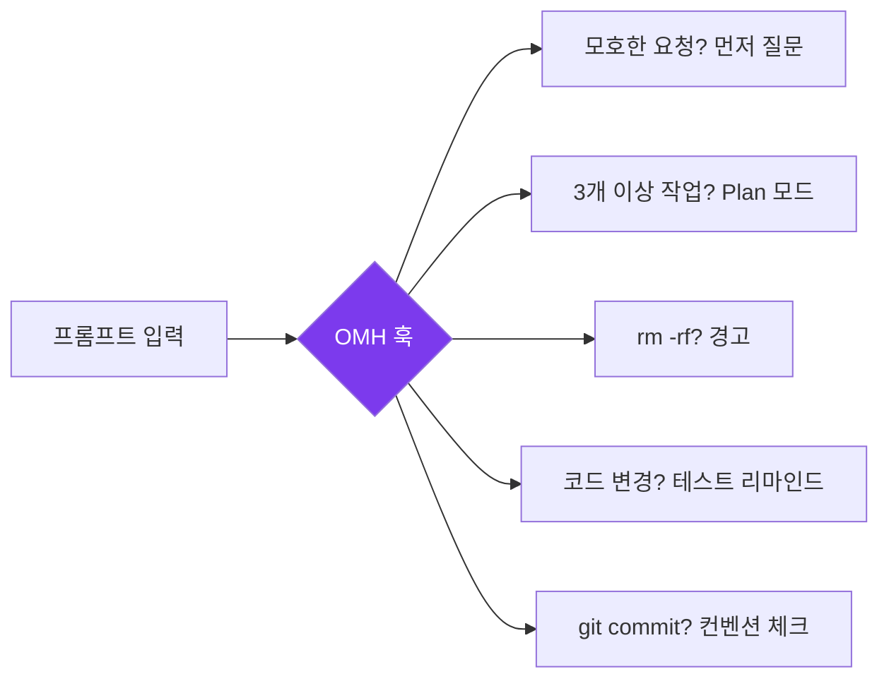
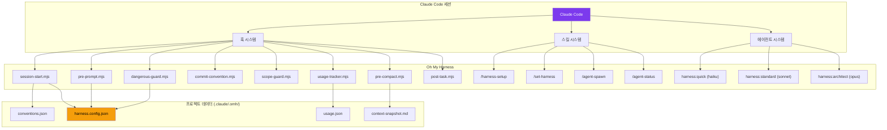
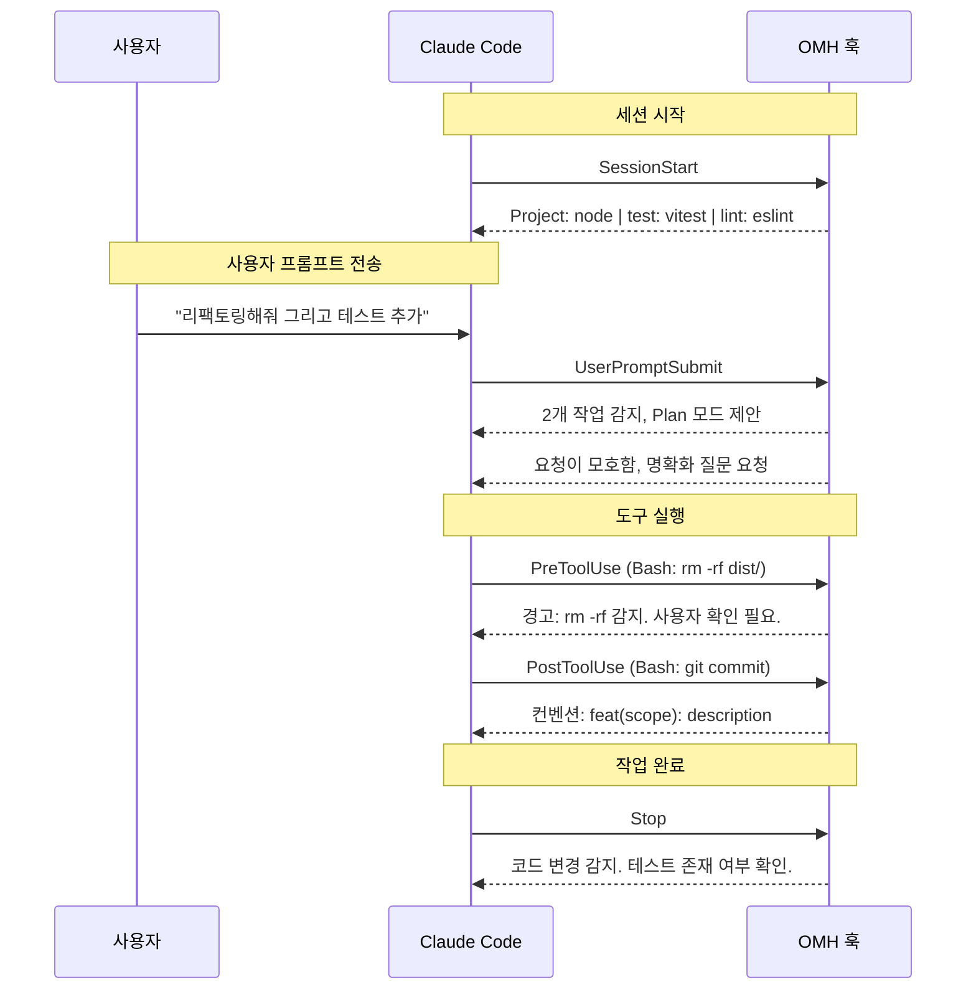
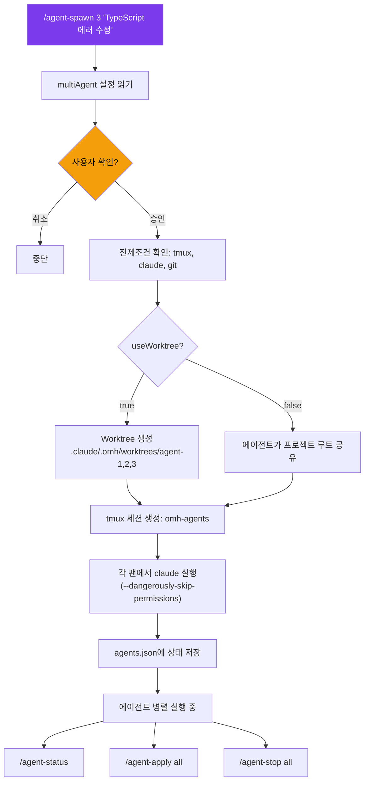
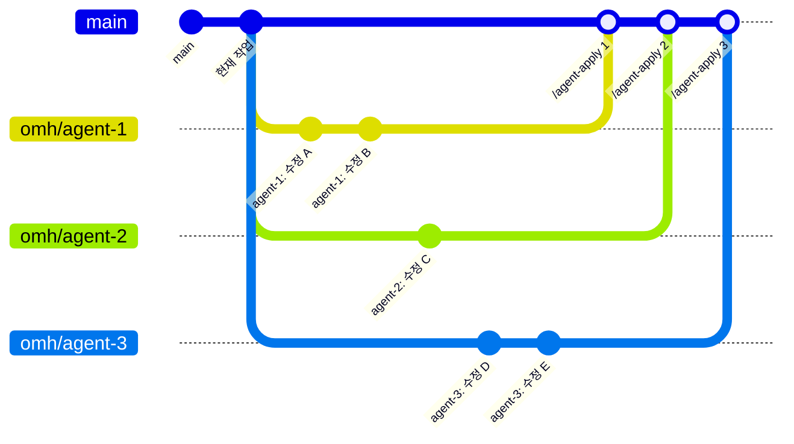

<p align="center">
  
  
  = 18" />
  
  
</p>

<h1 align="center">Oh My Harness</h1>

<p align="center">
  <strong>가벼운 Claude Code 하네스. 설정 없이 바로 사용.</strong><br/>
  스마트 기본값, 테스트 강제, 모델 라우팅, 멀티 에이전트 오케스트레이션 — 모두 네이티브 훅으로 동작합니다.
</p>

<p align="center">
  <a href="README.md">English</a> &middot;
  <a href="#빠른-시작">빠른 시작</a> &middot;
  <a href="docs/features.ko.md">기능</a> &middot;
  <a href="docs/multi-agent.ko.md">멀티 에이전트</a> &middot;
  <a href="docs/configuration.ko.md">설정</a> &middot;
  <a href="docs/architecture.ko.md">아키텍처</a>
</p>

---

## 왜 Oh My Harness인가?

Claude Code는 기본적으로 강력하지만 — 테스트를 강제하지 않고, `rm -rf` 전에 경고하지 않으며, 요청의 복잡도에 상관없이 동일하게 처리합니다.

**Oh My Harness (OMH)**는 Claude Code의 네이티브 훅 시스템을 활용하여 스마트한 기본값을 추가합니다. 무거운 플러그인도, 런타임 오버헤드도 없습니다 — 훅, 스킬, CLAUDE.md 지시문만으로 모든 세션을 더 안전하고 생산적으로 만듭니다.



---

## 빠른 시작

### 방법 A: Claude Code 플러그인 (권장)

```bash
# 1. 마켓플레이스 등록
claude plugins marketplace add https://github.com/Hoya324/oh-my-harness

# 2. 플러그인 설치
claude plugins install oh-my-harness

# 3. Claude Code 재시작 후 프로젝트 설정 초기화:
/harness-setup
```

### 방법 B: npm CLI

```bash
npm install -g oh-my-harness
cd your-project
oh-my-harness init
```

어떤 방법이든, Claude Code를 평소처럼 시작하면 하네스 기능이 자동으로 활성화됩니다.

---

## 기능 목록

| # | 기능 | 훅 | 기본값 | 설명 |
|:-:|------|-----|:-----:|------|
| 1 | 컨벤션 자동 감지 | `SessionStart` | ON | 프로젝트를 스캔하고 언어/테스트/린트 컨텍스트 주입 |
| 2 | 테스트 강제 | `Stop` | ON | 코드 변경 후 테스트 확인 리마인드 |
| 3 | 모델 라우팅 | CLAUDE.md + agents | ON | 복잡도에 따라 haiku / sonnet / opus로 서브에이전트 라우팅 |
| 4 | 자동 Plan 모드 | `UserPromptSubmit` | ON | 3개 이상 작업 감지 시 계획 수립 제안 |
| 5 | 모호성 가드 | `UserPromptSubmit` | ON | 모호한 요청에 대해 명확화 강제 |
| 6 | 위험 명령 가드 | `PreToolUse` | ON | `rm -rf`, `git push --force`, `.env` 쓰기 전 경고 |
| 7 | 컨텍스트 스냅샷 | `PreCompact` | ON | 컨텍스트 압축 전 작업 상태 저장 |
| 8 | 커밋 컨벤션 | `PostToolUse` | ON | 커밋 형식 안내 (Conventional / Gitmoji) |
| 9 | 스코프 가드 | `PostToolUse` | OFF | 허용된 경로 외 파일 수정 시 경고 |
| 10 | 사용량 추적 | `PostToolUse` | ON | 세션별 도구 사용량 기록 |
| 11 | 자동 .gitignore | CLI init | ON | `.claude/.omh/`를 `.gitignore`에 추가 |
| 12 | 멀티 에이전트 | `/agent-spawn` | — | tmux + git worktree를 활용한 병렬 Claude 에이전트 |

> 각 기능의 상세 설명은 [기능 문서](docs/features.ko.md)를 참고하세요.

---

## 아키텍처

> 전체 내용: [docs/architecture.ko.md](docs/architecture.ko.md)



## 훅 파이프라인



## 멀티 에이전트

> 전체 내용: [docs/multi-agent.ko.md](docs/multi-agent.ko.md)





---

## 문서

| 문서 | 내용 |
|------|------|
| **[기능](docs/features.ko.md)** | HUD 상태 표시줄, 스마트 기본값, 기능 태그, 기능 상세 (1–10) |
| **[아키텍처](docs/architecture.ko.md)** | 시스템 다이어그램, 훅 파이프라인, 플러그인 vs npm CLI 디렉토리 구조 |
| **[멀티 에이전트](docs/multi-agent.ko.md)** | Spawn 명령어, 워크플로우, Worktree 브랜칭 모델, 안전 정책 |
| **[설정](docs/configuration.ko.md)** | 설정 레퍼런스, CLI 명령어, 슬래시 명령어, OMC 호환성, 삭제 방법 |

---

## 라이선스

MIT
