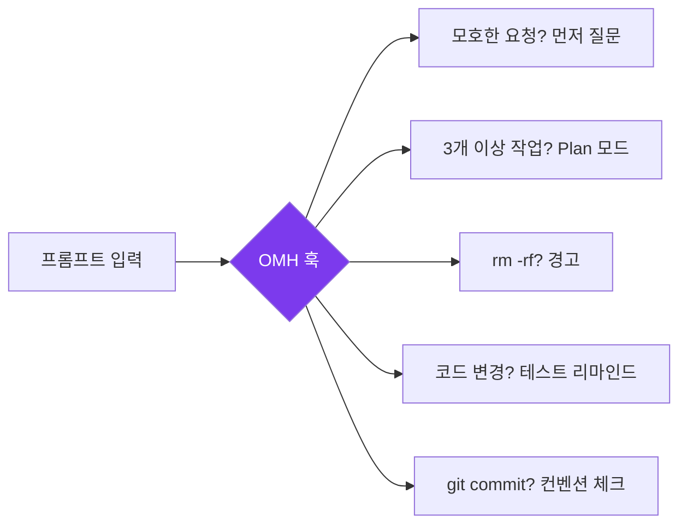
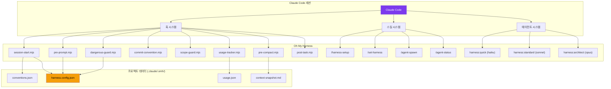
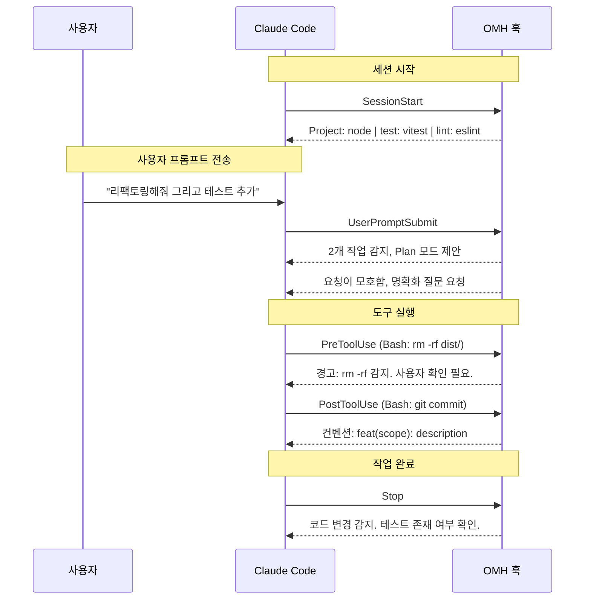
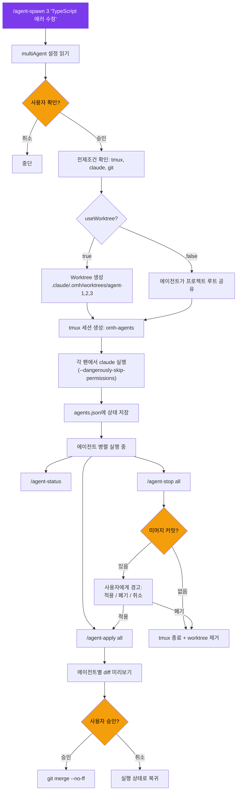
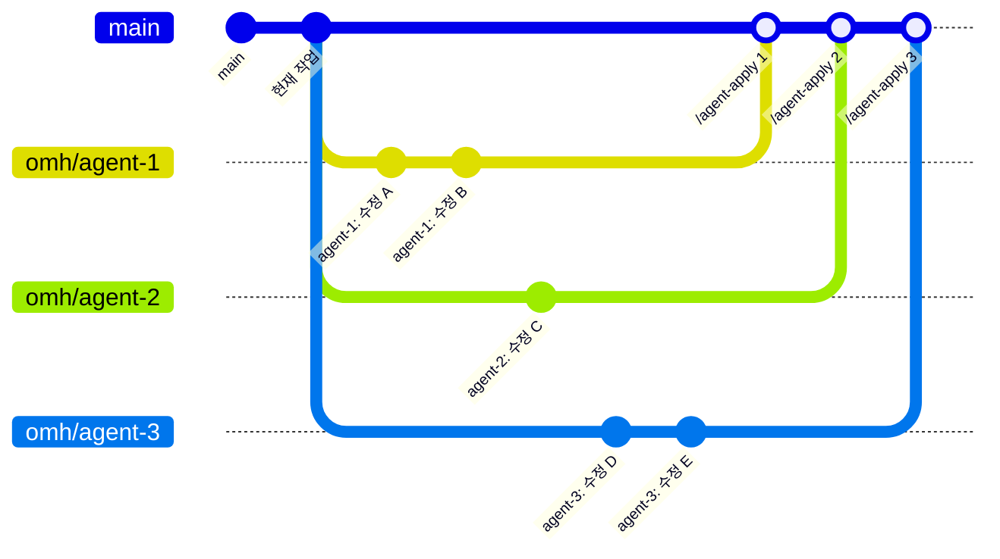

<p align="center">
  
  
  = 18" />
  
  
</p>

<h1 align="center">Oh My Harness</h1>

<p align="center">
  <strong>가벼운 Claude Code 하네스. 설정 없이 바로 사용.</strong><br/>
  스마트 기본값, 테스트 강제, 모델 라우팅, 멀티 에이전트 오케스트레이션 — 모두 네이티브 훅으로 동작합니다.
</p>

<p align="center">
  <a href="README.md">English</a> &middot;
  <a href="#빠른-시작">빠른 시작</a> &middot;
  <a href="#기능-목록">기능</a> &middot;
  <a href="#멀티-에이전트-시스템">멀티 에이전트</a> &middot;
  <a href="#설정">설정</a> &middot;
  <a href="#cli-명령어">CLI 레퍼런스</a>
</p>

---

## 왜 Oh My Harness인가?

Claude Code는 기본적으로 강력하지만 — 테스트를 강제하지 않고, `rm -rf` 전에 경고하지 않으며, 요청의 복잡도에 상관없이 동일하게 처리합니다.

**Oh My Harness (OMH)**는 Claude Code의 네이티브 훅 시스템을 활용하여 스마트한 기본값을 추가합니다. 무거운 플러그인도, 런타임 오버헤드도 없습니다 — 훅, 스킬, CLAUDE.md 지시문만으로 모든 세션을 더 안전하고 생산적으로 만듭니다.



---

## 상태 표시줄 (HUD)

OMH는 Claude Code의 기본 상태 표시줄을 실시간 대시보드로 대체합니다:

```
[OMH] | 5h:14%(3h51m) | wk:7%(6d5h) | session:29m | ctx:39% | 🔧53 | agents:2 | opus-4-6
```

| 항목 | 의미 |
|------|------|
| `5h:14%(3h51m)` | 5시간 사용량 14%, 3시간 51분 후 리셋 |
| `wk:7%(6d5h)` | 주간 사용량 7%, 6일 5시간 후 리셋 |
| `session:29m` | 현재 세션 지속 시간 |
| `ctx:39%` | 컨텍스트 윈도우 사용률 (초록 → 70%에서 노랑 → 85%에서 빨강) |
| `🔧53` | 이 세션의 총 도구 호출 수 |
| `agents:2` | 현재 실행 중인 서브에이전트 수 |
| `opus-4-6` | 사용 중인 모델 |

> 사용량 데이터는 Anthropic OAuth API에서 가져오며 90초 동안 캐시됩니다.

---

## 스마트 기본값 — OMH가 자동으로 하는 것들

OMH는 Claude Code의 생명주기에 훅으로 연결되어 자동으로 동작합니다. 수동 설정이 필요 없습니다.

```
┌─────────────────────────────────────────────────────────────────┐
│  프롬프트 입력                                                    │
│                                                                 │
│  ┌──────────────────────┐   ┌──────────────────────┐            │
│  │ 🔍 모호성 가드        │   │ 📋 자동 Plan 모드     │            │
│  │ 모호한 요청?          │   │ 3개 이상 작업 감지?    │            │
│  │ → 범위를 먼저 질문     │   │ → 계획 수립 제안      │            │
│  └──────────────────────┘   └──────────────────────┘            │
│                                                                 │
│  Claude 작업 시작                                                │
│                                                                 │
│  ┌──────────────────────┐   ┌──────────────────────┐            │
│  │ 🛡️ 위험 명령 가드     │   │ 📁 스코프 가드        │            │
│  │ rm -rf / force push? │   │ 허용 경로 밖 수정?     │            │
│  │ → 경고 + 확인         │   │ → 경고               │            │
│  └──────────────────────┘   └──────────────────────┘            │
│                                                                 │
│  ┌──────────────────────┐   ┌──────────────────────┐            │
│  │ 🤖 모델 라우팅        │   │ 📝 커밋 컨벤션        │            │
│  │ 작업 복잡도에 따라     │   │ git commit 감지?      │            │
│  │ 적절한 모델로 위임:    │   │ → 형식 안내           │            │
│  │ haiku/sonnet/opus    │   │                       │            │
│  └──────────────────────┘   └──────────────────────┘            │
│                                                                 │
│  작업 완료                                                       │
│                                                                 │
│  ┌──────────────────────┐   ┌──────────────────────┐            │
│  │ ✅ 테스트 강제         │   │ 💾 컨텍스트 스냅샷     │            │
│  │ 코드 변경됨?          │   │ 컨텍스트 압축 예정?    │            │
│  │ → 테스트 존재 확인     │   │ → 상태 먼저 저장      │            │
│  └──────────────────────┘   └──────────────────────┘            │
└─────────────────────────────────────────────────────────────────┘
```

### 모델 라우팅 상세

Claude가 서브에이전트에 작업을 위임할 때, OMH가 자동으로 적절한 모델을 선택합니다:

| 에이전트 계층 | 모델 | 사용 시점 | 예시 |
|:----------:|:-----:|-----------|------|
| `harness:quick` | **Haiku** | 단순 조회, 탐색 | "TODO 코멘트 찾아줘", "이 파일 뭐야?" |
| `harness:standard` | **Sonnet** | 구현, 수정 | "이 버그 수정해줘", "유효성 검사 추가", "테스트 작성" |
| `harness:architect` | **Opus** | 설계, 분석 | "인증 시스템 설계해줘", "보안 리뷰", "복잡한 리팩토링" |

현재 사용 중인 모델은 항상 HUD 상태 표시줄에서 확인할 수 있습니다.

### 기능 태그 — `[omh:*]`

모든 OMH 동작에는 태그가 붙어서, 어떤 기능이 발동했는지 항상 알 수 있습니다:

```
[omh:ambiguity-guard]    → 모호한 요청에 대해 명확화 질문
[omh:auto-plan]          → 3개 이상 작업 감지, plan 모드 제안
[omh:dangerous-guard]    → 파괴적 명령 전 경고
[omh:model-routing → sonnet] → 구현 작업을 sonnet에 위임
[omh:test-enforcement]   → 코드 변경 후 테스트 확인 리마인드
[omh:commit-convention]  → git commit 후 커밋 형식 안내
[omh:scope-guard]        → 허용 경로 밖 수정 경고
[omh:convention-detect]  → 세션 시작 시 프로젝트 컨벤션 감지
[omh:context-snapshot]   → 컨텍스트 압축 전 상태 저장
```

세션 출력 예시:
```
⏺ [omh:convention-detect] Project: node | test: vitest | lint: eslint
  ...
⏺ [omh:ambiguity-guard] 요청이 모호합니다. 구체적 범위를 확인합니다.
  ...
⏺ [omh:model-routing → haiku] TODO 코멘트를 찾고 있습니다...
  ...
⏺ [omh:model-routing → sonnet] 인증 미들웨어를 구현합니다...
  ...
⏺ [omh:dangerous-guard] WARNING: rm -rf 감지. 사용자 확인 필요.
  ...
⏺ [omh:test-enforcement] 코드 변경 감지. 테스트 존재 여부 확인.
```

---

## 빠른 시작

### 방법 A: Claude Code 플러그인 (권장)

```bash
# 1. 마켓플레이스 등록
claude plugins marketplace add https://github.com/Hoya324/oh-my-harness

# 2. 플러그인 설치
claude plugins install oh-my-harness

# 3. Claude Code 재시작 후 프로젝트 설정 초기화:
/harness-setup
```

### 방법 B: npm CLI

```bash
npm install -g oh-my-harness
cd your-project
oh-my-harness init
```

어떤 방법이든, Claude Code를 평소처럼 시작하면 하네스 기능이 자동으로 활성화됩니다.

---

## 온보딩 가이드

처음 사용하는 분들을 위한 단계별 가이드입니다.


### Step 1 — 설치

```bash
# 플러그인 (권장)
claude plugins marketplace add https://github.com/Hoya324/oh-my-harness
claude plugins install oh-my-harness

# 또는 npm
npm install -g oh-my-harness
```

### Step 2 — 셋업

```bash
# 플러그인 모드
/harness-setup

# npm 모드
oh-my-harness init
```

이 단계에서 자동으로 수행되는 작업:
- `.claude/.omh/harness.config.json` 생성 (기본 설정)
- `.gitignore`에 `.claude/.omh/` 추가
- 프로젝트 컨벤션 자동 감지 (언어, 테스트 프레임워크, 린터, 포매터)

### Step 3 — 설정 (선택사항)

기본 설정으로도 충분하지만, 필요에 따라 조정할 수 있습니다:

```bash
# 현재 설정 확인
/set-harness

# 자주 사용하는 설정 예시
/set-harness testEnforcement.minCases 3     # 테스트 케이스 최소 3개
/set-harness features.scopeGuard true       # 파일 수정 범위 제한 활성화
/set-harness scopeGuard.allowedPaths ["src"] # src/ 내부만 수정 허용
```

### Step 4 — 사용

설정 완료 후 Claude Code를 평소처럼 사용하면 됩니다. OMH가 자동으로 동작합니다:

| 상황 | OMH 동작 |
|------|---------|
| 세션 시작 | 프로젝트 컨벤션 감지 및 컨텍스트 주입 |
| "리팩토링해줘" (모호한 요청) | 구체적인 범위를 먼저 질문 |
| 3개 이상의 작업 요청 | Plan 모드 제안 |
| `rm -rf` 실행 시도 | 사용자 확인 요청 경고 |
| `git commit` 실행 | 커밋 컨벤션 형식 안내 |
| 코드 수정 완료 | 테스트 존재 여부 확인 리마인드 |
| 컨텍스트 압축 직전 | 현재 상태 스냅샷 저장 |

### Step 5 — 멀티 에이전트로 확장

병렬 작업이 필요할 때 멀티 에이전트를 활용합니다:

```bash
# 3개의 에이전트를 동시에 실행
/agent-spawn 3 "fix all TypeScript errors in src/"

# 진행 상황 확인
/agent-status

# 완료된 작업 머지
/agent-apply all

# 정리
/agent-stop all
```

> **Tip:** 처음에는 `useWorktree: true` (기본값)로 사용하세요. 각 에이전트가 독립된 git 브랜치에서 작업하므로 충돌 걱정이 없습니다.

---

## 기능 목록

| # | 기능 | 훅 | 기본값 | 설명 |
|:-:|------|-----|:-----:|------|
| 1 | [컨벤션 자동 감지](#1-컨벤션-자동-감지) | `SessionStart` | ON | 프로젝트를 스캔하고 언어/테스트/린트 컨텍스트 주입 |
| 2 | [테스트 강제](#2-테스트-강제) | `Stop` | ON | 코드 변경 후 테스트 확인 리마인드 |
| 3 | [모델 라우팅](#3-모델-라우팅) | CLAUDE.md + agents | ON | 복잡도에 따라 haiku / sonnet / opus로 서브에이전트 라우팅 |
| 4 | [자동 Plan 모드](#4-자동-plan-모드) | `UserPromptSubmit` | ON | 3개 이상 작업 감지 시 계획 수립 제안 |
| 5 | [모호성 가드](#5-모호성-가드) | `UserPromptSubmit` | ON | 모호한 요청에 대해 명확화 강제 |
| 6 | [위험 명령 가드](#6-위험-명령-가드) | `PreToolUse` | ON | `rm -rf`, `git push --force`, `.env` 쓰기 전 경고 |
| 7 | [컨텍스트 스냅샷](#7-컨텍스트-스냅샷) | `PreCompact` | ON | 컨텍스트 압축 전 작업 상태 저장 |
| 8 | [커밋 컨벤션](#8-커밋-컨벤션) | `PostToolUse` | ON | 커밋 형식 안내 (Conventional / Gitmoji) |
| 9 | [스코프 가드](#9-스코프-가드) | `PostToolUse` | OFF | 허용된 경로 외 파일 수정 시 경고 |
| 10 | [사용량 추적](#10-사용량-추적) | `PostToolUse` | ON | 세션별 도구 사용량 기록 |
| 11 | 자동 .gitignore | CLI init | ON | `.claude/.omh/`를 `.gitignore`에 추가 |
| 12 | [멀티 에이전트](#멀티-에이전트-시스템) | `/agent-spawn` | — | tmux + git worktree를 활용한 병렬 Claude 에이전트 |

---

## 동작 방식

OMH는 **Claude Code 플러그인** 또는 **npm CLI** 두 가지 모드로 동작합니다. 둘 다 동일한 결과를 제공합니다: 네이티브 훅, 스킬, CLAUDE.md 지시문.

### 아키텍처



### 훅 파이프라인



### 플러그인 모드 (권장)

플러그인 시스템이 훅 등록과 스킬 로딩을 자동으로 처리합니다:

```
oh-my-harness/                    <- 플러그인 루트 ($CLAUDE_PLUGIN_ROOT)
├── .claude-plugin/
│   ├── plugin.json               <- 플러그인 매니페스트
│   └── marketplace.json          <- 마켓플레이스 목록
├── CLAUDE.md                     <- 시스템 프롬프트 (자동 주입)
├── hooks/
│   ├── hooks.json                <- 훅 등록 ($CLAUDE_PLUGIN_ROOT 사용)
│   ├── lib/output.mjs            <- 공유 출력 헬퍼
│   ├── session-start.mjs         <- 컨벤션 감지
│   ├── pre-prompt.mjs            <- 모호성 + 자동 Plan
│   ├── dangerous-guard.mjs       <- 위험 명령 경고
│   ├── commit-convention.mjs     <- 커밋 형식 안내
│   ├── scope-guard.mjs           <- 경로 제한 경고
│   ├── usage-tracker.mjs         <- 도구 사용량 기록
│   ├── pre-compact.mjs           <- 컨텍스트 스냅샷
│   └── post-task.mjs             <- 테스트 강제
├── skills/                       <- 슬래시 명령어 (자동 등록)
│   ├── harness-setup/SKILL.md    <- /harness-setup
│   ├── set-harness/SKILL.md      <- /set-harness
│   ├── init-project/SKILL.md     <- /init-project
│   ├── agent-spawn/SKILL.md      <- /agent-spawn
│   ├── agent-status/SKILL.md     <- /agent-status
│   ├── agent-apply/SKILL.md      <- /agent-apply
│   └── agent-stop/SKILL.md       <- /agent-stop
└── agents/                       <- 모델 라우팅 에이전트
    ├── quick.md                   <- haiku
    ├── standard.md                <- sonnet
    └── architect.md               <- opus
```

### npm CLI 모드

CLI가 훅과 명령어를 프로젝트의 `.claude/` 디렉토리에 복사합니다:

```
your-project/
└── .claude/
    ├── settings.local.json       <- 훅 등록
    ├── CLAUDE.md                 <- 행동 규칙 추가
    ├── commands/                 <- 슬래시 명령어
    │   ├── set-harness.md
    │   ├── init-project.md
    │   ├── agent-spawn.md
    │   ├── agent-status.md
    │   ├── agent-apply.md
    │   └── agent-stop.md
    └── .omh/                     <- 프로젝트 데이터 (gitignored)
        ├── harness.config.json
        ├── conventions.json
        ├── usage.json
        └── context-snapshot.md
```

---

## 기능 상세

### 1. 컨벤션 자동 감지

세션 시작 시 프로젝트 루트를 스캔하고 감지된 컨벤션을 컨텍스트로 주입합니다. 결과는 1시간 동안 캐시됩니다.

| 프로젝트 파일 | 언어 | 감지 도구 |
|-------------|------|----------|
| `package.json` | Node.js | jest / vitest / mocha, eslint / biome, prettier, typescript / vite / webpack |
| `pyproject.toml` | Python | pytest, ruff / flake8, black, mypy |
| `go.mod` | Go | go test, golangci-lint |
| `Cargo.toml` | Rust | cargo test, clippy, rustfmt |
| `build.gradle` | Java | junit, gradle |
| `pom.xml` | Java | junit, maven |

> 세션 시작 메시지 예시: `[oh-my-harness] Project: node | test: vitest | lint: eslint | fmt: prettier`

### 2. 테스트 강제

코드 변경(Edit / Write / NotebookEdit) 후 세션 종료 시 리마인더를 주입합니다:

- 변경된 코드에 대한 테스트 파일 존재 확인
- 각 테스트 파일에 최소 **N**개의 테스트 케이스 확인 (설정 가능, 기본값: 2)
- 테스트가 없으면 추가 제안

> 테스트는 최소한 **정상 경로**, **엣지 케이스**, **에러 케이스**를 커버해야 합니다.

### 3. 모델 라우팅

비용 효율적인 서브에이전트 위임을 위한 3단계 에이전트 계층:

| 에이전트 | 모델 | 용도 |
|---------|------|------|
| `harness:quick` | haiku | 파일 조회, 간단한 질문, 탐색 |
| `harness:standard` | sonnet | 구현, 버그 수정, 디버깅 |
| `harness:architect` | opus | 아키텍처, 복잡한 분석, 보안 리뷰 |

CLAUDE.md가 작업 복잡도에 따라 적절한 계층으로 자동 위임하도록 Claude에게 지시합니다.

### 4. 자동 Plan 모드

단일 메시지에서 3개 이상의 독립적인 작업을 감지합니다:

- 번호 목록 (`1. 2. 3.`)
- 불릿 포인트 (`-`, `*`)
- 한국어 접속사 (`그리고`, `또한`, `추가로`, `아울러`, `더불어`)

Plan 모드를 제안합니다 — 강제하지 않습니다.

### 5. 모호성 가드

점수 기반 시스템으로 모호한 요청을 감지합니다 (임계값: 2):

| 신호 | 점수 | 예시 |
|------|:----:|------|
| 모호한 지시어 | +1 | "이거 수정해줘", "그거 고쳐" |
| 범위 없는 동사 | +1 | "리팩토링해줘" (파일/함수 대상 없음) |
| 열린 선택지 | +1 | "~하거나", "~든지" |
| 매우 짧은 메시지 | +1 | 15자 미만, 특정 식별자 없음 |
| 영문 범위 없음 | +1 | "fix it", "clean up" (대상 없음) |

점수 >= 임계값일 때, Claude는 작업 시작 전에 **반드시** 명확화 질문을 해야 합니다.

### 6. 위험 명령 가드

잠재적으로 파괴적인 작업 전에 경고합니다:

**Bash 도구 패턴:**

| 패턴 | 경고 |
|------|------|
| `rm -rf`, `rm --force` | 파일 삭제 |
| `git push --force` | 강제 푸시 |
| `git reset --hard` | 하드 리셋 |
| `git clean -f` | Git 정리 |
| `DROP TABLE / DATABASE` | 데이터베이스 파괴 |
| `TRUNCATE TABLE` | 테이블 잘라내기 |
| `DELETE FROM` (WHERE 없음) | 대량 삭제 |
| `chmod 777` | 안전하지 않은 권한 |
| `curl \| sh` | 원격 실행 |
| `npm publish` | 패키지 배포 |
| `docker system prune` | 컨테이너 정리 |

**Write/Edit 도구 패턴:**

| 패턴 | 경고 |
|------|------|
| `.env` 파일 | 환경 변수 시크릿 |
| `credentials` | 인증 정보 파일 |
| `secret` | 시크릿 파일 |
| `id_rsa`, `.pem`, `.key` | 개인 키 파일 |

> 경고만 표시합니다 — 실행을 차단하지 않습니다. Claude에게 사용자 확인을 요청합니다.

### 7. 컨텍스트 스냅샷

컨텍스트 압축(`PreCompact`) 전에 현재 상태를 `.claude/.omh/context-snapshot.md`에 저장합니다:

- 세션 요약
- 활성 작업
- 압축 후 스냅샷 검토 리마인더

### 8. 커밋 컨벤션

`git commit`이 감지되면 커밋 형식을 안내합니다.

**자동 감지 우선순위:**
1. commitlint 설정 파일 -> Conventional Commits
2. `package.json`의 gitmoji 의존성 -> Gitmoji
3. `package.json`의 commitizen -> Conventional Commits
4. 기본값 -> Conventional Commits

```
# Conventional Commits
<type>(<scope>): <description>
# Types: feat, fix, docs, style, refactor, perf, test, build, ci, chore

# Gitmoji
<emoji> <description>
```

### 9. 스코프 가드

`allowedPaths`와 함께 활성화하면, Edit/Write가 허용된 디렉토리 외부 파일을 대상으로 할 때 경고합니다.

```json
{
  "features": { "scopeGuard": true },
  "scopeGuard": { "allowedPaths": ["src/auth", "src/utils"] }
}
```

> 기본적으로 OFF입니다. Claude의 쓰기 범위를 제한하고 싶을 때 활성화하세요.

### 10. 사용량 추적

모든 도구 호출을 `.claude/.omh/usage.json`에 조용히 기록합니다:

```json
{
  "sessions": {
    "session-id": {
      "tool_counts": { "Edit": 5, "Bash": 3, "Read": 12 },
      "total_calls": 20,
      "started_at": "2026-03-23T10:00:00Z",
      "last_tool": "Edit"
    }
  }
}
```

---

## 멀티 에이전트 시스템

tmux 팬에서 병렬 Claude Code 인스턴스를 실행하며, 각각 독립된 git worktree를 갖습니다.

### 명령어

| 명령어 | 설명 |
|--------|------|
| `/agent-spawn [N] [task]` | N개의 에이전트를 worktree와 함께 tmux 팬에서 실행 (기본: 2) |
| `/agent-status` | 모든 에이전트 상태 확인 (커밋, 변경 파일) |
| `/agent-apply [id\|all]` | 에이전트 변경사항을 main에 미리보기 및 머지 (worktree 모드 전용) |
| `/agent-stop [id\|all]` | 에이전트 중지, 미머지 작업 경고, 정리 |

### 워크플로우



### Worktree 브랜칭 모델



### Worktree 모드 vs 공유 모드

| | `useWorktree: true` (기본) | `useWorktree: false` |
|---|---|---|
| **격리** | 각 에이전트가 독립 브랜치에서 작업 | 모든 에이전트가 프로젝트 루트 공유 |
| **충돌** | 병렬 작업 중 불가능 | 가능 — 주의 필요 |
| **`/agent-apply`** | 변경사항 머지에 필수 | 해당 없음 |
| **`/agent-stop`** | 미머지 커밋 경고 | 팬만 종료 |
| **적합한 용도** | 모든 병렬 코드 변경 | 읽기 전용 작업, 분석 |

### 전제조건

- **tmux** — `brew install tmux` (macOS) / `apt install tmux` (Linux)
- **git** — worktree 격리용
- **claude CLI** — PATH에서 사용 가능해야 함

### 안전 정책

- **항상 먼저 묻기** — 사용자 확인 없이 절대 실행하지 않음
- **자동 머지 금지** — `/agent-apply`는 항상 diff를 보여주고 승인을 기다림
- **조용한 폐기 금지** — 미머지 커밋이 있는 `/agent-stop`은 명시적 선택 필요
- **`--dangerously-skip-permissions`** — 에이전트가 도구 확인을 건너뜀; 사용자에게 항상 사전 고지
- **최대 에이전트 수** — `multiAgent.maxAgents`로 제한 (기본값: 4)

---

## 설정

모든 설정은 `.claude/.omh/harness.config.json`에 있습니다:

```json
{
  "version": 1,
  "features": {
    "conventionSetup": true,
    "testEnforcement": true,
    "contextOptimization": true,
    "autoPlanMode": true,
    "ambiguityDetection": true,
    "dangerousGuard": true,
    "contextSnapshot": true,
    "commitConvention": true,
    "scopeGuard": false,
    "usageTracking": true,
    "autoGitignore": true
  },
  "testEnforcement": { "minCases": 2, "promptOnMissing": true },
  "modelRouting": { "quick": "haiku", "standard": "sonnet", "complex": "opus" },
  "autoPlan": { "threshold": 3 },
  "ambiguityDetection": { "threshold": 2, "language": "auto" },
  "commitConvention": { "style": "auto" },
  "scopeGuard": { "allowedPaths": [] },
  "multiAgent": { "maxAgents": 4, "useWorktree": true, "tmuxSession": "omh-agents" }
}
```

### 설정 변경

```bash
/set-harness                                # 현재 설정 전체 보기
/set-harness features.scopeGuard true       # 스코프 가드 활성화
/set-harness testEnforcement.minCases 3     # 테스트 케이스 3개 이상 요구
/set-harness modelRouting.standard opus     # 구현에 opus 사용
/set-harness commitConvention.style gitmoji # gitmoji로 전환
/set-harness multiAgent.maxAgents 6         # 최대 6개 에이전트 허용
```

### 설정 레퍼런스

| 경로 | 타입 | 기본값 | 설명 |
|------|------|--------|------|
| `features.conventionSetup` | bool | `true` | 프로젝트 컨벤션 자동 감지 |
| `features.testEnforcement` | bool | `true` | 변경 후 테스트 리마인드 |
| `features.contextOptimization` | bool | `true` | 모델 라우팅 활성화 |
| `features.autoPlanMode` | bool | `true` | 다중 작업 시 Plan 모드 제안 |
| `features.ambiguityDetection` | bool | `true` | 모호한 요청에 명확화 강제 |
| `features.dangerousGuard` | bool | `true` | 파괴적 명령 전 경고 |
| `features.contextSnapshot` | bool | `true` | 압축 전 상태 저장 |
| `features.commitConvention` | bool | `true` | 커밋 형식 안내 |
| `features.scopeGuard` | bool | `false` | 파일 수정 범위 제한 |
| `features.usageTracking` | bool | `true` | 도구 사용량 추적 |
| `features.autoGitignore` | bool | `true` | .gitignore 자동 업데이트 |
| `testEnforcement.minCases` | number | `2` | 파일당 최소 테스트 케이스 |
| `testEnforcement.promptOnMissing` | bool | `true` | 테스트 미존재 시 알림 |
| `modelRouting.quick` | string | `haiku` | 탐색용 모델 |
| `modelRouting.standard` | string | `sonnet` | 구현용 모델 |
| `modelRouting.complex` | string | `opus` | 아키텍처용 모델 |
| `autoPlan.threshold` | number | `3` | 자동 Plan 트리거 작업 수 |
| `ambiguityDetection.threshold` | number | `2` | 명확화 트리거 점수 |
| `commitConvention.style` | string | `auto` | `auto` / `conventional` / `gitmoji` |
| `scopeGuard.allowedPaths` | string[] | `[]` | 허용 디렉토리 (빈 배열 = 제한 없음) |
| `multiAgent.maxAgents` | number | `4` | 최대 병렬 에이전트 수 |
| `multiAgent.useWorktree` | bool | `true` | 격리를 위한 git worktree 사용 |
| `multiAgent.tmuxSession` | string | `omh-agents` | tmux 세션 이름 |

---

## CLI 명령어

```bash
oh-my-harness init      # 현재 프로젝트에 하네스 설정
oh-my-harness update    # 설정에서 세팅 재생성
oh-my-harness status    # 현재 설정 표시
oh-my-harness reset     # 모든 하네스 파일 제거 (완전 삭제)
```

## 슬래시 명령어 (스킬)

| 명령어 | 설명 |
|--------|------|
| `/harness-setup` | oh-my-harness 초기화 (플러그인 모드) |
| `/set-harness [경로] [값]` | 하네스 설정 보기 또는 수정 |
| `/init-project` | 컨벤션 감지 및 테스트 인프라 설정 |
| `/agent-spawn [N] [작업]` | N개의 병렬 Claude 에이전트를 tmux에서 실행 |
| `/agent-status` | 실행 중인 에이전트 상태 확인 |
| `/agent-apply [id\|all]` | 에이전트 worktree 변경사항 머지 |
| `/agent-stop [id\|all]` | 에이전트 중지 및 정리 |

---

## OMC 호환성

Oh My Harness는 [Oh My ClaudeCode](https://github.com/yeachan-heo/oh-my-claudecode)와 충돌 없이 공존합니다:

| 항목 | OMH | OMC |
|------|-----|-----|
| CLAUDE.md 마커 | `<!-- HARNESS:START/END -->` | `<!-- OMC:START/END -->` |
| 훅 네임스페이스 | `.omh/hooks/` | OMC 플러그인 훅 |
| 스킬 접두사 | (없음) | `oh-my-claudecode:` |
| 에이전트 접두사 | `harness:` | `oh-my-claudecode:` |
| 킬 스위치 | `DISABLE_HARNESS=1` | `DISABLE_OMC=1` |

두 플러그인을 동시에 설치해도 충돌이 발생하지 않습니다.

---

## 비활성화 / 삭제

```bash
# 일시적 비활성화 (환경 변수)
DISABLE_HARNESS=1 claude

# 플러그인 모드 — 삭제
claude plugins uninstall oh-my-harness

# npm 모드 — 완전 제거
oh-my-harness reset
npm uninstall -g oh-my-harness
```

## 요구사항

- **Node.js** >= 18
- **Claude Code** CLI
- **tmux** — 멀티 에이전트 전용 (`brew install tmux`)
- **git** — worktree 격리용

## 라이선스

MIT
