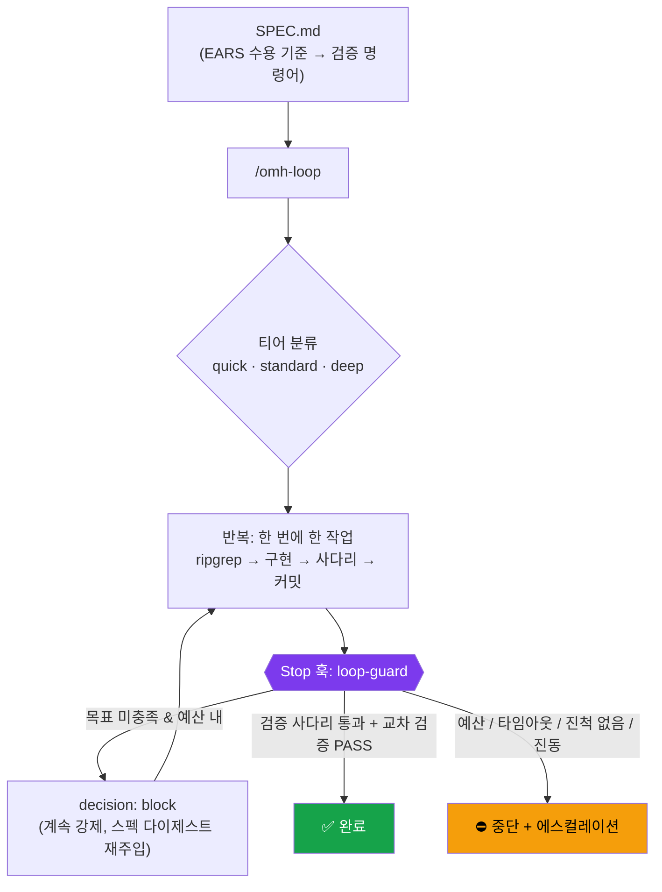
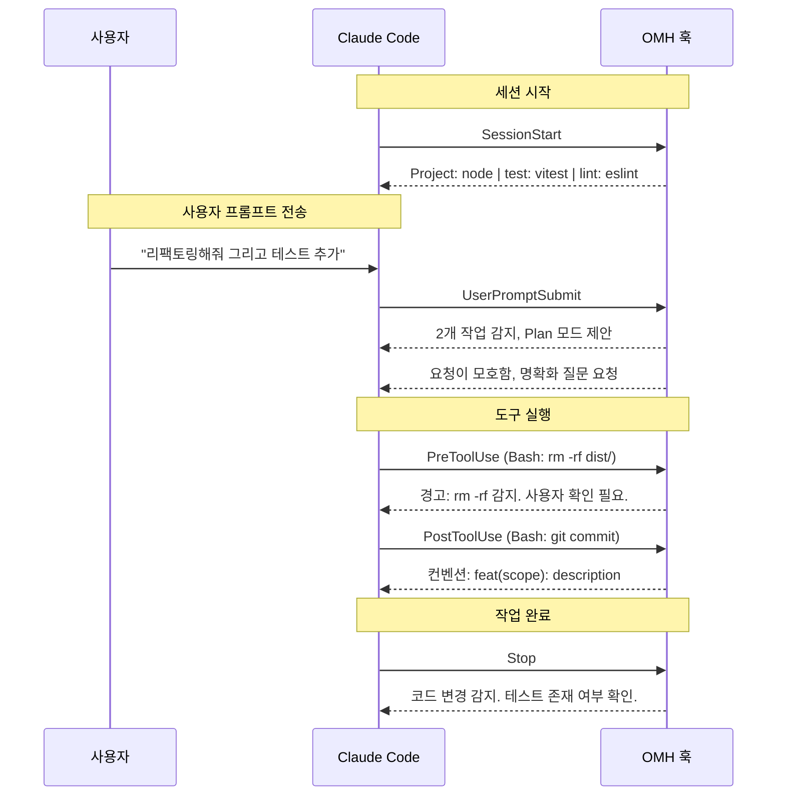
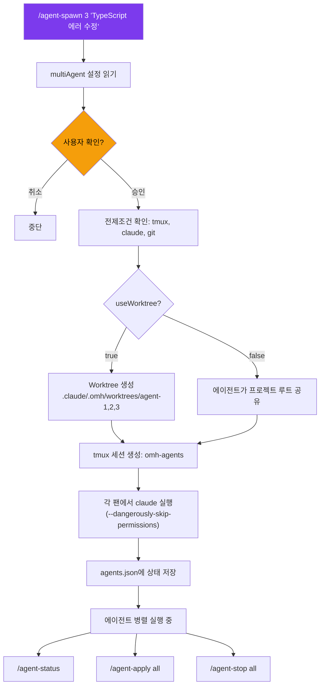
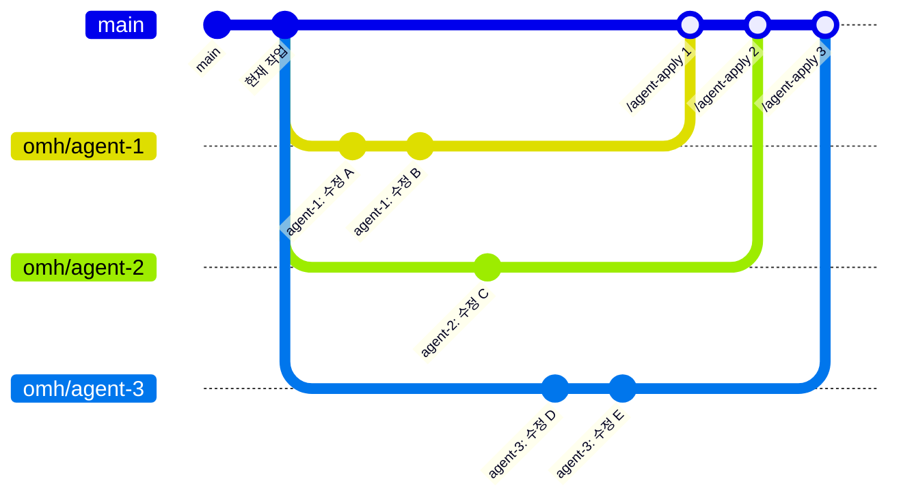
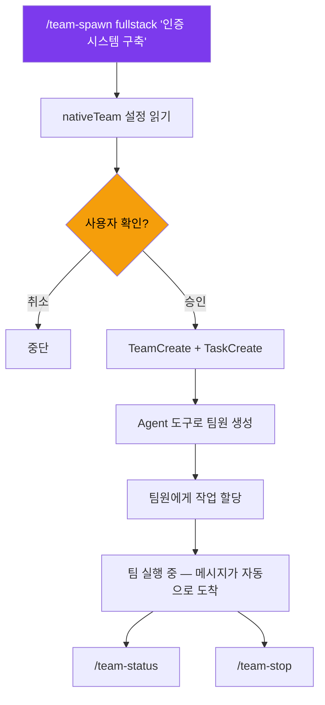

<p align="center">
  
  
  = 18" />
  
  
</p>

<h1 align="center">Oh My Harness</h1>

<p align="center">
  <strong>스펙 기반 자율 Claude Code 하네스. 목표만 정의하면 — 끝날 때까지 루프를 돕니다.</strong><br/>
  스스로 검증하고 교차 검증하는 자율 루프에, 스마트 기본값, 테스트 강제, 모델 라우팅, 멀티 에이전트 오케스트레이션까지 — 모두 네이티브 훅으로 동작합니다.
</p>

<p align="center">
  <a href="README.md">English</a> &middot;
  <a href="#빠른-시작">빠른 시작</a> &middot;
  <a href="docs/features.ko.md">기능</a> &middot;
  <a href="docs/multi-agent.ko.md">멀티 에이전트</a> &middot;
  <a href="docs/configuration.ko.md">설정</a> &middot;
  <a href="docs/architecture.ko.md">아키텍처</a>
</p>

---

## 왜 Oh My Harness인가?

Claude Code는 기본적으로 강력하지만 — 일이 끝나지 않았는데도 턴이 끝나면 멈추고, 자신의 작업을 목표에 비춰 검증하지 않으며, 요청의 복잡도에 상관없이 모두 동일하게 처리합니다.

**Oh My Harness (OMH)**는 Claude Code를 **스펙 기반 자율 하네스**로 바꿉니다. 목표를 `SPEC.md`에 한 번만 정의하면, OMH가 구현하고 스스로 검증하고 교차 검증하는 *루프*를 돌려 스펙이 객관적으로 충족될 때까지 진행합니다. 루프는 Claude Code의 네이티브 훅 위에서 동작하므로, **언제 계속하고 언제 멈출지는 하네스가 결정합니다** — 모델의 자기 판단이 아닙니다. 루프를 둘러싼 곳에는 모든 세션을 더 안전하게 만드는 동일한 가벼운 스마트 기본값(테스트 강제, 위험 명령 가드, 모델 라우팅, 멀티 에이전트)이 그대로 자리합니다.


```mermaid
graph LR
    A[프롬프트 입력] --> B{OMH 훅}
    B --> C["모호한 요청? 먼저 질문"]
    B --> D["3개 이상 작업? Plan 모드"]
    B --> E["rm -rf? 경고"]
    B --> F["코드 변경? 테스트 리마인드"]
    B --> G["git commit? 컨벤션 체크"]
    style B fill:#7C3AED,color:#fff
```

---

## 철학

**진짜 벽이 있는 자율성 (Autonomy with real walls).**

이전의 OMH는 "벽이 아니라 경고"를 지향했습니다. 자율 루프는 정작 중요한 곳에서 이 방향을 바꿉니다. 멈출 수 없는 루프는 위험하고, 너무 일찍 멈추는 루프는 쓸모가 없습니다 — 그래서 루프에는 **진짜 벽**이 있습니다. 목표가 충족되지 않았고 예산 안에 있는 동안 하네스는 *계속을 강제*하고, 객관적 신호(검증 사다리 통과 + 교차 검증, 또는 반복/벽시계 예산·진척 없음·진동 같은 가드레일)가 발생하면 *종료를 강제*합니다. 모델이 스스로 "끝났다"고 판단하는 일은 없습니다 — 기계가 검증 가능한 수용 기준에 비추어 하네스가 판단합니다.

그 외의 모든 곳에서 OMH는 거의 의식하지 못할 만큼 가벼운 하네스로 남습니다 — 경고로 안내하는 스마트 기본값과, 감지된 스택에서 자동 스캐폴딩되어 직접 소유하고 커스터마이즈하는 **프로젝트 전용 스킬**(테스트 컨벤션, 리뷰 체크리스트, 린트 워크플로우)이 그것입니다.

- **내장 스킬**(에이전트 관리, 설정)은 플러그인에 남습니다
- **프로젝트 스킬**(code-review, test-write, lint-fix)은 `.claude/skills/`에 위치합니다 — 당신의 프로젝트, 당신의 규칙
- `/init-project`로 스캐폴딩한 뒤 자유롭게 커스터마이즈하세요

---

## 빠른 시작

Claude Code 플러그인 마켓플레이스로 설치하세요 — 한 번에 복사·붙여넣기:

```bash
claude plugin marketplace add Hoya324/oh-my-harness
claude plugin install oh-my-harness@oh-my-harness
```

이게 전부입니다. **설정은 전혀 필요 없습니다** — OMH는 설치되는 순간 합리적인 기본값으로 동작하고, 하네스 기능(자율 루프 포함)이 자동으로 활성화됩니다. `/harness-setup`은 선택 사항이며, `harness.config.json`을 직접 조정하고 싶을 때만 사용하면 됩니다.

---

## 업데이트

새 버전이 출시되면 최신 훅, 감지 패턴, 기능을 적용할 수 있습니다.

```bash
# 최신 플러그인 버전 가져오기
claude plugin update oh-my-harness@oh-my-harness

# 업데이트된 훅과 사전 적용을 위해 재초기화
/harness-setup
```

> **참고:** 업데이트는 기존 `harness.config.json`을 보존합니다. 훅, 명령어, CLAUDE.md 지시문만 갱신됩니다.

---

## 기능 목록

OMH의 기능은 세 그룹으로 나뉩니다 — 모든 세션에서 자동으로 동작하는 **자동 가드**, 사용자가 직접 호출하는 **자율 실행**, 그리고 이를 가로지르는 **라우팅·스캐폴딩·관측** 레이어.

### A. 자동 가드 & 라우팅 — 항상 켜짐

| 기능 | 훅 | 기본값 | 설명 |
|------|-----|:-----:|------|
| 컨벤션 자동 감지 | `SessionStart` | ON | 프로젝트를 스캔하고 언어/테스트/린트 컨텍스트 주입 |
| 무게 라우팅 (Tier 1/2/3) | `UserPromptSubmit` | ON | 프롬프트 무게를 분류해 가드 강도 조절; Tier 3은 완료 전 검증 강제 |
| 모호성 가드 | `UserPromptSubmit` | ON | 모호한 요청에 대해 명확화 강제 |
| 자동 Plan 모드 | `UserPromptSubmit` | ON | 3개 이상 작업 감지 시 계획 수립 제안 |
| 위험 명령 가드 | `PreToolUse` | ON | `rm -rf`, `git push --force`, `.env` 쓰기 전 경고 |
| 커밋 컨벤션 | `PostToolUse` | ON | 커밋 형식 안내 (Conventional / Gitmoji) |
| 스코프 가드 | `PostToolUse` | OFF | 허용된 경로 외 파일 수정 시 경고 |
| 사용량 추적 | `PostToolUse` | ON | 세션별 도구 사용량 기록 |
| 테스트 강제 | `Stop` | ON | 코드 변경 후 테스트 확인 리마인드 |
| 검증 게이트 | `Stop` (verify-gate) | ON | 매 턴 diff 위험도를 판단해 verify 사다리를 직접 실행; 민감/무테스트 변경이 red면 차단 (세션을 가두지 않음) |
| 컨텍스트 스냅샷 | `PreCompact` | ON | 컨텍스트 압축 전 작업 상태 저장 |
| Living State (`STATE.md`) | `SessionStart` / `PreCompact` | ON | 디스크 앵커 목표/phase/결정을 세션 넘어 재주입해 context rot 방어 |

### B. 자율 실행 — 직접 호출

| 기능 | 트리거 | 기본값 | 설명 |
|------|--------|:-----:|------|
| **자율 루프** | `Stop` (loop-guard) + `/omh-loop` | ON | 스펙 기반 루프: 검증 사다리 + 교차 검증이 완료를 확인할 때까지 계속을 강제하며, 티어별 가드레일(예산, 타임아웃, 진척 없음, 진동)을 적용 |
| 스펙 작성 | `/omh-spec` | ON | 기계가 검증 가능한 `SPEC.md`(EARS 수용 기준 → 검증 명령어)를 작성해 루프의 기준점으로 삼음 |
| N-라운드 검증 | `/omh-verify` | — | 모델 로테이션(Claude → GPT/codex → Gemini)으로 N회 독립 검증+수정; 외부 검증자는 읽기 전용 |
| 네이티브 팀 | `/team-spawn` | ON | Claude Code 내장 팀 오케스트레이션 (템플릿 지원) |
| 멀티 에이전트 | `/agent-spawn` | — | tmux + git worktree를 활용한 병렬 Claude 에이전트 |

### C. 라우팅·스캐폴딩·관측

| 기능 | 트리거 | 기본값 | 설명 |
|------|--------|:-----:|------|
| 모델 라우팅 | CLAUDE.md + agents | ON | 복잡도에 따라 haiku / sonnet / opus로 서브에이전트 라우팅 |
| 스킬 스캐폴딩 | `/init-project` | ON | 감지된 스택에 맞춰 프로젝트 전용 스킬 자동 생성 |
| 자동 .gitignore | CLI init | ON | `.claude/.omh/`를 `.gitignore`에 추가 |
| 상태 HUD | 상태 표시줄 | ON | 레이트리밋·컨텍스트·도구 호출·모델 실시간 대시보드 |

> 각 기능의 상세 설명은 [기능 문서](docs/features.ko.md)와 [자율 루프 가이드](docs/loop.ko.md)를 참고하세요.

---

## 자율 루프

목표를 한 번만 정의하면, OMH가 객관적으로 충족될 때까지 루프를 돕니다.

```bash
/omh-spec add JWT auth with refresh tokens   # 기계가 검증 가능한 SPEC.md 작성
/omh-loop SPEC.md                             # 자율적으로 실행
/omh-loop stop                                # 킬 스위치 (또는 .claude/.omh/STOP 생성)
```

**동작 방식** — Stop 훅(`loop-guard`)이 루프 엔진이자 안전 집행자입니다:


```mermaid
graph TD
    SPEC["SPEC.md<br/>(EARS 수용 기준 → 검증 명령어)"] --> START["/omh-loop"]
    START --> TIER{"티어 분류<br/>quick · standard · deep"}
    TIER --> ITER["반복: 한 번에 한 작업<br/>ripgrep → 구현 → 사다리 → 커밋"]
    ITER --> STOP{{"Stop 훅: loop-guard"}}
    STOP -->|"목표 미충족 & 예산 내"| CONT["decision: block<br/>(계속 강제, 스펙 다이제스트 재주입)"]
    CONT --> ITER
    STOP -->|"검증 사다리 통과 + 교차 검증 PASS"| DONE["✅ 완료"]
    STOP -->|"예산 / 타임아웃 / 진척 없음 / 진동"| GUARD["⛔ 중단 + 에스컬레이션"]
    style STOP fill:#7C3AED,color:#fff
    style DONE fill:#16a34a,color:#fff
    style GUARD fill:#f59e0b,color:#000
```

- **저비용 우선 검증 사다리** — 결정론적 검사(린트/타입체크 → 테스트/빌드)가 먼저 빠르게 실패하며 *실제* 실패 출력을 되먹입니다. 비싼 모델 심판은 통과(green) 상태에서만 실행됩니다.
- **교차 검증** — *다른* 모델(opus)이 각 수용 기준을 (에이전트의 자기 보고가 아닌) 저장소 상태에 비춰 채점하고, revert-and-rerun 변이 검사를 수행한 뒤 `PASS | FAIL | INCONCLUSIVE`를 반환합니다 (INCONCLUSIVE는 안전하게 중단으로 귀결).
- **티어별 예산** — `quick`(≤3회) · `standard`(≤8회) · `deep`(≤20회), 각각 벽시계 상한과 교차 검증 정책을 가집니다.
- **진짜 가드레일** — 티어별 & 티어 교차 반복 상한, 벽시계 타임아웃, 진척 없음/정체 및 진동 감지, `stop_hook_active` 자가 루프 가드, 동시 세션/worktree 격리, 원자적 상태 쓰기, fail-open, 그리고 `STOP` 킬 스위치.

설계와 그 근거가 된 연구(Ralph Wiggum 루프, Reflexion, Chain-of-Verification, FrugalGPT 스타일 캐스케이드, EARS)는 [docs/loop.ko.md](docs/loop.ko.md)에 정리되어 있습니다.

---

## 아키텍처

> 전체 내용: [docs/architecture.ko.md](docs/architecture.ko.md)

OMH는 **네 개의 계층**으로 구성됩니다. 핵심 판단 로직은 순수하게 유지되어 단위 테스트되고, 외부 세계와 맞닿는 훅은 얇고 fail-open 하게 유지됩니다.

| 계층 | 구성 요소 | 역할 |
|------|-----------|------|
| **① 훅** | Claude Code 생명주기 이벤트 위의 9개 `.mjs` | 얇은 **fail-open** 래퍼 — 부수효과 신호(git, 시간, stdin)를 모아 판단을 출력 |
| **② 순수 코어** (`lib/`) | `loop` · `tier` · `detect` · `config` · `verify` · `state` · `dictionary` | 모든 판단 로직을 **순수 함수**(fs / git / 시간 없음)로 → 완전한 단위 테스트 |
| **③ 스킬** | 12개 슬래시 명령어 | 사용자 호출 워크플로우 (`/omh-loop`, `/omh-verify`, `/team-spawn`, …) |
| **④ 에이전트** | `quick` · `standard` · `architect` | 모델 라우팅 — 작업 무게에 따라 haiku / sonnet / opus |


```mermaid
graph TB
    subgraph "Claude Code 세션"
        direction TB
        CC[Claude Code] --> HOOKS[훅 시스템]
        CC --> SKILLS[스킬 시스템]
        CC --> AGENTS[에이전트 시스템]
    end

    subgraph "Oh My Harness"
        direction TB
        HOOKS --> H1[session-start.mjs]
        HOOKS --> H2[pre-prompt.mjs]
        HOOKS --> H3[dangerous-guard.mjs]
        HOOKS --> H4[commit-convention.mjs]
        HOOKS --> H5[scope-guard.mjs]
        HOOKS --> H6[usage-tracker.mjs]
        HOOKS --> H7[pre-compact.mjs]
        HOOKS --> H8[post-task.mjs]
        HOOKS --> H9[loop-guard.mjs]

        SKILLS --> S1["/harness-setup"]
        SKILLS --> S2["/set-harness"]
        SKILLS --> S3["/agent-spawn"]
        SKILLS --> S4["/team-spawn"]
        SKILLS --> S5["/omh-spec"]
        SKILLS --> S6["/omh-loop"]

        AGENTS --> A1["harness:quick (haiku)"]
        AGENTS --> A2["harness:standard (sonnet)"]
        AGENTS --> A3["harness:architect (opus)"]
    end

    subgraph "프로젝트 데이터 (.claude/.omh/)"
        CONFIG[harness.config.json]
        CONV[conventions.json]
        USAGE[usage.json]
        SNAP[context-snapshot.md]
        LOOP[loop-state.json]
    end

    H1 --> CONV
    H6 --> USAGE
    H7 --> SNAP
    H9 --> LOOP
    H1 --> CONFIG
    H2 --> CONFIG
    H3 --> CONFIG

    style CC fill:#7C3AED,color:#fff
    style CONFIG fill:#f59e0b,color:#000
```

## 훅 파이프라인

각 Claude Code 생명주기 이벤트가 OMH 훅 하나를 트리거합니다 — `Stop` 이벤트가 자율 루프가 사는 곳입니다:

| 생명주기 이벤트 | 훅 | 동작 |
|-----------------|-----|------|
| `SessionStart` | `session-start.mjs` | 컨벤션 감지 · `STATE.md` 주입 |
| `UserPromptSubmit` | `pre-prompt.mjs` | 무게 티어 · 모호성 가드 · 자동 Plan |
| `PreToolUse` | `dangerous-guard.mjs` | 위험 명령 경고 |
| `PostToolUse` | `commit-convention` · `scope-guard` · `usage-tracker` | 커밋 형식 · 스코프 · 사용량 통계 |
| `PreCompact` | `pre-compact.mjs` | 컨텍스트 스냅샷 · `STATE.md` 갱신 |
| `Stop` | **`loop-guard.mjs`** · **`verify-gate.mjs`** · `post-task.mjs` | **자율 루프 엔진** · **위험도 기반 검증 게이트** · 테스트 강제 |


```mermaid
sequenceDiagram
    participant U as 사용자
    participant CC as Claude Code
    participant OMH as OMH 훅

    Note over CC,OMH: 세션 시작
    CC->>OMH: SessionStart
    OMH-->>CC: Project: node | test: vitest | lint: eslint

    Note over U,CC: 사용자 프롬프트 전송
    U->>CC: "리팩토링해줘 그리고 테스트 추가"
    CC->>OMH: UserPromptSubmit
    OMH-->>CC: 2개 작업 감지, Plan 모드 제안
    OMH-->>CC: 요청이 모호함, 명확화 질문 요청

    Note over CC,OMH: 도구 실행
    CC->>OMH: PreToolUse (Bash: rm -rf dist/)
    OMH-->>CC: 경고: rm -rf 감지. 사용자 확인 필요.

    CC->>OMH: PostToolUse (Bash: git commit)
    OMH-->>CC: 컨벤션: feat(scope): description

    Note over CC,OMH: 작업 완료
    CC->>OMH: Stop
    OMH-->>CC: 코드 변경 감지. 테스트 존재 여부 확인.
```

## 멀티 에이전트

> 전체 내용: [docs/multi-agent.ko.md](docs/multi-agent.ko.md)


```mermaid
graph TD
    START["/agent-spawn 3 'TypeScript 에러 수정'"] --> CONFIG[multiAgent 설정 읽기]
    CONFIG --> CONFIRM{"사용자 확인?"}
    CONFIRM -->|취소| ABORT[중단]
    CONFIRM -->|승인| CHECK["전제조건 확인: tmux, claude, git"]
    CHECK --> WT{"useWorktree?"}

    WT -->|true| CREATE_WT["Worktree 생성<br/>.claude/.omh/worktrees/agent-1,2,3"]
    WT -->|false| SHARED[에이전트가 프로젝트 루트 공유]

    CREATE_WT --> TMUX["tmux 세션 생성: omh-agents"]
    SHARED --> TMUX

    TMUX --> LAUNCH["각 팬에서 claude 실행<br/>(--dangerously-skip-permissions)"]
    LAUNCH --> STATE[agents.json에 상태 저장]
    STATE --> DONE[에이전트 병렬 실행 중]

    DONE --> STATUS["/agent-status"]
    DONE --> APPLY["/agent-apply all"]
    DONE --> STOP["/agent-stop all"]

    style START fill:#7C3AED,color:#fff
    style CONFIRM fill:#f59e0b,color:#000
```


```mermaid
gitGraph
    commit id: "main"
    commit id: "현재 작업"
    branch omh/agent-1
    branch omh/agent-2
    branch omh/agent-3
    checkout omh/agent-1
    commit id: "agent-1: 수정 A"
    commit id: "agent-1: 수정 B"
    checkout omh/agent-2
    commit id: "agent-2: 수정 C"
    checkout omh/agent-3
    commit id: "agent-3: 수정 D"
    commit id: "agent-3: 수정 E"
    checkout main
    merge omh/agent-1 id: "/agent-apply 1"
    merge omh/agent-2 id: "/agent-apply 2"
    merge omh/agent-3 id: "/agent-apply 3"
```

## 네이티브 팀

> 전체 내용: [docs/multi-agent.ko.md](docs/multi-agent.ko.md#네이티브-팀-시스템)

tmux도, worktree도 필요 없습니다 — Claude Code의 내장 팀 오케스트레이션을 사용합니다.


```mermaid
graph TD
    START["/team-spawn fullstack '인증 시스템 구축'"] --> CONFIG[nativeTeam 설정 읽기]
    CONFIG --> CONFIRM{"사용자 확인?"}
    CONFIRM -->|취소| ABORT[중단]
    CONFIRM -->|승인| CREATE["TeamCreate + TaskCreate"]
    CREATE --> SPAWN["Agent 도구로 팀원 생성"]
    SPAWN --> ASSIGN["팀원에게 작업 할당"]
    ASSIGN --> RUNNING["팀 실행 중 — 메시지가 자동으로 도착"]

    RUNNING --> STATUS["/team-status"]
    RUNNING --> STOP["/team-stop"]

    style START fill:#7C3AED,color:#fff
    style CONFIRM fill:#f59e0b,color:#000
```

| 템플릿 | 구성원 | 적합한 용도 |
|--------|--------|------------|
| `fullstack` | frontend + backend + tester (모두 sonnet) | 풀스택 기능 개발 |
| `review` | reviewer (opus) + tester (sonnet) | 코드 리뷰 |
| `research` | researcher (haiku) + implementer (sonnet) + architect (opus) | 연구 기반 개발 |

---

## 문서

| 문서 | 내용 |
|------|------|
| **[자율 루프](docs/loop.ko.md)** | 스펙 기반 루프, 검증 사다리, 교차 검증, 티어, 가드레일, 그리고 설계 근거가 된 연구 |
| **[검증 & 무게 인식](docs/verify.ko.md)** | 무게 라우팅(Tier 1/2/3), N-라운드 다중 모델 검증+수정, 읽기 전용 외부 검증자, Living `STATE.md` 앵커 |
| **[기능](docs/features.ko.md)** | HUD 상태 표시줄, 스마트 기본값, 기능 태그, 기능 상세 설명 |
| **[아키텍처](docs/architecture.ko.md)** | 시스템 다이어그램, 훅 파이프라인, 플러그인 & 로컬 CLI 디렉토리 구조 |
| **[멀티 에이전트](docs/multi-agent.ko.md)** | Spawn 명령어, 워크플로우, Worktree 브랜칭 모델, 안전 정책 |
| **[설정](docs/configuration.ko.md)** | 설정 레퍼런스, CLI 명령어, 슬래시 명령어, OMC 호환성, 삭제 방법 |

---

## 라이선스

MIT
