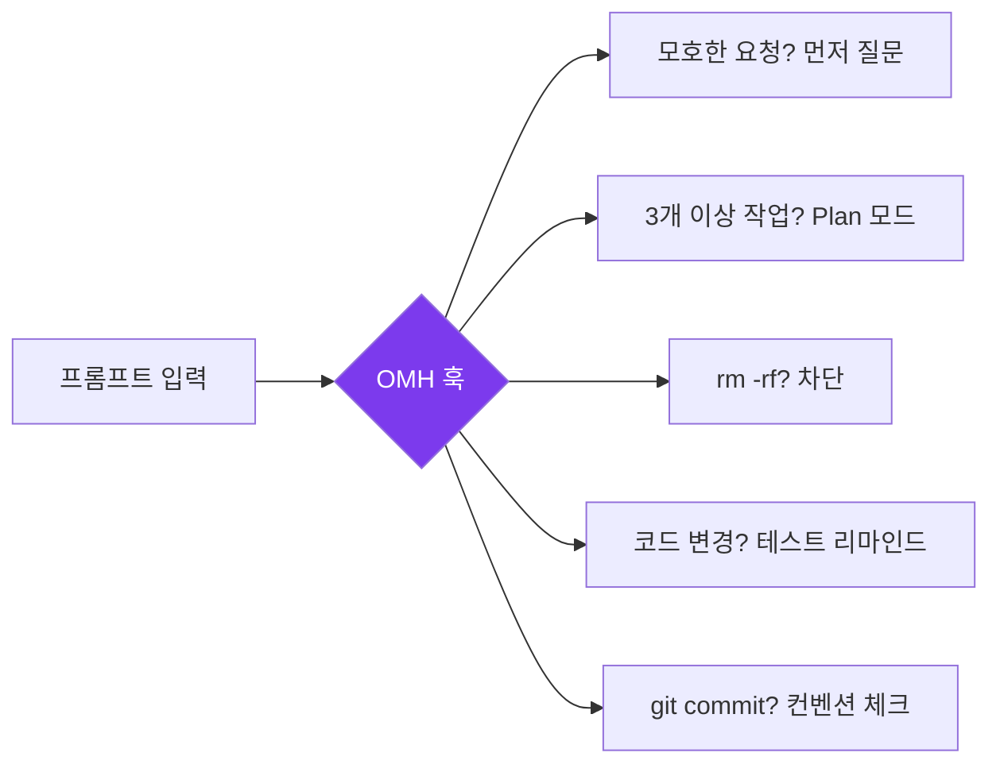
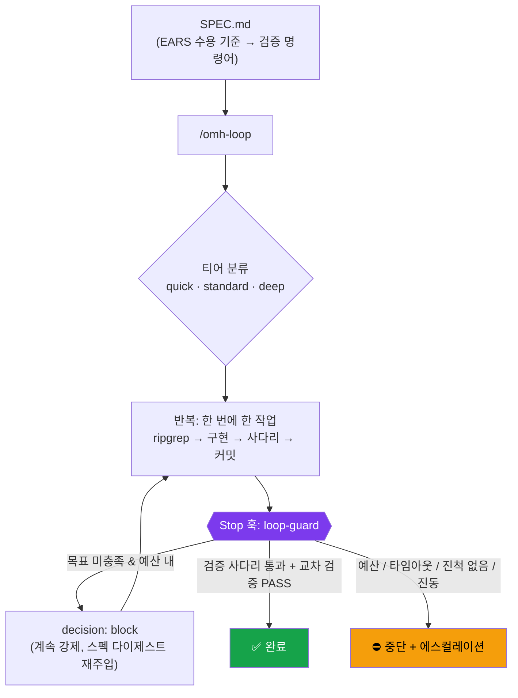
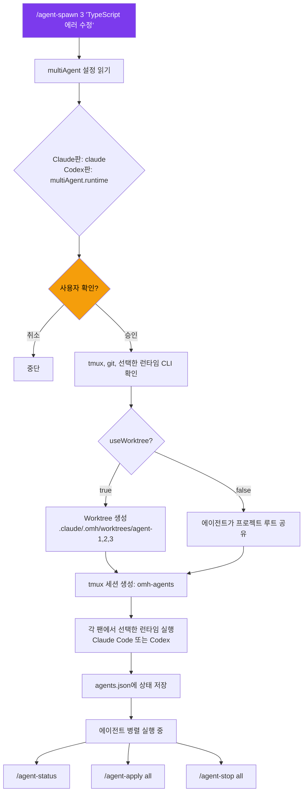
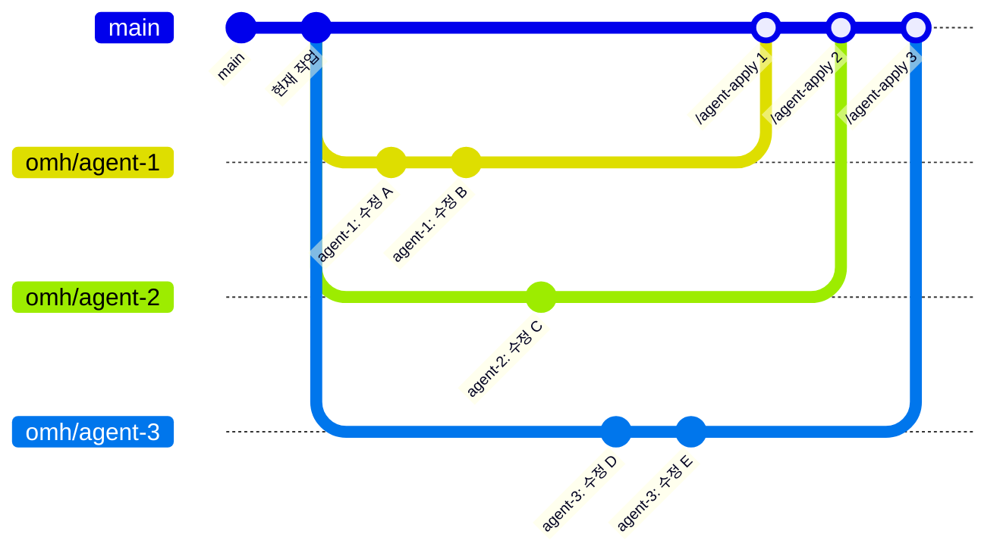
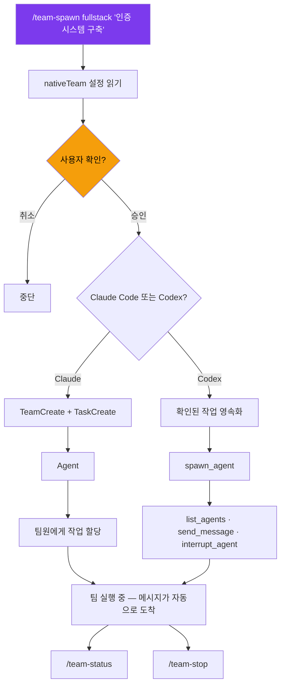

<p align="center">
  
  
  
  = 18" />
  
  
</p>

<h1 align="center">Oh My Harness</h1>

<p align="center">
  <strong>Claude Code와 Codex를 위한 스펙 기반 자율 하네스. 목표만 정의하면 — 끝날 때까지 루프를 돕니다.</strong><br/>
  스스로 검증하고 교차 검증하는 자율 루프에, 스마트 기본값, 테스트 강제, 모델 라우팅, 멀티 에이전트 오케스트레이션까지 — 모두 네이티브 훅으로 동작합니다.
</p>

<p align="center">
  <a href="README.md">English</a> &middot;
  <a href="#빠른-시작">빠른 시작</a> &middot;
  <a href="docs/features.ko.md">기능</a> &middot;
  <a href="docs/multi-agent.ko.md">멀티 에이전트</a> &middot;
  <a href="docs/configuration.ko.md">설정</a> &middot;
  <a href="docs/architecture.ko.md">아키텍처</a>
</p>

---

## 왜 Oh My Harness인가?

Claude Code는 기본적으로 강력하지만 — 일이 끝나지 않았는데도 턴이 끝나면 멈추고, 자신의 작업을 목표에 비춰 검증하지 않으며, 요청의 복잡도에 상관없이 모두 동일하게 처리합니다.

**Oh My Harness (OMH)**는 Claude Code를 **스펙 기반 자율 하네스**로 바꿉니다. 목표를 `SPEC.md`에 한 번만 정의하면, OMH가 구현하고 스스로 검증하고 교차 검증하는 *루프*를 돌려 스펙이 객관적으로 충족될 때까지 진행합니다. 루프는 Claude Code의 네이티브 훅 위에서 동작하므로, **언제 계속하고 언제 멈출지는 하네스가 결정합니다** — 모델의 자기 판단이 아닙니다. 루프를 둘러싼 곳에는 모든 세션을 더 안전하게 만드는 동일한 가벼운 스마트 기본값(테스트 강제, 위험 명령 가드, 모델 라우팅, 멀티 에이전트)이 그대로 자리합니다.


```mermaid
graph LR
    A[프롬프트 입력] --> B{OMH 훅}
    B --> C["모호한 요청? 먼저 질문"]
    B --> D["3개 이상 작업? Plan 모드"]
    B --> E["rm -rf? 차단"]
    B --> F["코드 변경? 테스트 리마인드"]
    B --> G["git commit? 컨벤션 체크"]
    style B fill:#7C3AED,color:#fff
```

---

## 철학

**진짜 벽이 있는 자율성 (Autonomy with real walls).**

이전의 OMH는 "벽이 아니라 경고"를 지향했습니다. 자율 루프는 정작 중요한 곳에서 이 방향을 바꿉니다. 멈출 수 없는 루프는 위험하고, 너무 일찍 멈추는 루프는 쓸모가 없습니다 — 그래서 루프에는 **진짜 벽**이 있습니다. 목표가 충족되지 않았고 예산 안에 있는 동안 하네스는 *계속을 강제*하고, 객관적 신호(검증 사다리 통과 + 교차 검증, 또는 반복/벽시계 예산·진척 없음·진동 같은 가드레일)가 발생하면 *종료를 강제*합니다. 모델이 스스로 "끝났다"고 판단하는 일은 없습니다 — 기계가 검증 가능한 수용 기준에 비추어 하네스가 판단합니다.

그 외의 모든 곳에서 OMH는 거의 의식하지 못할 만큼 가벼운 하네스로 남습니다 — advisory 기본값은 경고로 안내하고 critical 실행 전 guard는 안전하지 않은 작업을 차단하며, 감지된 스택에서 자동 스캐폴딩되는 **프로젝트 전용 스킬**(테스트 컨벤션, 리뷰 체크리스트, 린트 워크플로우)은 직접 소유하고 커스터마이즈할 수 있습니다.

- **내장 스킬**(에이전트 관리, 설정)은 플러그인에 남습니다
- **프로젝트 스킬**(code-review, test-write, lint-fix)은 Claude Code의 `.claude/skills/`와 Codex의 `.agents/skills/`에 위치하며, `--runtime both`는 둘 다 생성합니다 — 당신의 프로젝트, 당신의 규칙
- `/init-project`로 스캐폴딩한 뒤 자유롭게 커스터마이즈하세요

---

## 빠른 시작

Claude Code, Codex, 또는 둘 다에 맞는 설치 경로를 선택하세요:

```bash
# Claude Code
claude plugin marketplace add Hoya324/oh-my-harness
claude plugin install oh-my-harness@oh-my-harness

# Codex CLI / desktop local marketplace source
codex plugin marketplace add Hoya324/oh-my-harness
```

또는 현재 프로젝트에 런타임 파일을 직접 설치할 수 있습니다:

```bash
# 로컬 CLI가 PATH에 없다면
git clone https://github.com/Hoya324/oh-my-harness.git
cd oh-my-harness
npm link
cd /path/to/your-project

# 프로젝트에 로컬 CLI 설치
oh-my-harness init --runtime claude
oh-my-harness init --runtime codex
oh-my-harness init --runtime both
```

Claude 명령은 Claude Code 플러그인을 설치합니다. Codex 명령은 마켓플레이스 소스를 등록합니다. **Codex CLI**를 실행하고 `/plugins`를 입력한 뒤, 구성된 마켓플레이스에서 `oh-my-harness`를 설치하고 **새 세션**을 시작하세요. **Codex 데스크톱**에서는 **Plugins**를 열고 **Personal** 아래의 구성된 마켓플레이스에서 설치한 뒤 새 채팅을 여세요. [공식 Codex 플러그인 가이드](https://developers.openai.com/codex/plugins)도 참고하세요. 마켓플레이스 설치가 자동으로 번들하는 범위는 Codex hooks, skills, MCP 서버입니다. quick/standard/architect 역할 프로필과 지속 `AGENTS.md` 지침을 추가하려면 번들된 `/harness-setup`을 호출해 쓰기를 승인하거나 `oh-my-harness init --runtime codex`를 실행하세요. 두 런타임을 함께 프로비저닝하려면 `--runtime both`를 사용하세요. 로컬 CLI 기본값은 계속 `--runtime claude`입니다.

## Codex 지원

OMH 0.5.0은 네이티브 [`.codex-plugin`](.codex-plugin/plugin.json) 매니페스트로 Codex CLI와 데스크톱을 지원합니다. 마켓플레이스 payload는 수명주기 hooks, Codex 네이티브 skills, MCP 메모리를 제공하고, `/harness-setup` 또는 직접 로컬 CLI init이 별도의 지속 `AGENTS.md` 지침과 quick/standard/architect 역할을 프로비저닝합니다.

| 기능 | Claude Code | Codex CLI / 데스크톱 |
|---|---|---|
| 네이티브 플러그인 | `.claude-plugin` 마켓플레이스 항목 | 로컬 마켓플레이스의 `.codex-plugin` |
| 수명주기 가드 | Claude 훅 계약 | Codex 훅 브리지; 위험 명령과 명시적 범위 위반은 도구 실행 전에 거부 |
| 스펙 / 루프 / 검증 | `/omh-spec`, `/omh-loop`, `/omh-verify` | 같은 공개 스킬 이름과 공유 코어 |
| 프로젝트 스킬 | `.claude/skills/` | `.agents/skills/` |
| 역할 / 협업 | Claude 에이전트와 팀 도구 | Codex quick/standard/architect 역할과 협업 도구 |
| tmux/worktree 워커 | Claude 프로세스 | Claude 또는 `codex exec` 프로세스 선택 |
| 상태 | Claude 상태 표시줄 HUD | `omh-status`와 훅 메시지; Codex에는 Claude 커스텀 HUD 없음 |
| 상태와 메모리 | `.claude/.omh/`, `~/.omh/memory/graph.jsonl` | 동일한 저장소 |

Codex의 네이티브 훅 신뢰 경계는 그대로 유지됩니다. 설치 후 `/hooks`를 열어 OMH 수명주기 훅을 검토하고 승인할 항목만 신뢰하세요. 설치 프로그램은 이 검토를 우회하지 않습니다. Codex에는 동등한 확장 지점이 없으므로 커스텀 상태 표시줄 HUD는 Claude 전용입니다. Codex에서는 `omh-status`를 호출해 현재 티어, 루프, 검증, 사용량, MCP 메모리 상태를 확인하세요.

> 호환성을 위해 `.claude/.omh/`라는 이름을 유지합니다. Claude Code와 Codex는 동일한 설정, `STATE.md`, 루프 상태, 사용량 데이터, 학습을 의도적으로 함께 읽고 씁니다. 장기 메모리도 `~/.omh/memory/graph.jsonl`에서 공유합니다.

Codex는 이벤트마다 **one orchestrator** 명령을 등록합니다. 공식 Codex sibling handler는 concurrent로 실행되지만 OMH orchestrator는 공유 handler를 **sequential**하게 실행해 안전 순서를 결정적으로 유지합니다. 중요한 `PreToolUse` guard는 안전 확인 실패 시 fail closed이고, advisory hook은 경고하거나 계속하며 fail open입니다.

`omh-status`는 프로젝트 상태를 먼저 보고 **user-global fallback**을 사용합니다. lifecycle 대상을 결정적으로 지정하려면 `--scope project` 또는 `--scope user`를 사용하세요. 생략하면 CLI가 문서화된 prompt, 기본값, 또는 감지된 registration 선택을 사용합니다. Claude 프로젝트/사용자 lifecycle은 서로 격리(isolated)됩니다. malformed 관리 config, settings, guidance block은 **before mutation** preflight에서 실패합니다.

---

## 업데이트

새 버전이 출시되면 최신 훅, 감지 패턴, 기능을 적용할 수 있습니다.

```bash
# 최신 플러그인 버전 가져오기
claude plugin update oh-my-harness@oh-my-harness

# 업데이트된 훅과 사전 적용을 위해 재초기화
/harness-setup

# 설치된 범위의 OMH 관리 Codex 파일만 갱신
oh-my-harness update --runtime codex
```

> **참고:** Codex update는 OMH가 관리하는 훅, 내장 스킬, 역할, 표시된 지침과 프로젝트 로컬 메모리 런타임/등록을 갱신합니다. Claude 플러그인 업데이트는 별도의 플러그인 설정 흐름을 따르며 관리 payload가 다릅니다. 사용자 설정, 공유 상태, 무관한 훅, 커스텀 스킬, 표시 블록 밖의 `AGENTS.md` / `CLAUDE.md` 내용은 보존됩니다. `reset --runtime codex`는 관리되는 Codex 등록을 제거하되 Claude가 남아 있으면 공유 프로젝트 상태를 보존합니다. `reset --runtime both`는 두 등록을 제거하고, 남은 등록이 사용하지 않을 때만 `.claude/.omh/`를 제거합니다. 두 reset 모두 별도 장기 메모리 저장소 `~/.omh/memory/graph.jsonl`은 삭제하지 않습니다.

---

## 기능 목록

OMH의 기능은 세 그룹으로 나뉩니다 — 모든 세션에서 자동으로 동작하는 **자동 가드**, 사용자가 직접 호출하는 **자율 실행**, 그리고 이를 가로지르는 **라우팅·스캐폴딩·관측** 레이어.

### A. 자동 가드 & 라우팅 — 항상 켜짐

| 기능 | 훅 | 기본값 | 설명 |
|------|-----|:-----:|------|
| 컨벤션 자동 감지 | `SessionStart` | ON | 프로젝트를 스캔하고 언어/테스트/린트 컨텍스트 주입 |
| 무게 라우팅 (Tier 1/2/3) | `UserPromptSubmit` | ON | 프롬프트 무게를 분류해 가드 강도 조절; Tier 3은 완료 전 검증 강제 |
| 모호성 가드 | `UserPromptSubmit` | ON | 모호한 요청에 대해 명확화 강제 |
| 자동 Plan 모드 | `UserPromptSubmit` | ON | 3개 이상 작업 감지 시 계획 수립 제안 |
| 위험 명령 가드 | `PreToolUse` | ON | 파괴적 명령과 민감 파일 쓰기를 안전한 요청으로 바꿀 때까지 차단 |
| 플랜 게이트 | `PreToolUse` (plan-gate) | ON | Tier 3 프롬프트는 편집 전 plan모드 구현 플랜 작성 강제 |
| 커밋 컨벤션 | `PostToolUse` | ON | 커밋 형식 안내 (Conventional / Gitmoji) |
| 스코프 가드 | Codex `PreToolUse` / Claude `PostToolUse` | OFF | Codex는 범위 밖 편집과 감사 가능한 경로가 없는 인식된 파일시스템 mutation을 차단하고 Claude는 도구 실행 후 보고 |
| 사용량 추적 | `PostToolUse` | ON | 세션별 도구 사용량 기록 |
| 테스트 강제 | `Stop` | ON | 코드 변경 후 테스트 확인 리마인드 |
| 검증 게이트 | `Stop` (verify-gate) | ON | 매 턴 diff 위험도를 판단해 verify 사다리를 직접 실행; 민감/무테스트 변경이 red면 차단 (세션을 가두지 않음) |
| 컨텍스트 스냅샷 | `PreCompact` | ON | 컨텍스트 압축 전 작업 상태 저장 |
| Living State (`STATE.md`) | `SessionStart` / `PreCompact` | ON | 디스크 앵커 목표/phase/결정을 세션 넘어 재주입해 context rot 방어 |

Tier 3 작업에서 Claude는 `Edit`/`Write` 계열 도구를 막고 `ExitPlanMode`로 해제합니다. Codex는 `apply_patch`를 edit로 매핑하고, 비어 있지 않으며 각 항목의 `step`이 비어 있지 않고 `status`가 허용 값인 `update_plan`만 해제 신호로 매핑합니다. 그 밖의 payload는 게이트를 해제하지 않으며 denial 상한은 세션을 가두지 않는 최종 탈출구로 남습니다.

스코프 이벤트는 런타임별로 의도적으로 다릅니다. **Codex PreToolUse** 집행은 중요한 orchestrator 안에서 도구 실행 전에 동작하고, **Claude PostToolUse**는 기존 관측 계약을 유지합니다. Codex 스코프 설정을 읽을 수 없으면 프로젝트 경계를 fallback으로 사용해 프로젝트 내부 경로는 허용하고 외부로 나가는 traversal은 차단합니다.

### B. 자율 실행 — 직접 호출

| 기능 | 트리거 | 기본값 | 설명 |
|------|--------|:-----:|------|
| **자율 루프** | `Stop` (loop-guard) + `/omh-loop` | ON | 스펙 기반 루프: 검증 사다리 + 교차 검증이 완료를 확인할 때까지 계속을 강제하며, 티어별 가드레일(예산, 타임아웃, 진척 없음, 진동)을 적용 |
| 스펙 작성 | `/omh-spec` | ON | 기계가 검증 가능한 `SPEC.md`(EARS 수용 기준 → 검증 명령어)를 작성해 루프의 기준점으로 삼음 |
| N-라운드 검증 | `/omh-verify` | — | 모델 로테이션(Claude → GPT/codex → Gemini)으로 N회 독립 검증+수정; 외부 검증자는 읽기 전용 |
| **장기 메모리** | MCP `omh-memory` + `/omh-loop`, `/omh-verify` | ON | 세션·런타임을 넘나드는 지식그래프(Codex와 공유): 루프가 과거 학습을 읽고 reflexion·고신뢰 findings를 영속화 |
| 네이티브 팀 | `/team-spawn` | ON | Claude Code 또는 Codex 네이티브 협업 (템플릿 지원) |
| 멀티 에이전트 | `/agent-spawn` | — | tmux + git worktree에서 런타임 선택 가능한 Claude Code 또는 Codex 워커 |

### C. 라우팅·스캐폴딩·관측

| 기능 | 트리거 | 기본값 | 설명 |
|------|--------|:-----:|------|
| 모델 라우팅 | CLAUDE.md + agents | ON | 복잡도에 따라 haiku / sonnet / opus로 서브에이전트 라우팅 |
| 스킬 스캐폴딩 | `/init-project` | ON | 감지된 스택에 맞춰 프로젝트 전용 스킬 자동 생성 |
| 자동 .gitignore | CLI init | ON | `.claude/.omh/`를 `.gitignore`에 추가 |
| 상태 HUD | 상태 표시줄 | ON | 레이트리밋·컨텍스트·도구 호출·모델 실시간 대시보드 |

> 각 기능의 상세 설명은 [기능 문서](docs/features.ko.md)와 [자율 루프 가이드](docs/loop.ko.md)를 참고하세요.

---

## 자율 루프

목표를 한 번만 정의하면, OMH가 객관적으로 충족될 때까지 루프를 돕니다.

```bash
/omh-spec add JWT auth with refresh tokens   # 기계가 검증 가능한 SPEC.md 작성
/omh-loop SPEC.md                             # 자율적으로 실행
/omh-loop stop                                # 킬 스위치 (또는 .claude/.omh/STOP 생성)
```

**동작 방식** — Stop 훅(`loop-guard`)이 루프 엔진이자 안전 집행자입니다:


```mermaid
graph TD
    SPEC["SPEC.md<br/>(EARS 수용 기준 → 검증 명령어)"] --> START["/omh-loop"]
    START --> TIER{"티어 분류<br/>quick · standard · deep"}
    TIER --> ITER["반복: 한 번에 한 작업<br/>ripgrep → 구현 → 사다리 → 커밋"]
    ITER --> STOP{{"Stop 훅: loop-guard"}}
    STOP -->|"목표 미충족 & 예산 내"| CONT["decision: block<br/>(계속 강제, 스펙 다이제스트 재주입)"]
    CONT --> ITER
    STOP -->|"검증 사다리 통과 + 교차 검증 PASS"| DONE["✅ 완료"]
    STOP -->|"예산 / 타임아웃 / 진척 없음 / 진동"| GUARD["⛔ 중단 + 에스컬레이션"]
    style STOP fill:#7C3AED,color:#fff
    style DONE fill:#16a34a,color:#fff
    style GUARD fill:#f59e0b,color:#000
```

- **저비용 우선 검증 사다리** — 결정론적 검사(린트/타입체크 → 테스트/빌드)가 먼저 빠르게 실패하며 *실제* 실패 출력을 되먹입니다. 비싼 모델 심판은 통과(green) 상태에서만 실행됩니다.
- **교차 검증** — *다른* 모델(opus)이 각 수용 기준을 (에이전트의 자기 보고가 아닌) 저장소 상태에 비춰 채점하고, revert-and-rerun 변이 검사를 수행한 뒤 `PASS | FAIL | INCONCLUSIVE`를 반환합니다 (INCONCLUSIVE는 안전하게 중단으로 귀결).
- **티어별 예산** — `quick`(≤3회) · `standard`(≤8회) · `deep`(≤20회), 각각 벽시계 상한과 교차 검증 정책을 가집니다.
- **진짜 가드레일** — 티어별 & 티어 교차 반복 상한, 벽시계 타임아웃, 진척 없음/정체 및 진동 감지, `stop_hook_active` 자가 루프 가드, 동시 세션/worktree 격리, 원자적 상태 쓰기, fail-open, 그리고 `STOP` 킬 스위치.

설계와 그 근거가 된 연구(Ralph Wiggum 루프, Reflexion, Chain-of-Verification, FrugalGPT 스타일 캐스케이드, EARS)는 [docs/loop.ko.md](docs/loop.ko.md)에 정리되어 있습니다.

---

## 장기 메모리 (LTM)

OMH는 학습한 것을 **지식그래프 메모리**에 영속화하며, 이 저장소는 **Claude Code와 Codex가 공유**합니다 — 하나의 스토어, 두 런타임 — 한 세션(과 한 에이전트)의 교훈이 다음으로 이어집니다.

```bash
# 플러그인 설치: 세션에서 omh-memory MCP 도구(예: search_nodes)를 사용하세요.
# 로컬 Codex 프로젝트 범위:
oh-my-harness init --runtime codex
node .claude/.omh/runtime/lib/memory.mjs search "<project>"
# 로컬 Codex 사용자 범위:
oh-my-harness init --runtime codex --scope user
node ~/.claude/.omh/runtime/lib/memory.mjs stats
```

- **백엔드** — 고정 버전 지식그래프 서버 `@modelcontextprotocol/server-memory@2026.7.4`: 로컬, API 키 불필요, JSONL 파일에 엔티티+관계+observation. 플러그인 MCP는 plugin root로 이동해 `bin/omh-memory.sh`를 실행합니다. 로컬 Codex init은 선택한 scope 아래 같은 launcher/library를 설치하고 `[mcp_servers.omh-memory]`를 관리합니다. 둘 다 `~/.omh/memory/graph.jsonl`을 가리킵니다.
- **루프가 읽음** — 계획 전에 `/omh-loop`·`/omh-spec`이 그래프에서 과거 학습·이미 검증된 `quickCheck`/`verify` 커맨드·기존 함정을 조회해 계획에 반영합니다(이미 아는 것을 재탐지하지 않음).
- **루프가 씀** — 실패한 iteration의 Reflexion은 `Learning` 엔티티가 되고, 통과한 verify는 검증된 커맨드를 `Project`에 적립하며, `/omh-verify`는 **고신뢰 findings**(2+ 모델 합의)를 영속화해 다음 실행이 재발견하지 않게 합니다.
- **에이전트 + 프로그래매틱 접근** — 플러그인 사용자는 `omh-memory` MCP 도구를 실시간으로 사용합니다. 로컬 Codex 설치는 위에 표시된 범위별 관리 `runtime/lib/memory.mjs` 도우미(원자적 쓰기, 서버와 포맷 호환)를 사용할 수 있습니다.
- **Graceful degradation** — MCP 서버가 미연결(또는 오프라인)이면 LTM 단계는 조용히 스킵됩니다. 루프는 메모리 때문에 막히지 않습니다.
- **실행과 플랫폼** — launcher는 `npx --yes --prefer-offline`을 사용하지만 처음 uncached 실행은 npm registry/network 접근이 필요합니다. release 검증은 macOS 현재 머신 cache에 이 정확한 패키지를 warm합니다. Native Windows의 Codex hooks는 `commandWindows`로 실행할 수 있지만 MCP launcher 자체에는 Bash가 필요합니다.

> **동시성 주의.** 지식그래프 서버는 인메모리 복사본을 두고 mutation마다 파일 전체를 다시 쓰므로, 한 번에 한 writer를 전제로 설계됐습니다. 개인용(한 번에 한 에이전트)엔 무해하나, Claude Code와 Codex가 동시에 대량 쓰기하는 것은 피하세요.

**설정** — Claude Code는 플러그인의 `.mcp.json`에서 서버를 자동 로드합니다. `oh-my-harness init --runtime codex`(또는 `both`)는 프로젝트 런처를 프로비저닝하고 다음 Codex 등록을 자동 관리합니다:

```toml
[mcp_servers.omh-memory]
command = "bash"
args = ["/ABSOLUTE/PROJECT/.claude/.omh/runtime/bin/omh-memory.sh"]
startup_timeout_sec = 60
```

---

## 무게 인식 하네스 (Weight-Aware Harness)

모든 프롬프트에 같은 검증 비용을 쓸 필요는 없습니다. OMH는 요청 무게를 **Tier 1**(가벼움), **Tier 2**(표준), **Tier 3**(무겁거나 위험함)으로 분류하고 가드레일을 비례 적용합니다.

```bash
/omh-verify add JWT auth with refresh tokens   # N-라운드 독립 멀티모델 검증 + 수정
```

- **무게 라우팅** — `UserPromptSubmit` 훅이 티어를 판정하며 Tier 3은 완료 전에 검증을 강제합니다.
- **N-라운드 검증** — `/omh-verify`가 Claude → GPT/codex → Gemini 렌즈를 순환합니다. 외부 검증자는 read-only로 비평만 합니다.
- **Living state 앵커** — `STATE.md`가 목표·단계·결정·진행을 디스크에 유지하고 `SessionStart`/`PreCompact`에서 재주입됩니다.
- **전역 설정 폴백** — 프로젝트 `harness.config.json`을 우선하고 없으면 전역 `~/.claude/.omh` 설정을 사용합니다.

자세한 정책은 [docs/verify.ko.md](docs/verify.ko.md)에 있습니다.

---

## 아키텍처

> 전체 내용: [docs/architecture.ko.md](docs/architecture.ko.md)

OMH는 **네 개의 계층**으로 구성됩니다. 핵심 판단은 순수하게 유지되어 단위 테스트되고 네이티브 adapter가 올바른 실패 정책을 적용합니다.

| 계층 | 구성 요소 | 역할 |
|------|-----------|------|
| **① 훅** | 공유 스크립트 11개(생명주기 가드/관측기 9개 + 게이트 2개), Codex 브리지 모듈 2개 | Codex는 이벤트마다 one orchestrator를 두고 handler를 sequential 실행; critical guard는 fail closed, advisory hook은 계속 |
| **② 순수 코어** (`lib/`) | `loop` · `tier` · `detect` · `config` · `verify` · `state` · `dictionary` | 모든 판단 로직을 **순수 함수**(fs / git / 시간 없음)로 → 완전한 단위 테스트 |
| **③ 스킬** | Claude 13개 / Codex 14개 스킬 | 사용자 호출 워크플로우 (`/omh-loop`, `/omh-verify`, `/team-spawn`, `omh-status`, …) |
| **④ 에이전트** | `quick` · `standard` · `architect` | 모델 라우팅 — 작업 무게에 따라 haiku / sonnet / opus |


```mermaid
graph TB
    subgraph "Claude Code 세션"
        direction TB
        CC[Claude Code] --> HOOKS[훅 시스템]
        CC --> SKILLS[스킬 시스템]
        CC --> AGENTS[에이전트 시스템]
    end

    subgraph "Oh My Harness"
        direction TB
        HOOKS --> H1[session-start.mjs]
        HOOKS --> H2[pre-prompt.mjs]
        HOOKS --> H3[dangerous-guard.mjs]
        HOOKS --> H4[commit-convention.mjs]
        HOOKS --> H5[scope-guard.mjs]
        HOOKS --> H6[usage-tracker.mjs]
        HOOKS --> H7[pre-compact.mjs]
        HOOKS --> H8[post-task.mjs]
        HOOKS --> H9[loop-guard.mjs]
        HOOKS --> H10[plan-gate.mjs]
        HOOKS --> H11[verify-gate.mjs]

        SKILLS --> S1["/harness-setup"]
        SKILLS --> S2["/set-harness"]
        SKILLS --> S3["/agent-spawn"]
        SKILLS --> S4["/team-spawn"]
        SKILLS --> S5["/omh-spec"]
        SKILLS --> S6["/omh-loop"]

        AGENTS --> A1["harness:quick (haiku)"]
        AGENTS --> A2["harness:standard (sonnet)"]
        AGENTS --> A3["harness:architect (opus)"]
    end

    subgraph "프로젝트 데이터 (.claude/.omh/)"
        CONFIG[harness.config.json]
        CONV[conventions.json]
        USAGE[usage.json]
        SNAP[context-snapshot.md]
        LOOP[loop-state.json]
    end

    H1 --> CONV
    H6 --> USAGE
    H7 --> SNAP
    H9 --> LOOP
    H1 --> CONFIG
    H2 --> CONFIG
    H3 --> CONFIG
    H10 --> CONFIG
    H11 --> CONFIG

    style CC fill:#7C3AED,color:#fff
    style CONFIG fill:#f59e0b,color:#000
```

## 훅 파이프라인

생명주기 이벤트는 순서가 있는 OMH 훅 체인을 실행할 수 있습니다. `PreToolUse`, `PostToolUse`, `Stop`은 의도적으로 둘 이상을 실행하며 자율 루프는 `Stop` 체인에 있습니다:

| 생명주기 이벤트 | 훅 | 동작 |
|-----------------|-----|------|
| `SessionStart` | `session-start.mjs` | 컨벤션 감지 · `STATE.md` 주입 |
| `UserPromptSubmit` | `pre-prompt.mjs` | 무게 티어 · 모호성 가드 · 자동 Plan |
| `PreToolUse` | `dangerous-guard.mjs` · **`plan-gate.mjs`** · `scope-guard` (Codex) | 파괴적 작업 또는 malformed hook 입력 차단 · **플랜 게이트 (Tier 3)** · Codex 스코프 집행 |
| `PostToolUse` | `commit-convention` · `scope-guard` (Claude) · `usage-tracker` | 커밋 형식 · Claude 스코프 보고 · 사용량 통계 |
| `PreCompact` | `pre-compact.mjs` | 컨텍스트 스냅샷 · `STATE.md` 갱신 |
| `Stop` | **`loop-guard.mjs`** · **`verify-gate.mjs`** · `post-task.mjs` | **자율 루프 엔진** · **위험도 기반 검증 게이트** · 테스트 강제 |


```mermaid
sequenceDiagram
    participant U as 사용자
    participant CC as Claude Code
    participant OMH as OMH 훅

    Note over CC,OMH: 세션 시작
    CC->>OMH: SessionStart
    OMH-->>CC: Project: node | test: vitest | lint: eslint

    Note over U,CC: 사용자 프롬프트 전송
    U->>CC: "리팩토링해줘 그리고 테스트 추가"
    CC->>OMH: UserPromptSubmit
    OMH-->>CC: 2개 작업 감지, Plan 모드 제안
    OMH-->>CC: 요청이 모호함, 명확화 질문 요청

    Note over CC,OMH: 도구 실행
    CC->>OMH: PreToolUse (Bash: rm -rf dist/)
    OMH-->>CC: 차단: rm -rf 감지. 요청을 안전하게 변경.

    CC->>OMH: PostToolUse (Bash: git commit)
    OMH-->>CC: 컨벤션: feat(scope): description

    Note over CC,OMH: 작업 완료
    CC->>OMH: Stop
    OMH-->>CC: 코드 변경 감지. 테스트 존재 여부 확인.
```

## 멀티 에이전트

> 전체 내용: [docs/multi-agent.ko.md](docs/multi-agent.ko.md)


```mermaid
graph TD
    START["/agent-spawn 3 'TypeScript 에러 수정'"] --> CONFIG[multiAgent 설정 읽기]
    CONFIG --> RUNTIME{"Claude판: claude<br/>Codex판: multiAgent.runtime"}
    RUNTIME --> CONFIRM{"사용자 확인?"}
    CONFIRM -->|취소| ABORT[중단]
    CONFIRM -->|승인| CHECK["tmux, git, 선택한 런타임 CLI 확인"]
    CHECK --> WT{"useWorktree?"}

    WT -->|true| CREATE_WT["Worktree 생성<br/>.claude/.omh/worktrees/agent-1,2,3"]
    WT -->|false| SHARED[에이전트가 프로젝트 루트 공유]

    CREATE_WT --> TMUX["tmux 세션 생성: omh-agents"]
    SHARED --> TMUX

    TMUX --> LAUNCH["각 팬에서 선택한 런타임 실행<br/>Claude Code 또는 Codex"]
    LAUNCH --> STATE[agents.json에 상태 저장]
    STATE --> DONE[에이전트 병렬 실행 중]

    DONE --> STATUS["/agent-status"]
    DONE --> APPLY["/agent-apply all"]
    DONE --> STOP["/agent-stop all"]

    style START fill:#7C3AED,color:#fff
    style CONFIRM fill:#f59e0b,color:#000
```

Claude판은 Claude를 실행합니다. Codex판은 `multiAgent.runtime`을 따릅니다(기본 `codex`, 또는 `claude`). 고정 실행 명령은 다음과 같습니다:

```bash
claude --permission-mode bypassPermissions -p "Read TASK.md and complete its instructions."
codex exec --sandbox workspace-write --cd "<worktree>" "Read TASK.md and complete its instructions."
```

Claude 권한 우회는 확인 게이트에서 고지하며 Codex는 workspace-write 샌드박스를 사용합니다. 작업 본문은 `TASK.md`에만 두고 두 명령 모두 셸에 본문을 보간하지 않습니다.


```mermaid
gitGraph
    commit id: "main"
    commit id: "현재 작업"
    branch omh/agent-1
    branch omh/agent-2
    branch omh/agent-3
    checkout omh/agent-1
    commit id: "agent-1: 수정 A"
    commit id: "agent-1: 수정 B"
    checkout omh/agent-2
    commit id: "agent-2: 수정 C"
    checkout omh/agent-3
    commit id: "agent-3: 수정 D"
    commit id: "agent-3: 수정 E"
    checkout main
    merge omh/agent-1 id: "/agent-apply 1"
    merge omh/agent-2 id: "/agent-apply 2"
    merge omh/agent-3 id: "/agent-apply 3"
```

## 네이티브 팀

> 전체 내용: [docs/multi-agent.ko.md](docs/multi-agent.ko.md#네이티브-팀-시스템)

tmux와 worktree가 필요 없습니다. Claude Code는 `TeamCreate`, `TaskCreate`, `Agent`를 사용하고 Codex는 `spawn_agent`, `list_agents`, `send_message`, `interrupt_agent`를 사용합니다. 둘 다 실제 팀원을 만들기 전에 확인을 요구합니다.


```mermaid
graph TD
    START["/team-spawn fullstack '인증 시스템 구축'"] --> CONFIG[nativeTeam 설정 읽기]
    CONFIG --> CONFIRM{"사용자 확인?"}
    CONFIRM -->|취소| ABORT[중단]
    CONFIRM -->|승인| RUNTIME{"Claude Code 또는 Codex?"}
    RUNTIME -->|Claude| CREATE["TeamCreate + TaskCreate"]
    CREATE --> SPAWN["Agent"]
    RUNTIME -->|Codex| CCREATE["확인된 작업 영속화"]
    CCREATE --> CSPAWN["spawn_agent"]
    CSPAWN --> CRECON["list_agents · send_message · interrupt_agent"]
    SPAWN --> ASSIGN["팀원에게 작업 할당"]
    ASSIGN --> RUNNING["팀 실행 중 — 메시지가 자동으로 도착"]
    CRECON --> RUNNING

    RUNNING --> STATUS["/team-status"]
    RUNNING --> STOP["/team-stop"]

    style START fill:#7C3AED,color:#fff
    style CONFIRM fill:#f59e0b,color:#000
```

| 템플릿 | 구성원 | 적합한 용도 |
|--------|--------|------------|
| `fullstack` | frontend + backend + tester (모두 `standard`) | 풀스택 기능 개발 |
| `review` | reviewer (`architect`) + tester (`standard`) | 코드 리뷰 |
| `research` | researcher (`quick`) + implementer (`standard`) + architect (`architect`) | 연구 기반 개발 |

`quick`/`standard`/`architect`는 공유 에이전트 유형입니다. Claude판은 이를 haiku/sonnet/opus에 매핑하고, Codex판은 사용 가능한 프로필 선호도로 취급하며 특정 모델을 보장하지 않습니다.

---

## 문서

| 문서 | 내용 |
|------|------|
| **[자율 루프](docs/loop.ko.md)** | 스펙 기반 루프, 검증 사다리, 교차 검증, 티어, 가드레일, 그리고 설계 근거가 된 연구 |
| **[검증 & 무게 인식](docs/verify.ko.md)** | 무게 라우팅(Tier 1/2/3), N-라운드 다중 모델 검증+수정, 읽기 전용 외부 검증자, Living `STATE.md` 앵커 |
| **[기능](docs/features.ko.md)** | HUD 상태 표시줄, 스마트 기본값, 기능 태그, 기능 상세 설명 |
| **[아키텍처](docs/architecture.ko.md)** | 시스템 다이어그램, 훅 파이프라인, 플러그인 & 로컬 CLI 디렉토리 구조 |
| **[멀티 에이전트](docs/multi-agent.ko.md)** | Spawn 명령어, 워크플로우, Worktree 브랜칭 모델, 안전 정책 |
| **[설정](docs/configuration.ko.md)** | 설정 레퍼런스, CLI 명령어, 슬래시 명령어, OMC 호환성, 삭제 방법 |

---

## 라이선스

MIT
