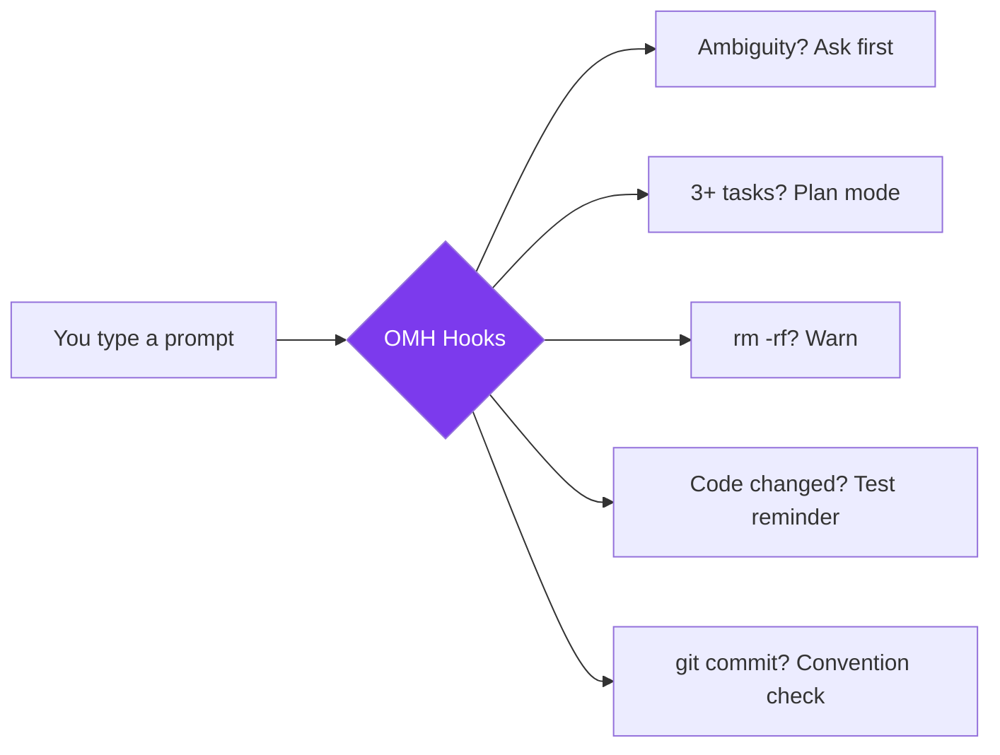
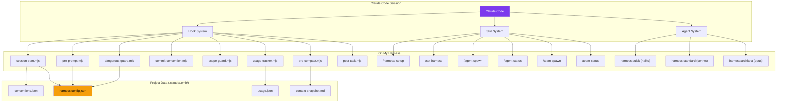
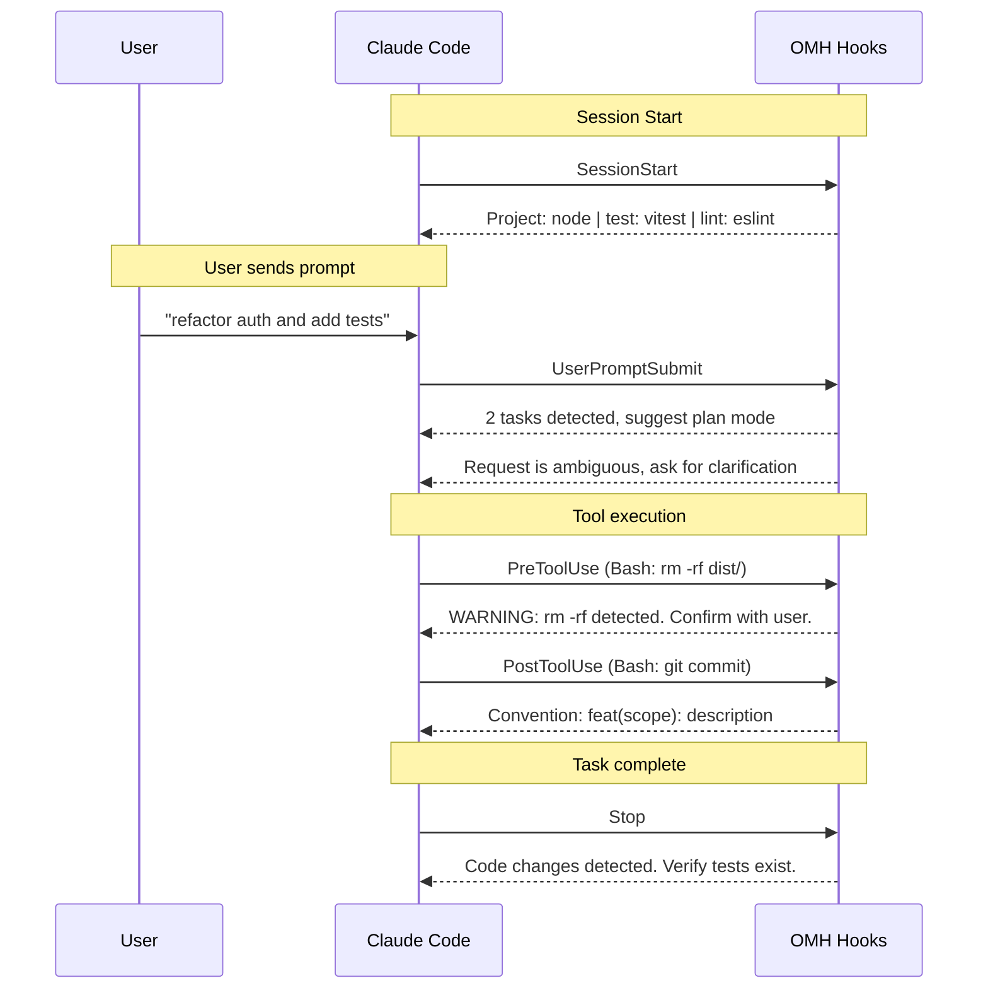
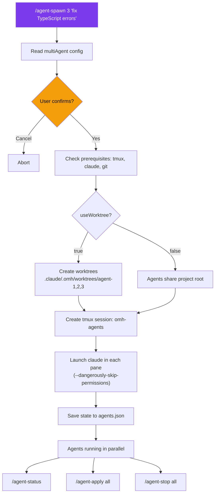
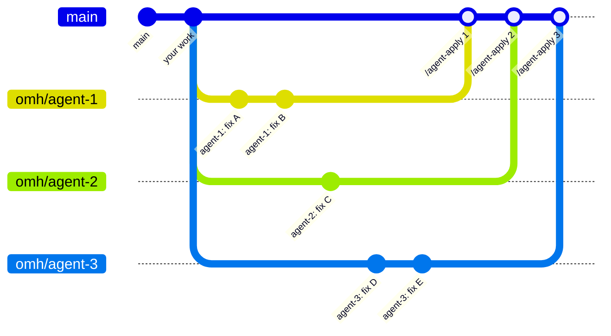
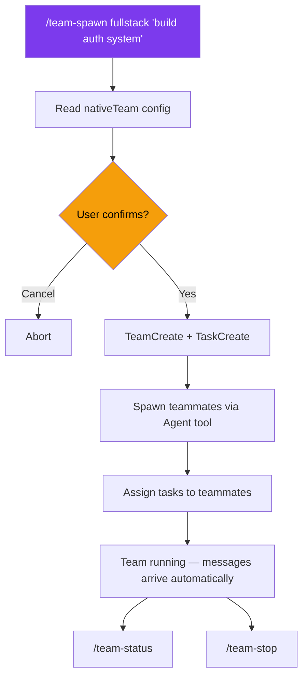

<p align="center">
  
  
  = 18" />
  
  
</p>

<h1 align="center">Oh My Harness</h1>

<p align="center">
  <strong>Lightweight Claude Code harness. Zero config, instant boost.</strong><br/>
  Smart defaults, test enforcement, model routing, and multi-agent orchestration — all through native hooks.
</p>

<p align="center">
  <a href="README.ko.md">한국어</a> &middot;
  <a href="#quick-start">Get Started</a> &middot;
  <a href="docs/features.md">Features</a> &middot;
  <a href="docs/multi-agent.md">Multi-Agent</a> &middot;
  <a href="docs/configuration.md">Config</a> &middot;
  <a href="docs/architecture.md">Architecture</a>
</p>

---

## Why Oh My Harness?

Claude Code is powerful out of the box — but it doesn't enforce testing, doesn't warn before `rm -rf`, and treats every request the same regardless of complexity.

**Oh My Harness (OMH)** adds a thin layer of smart defaults using Claude Code's native hook system. No heavy plugins, no runtime overhead — just hooks, skills, and CLAUDE.md instructions that make every session safer and more productive.



---

## Philosophy

**Minimal guards, maximum customization.**

OMH believes the best harness is one you barely notice. Instead of blocking and enforcing, OMH guides with smart defaults — warnings instead of walls, reminders instead of restrictions.

Where OMH truly shines is helping you build and use **project-specific skills**. Every codebase is different: your test conventions, review checklists, and lint workflows are unique. OMH auto-scaffolds per-project skills based on your detected stack, then gets out of the way so you can customize them.

- **Built-in skills** (agent management, setup) stay in the plugin
- **Project skills** (code-review, test-write, lint-fix) live in `.claude/skills/` — your project, your rules
- Run `/init-project` to scaffold, then customize freely

---

## Quick Start

### Option A: Claude Code Plugin (recommended)

```bash
# 1. Install plugin (user scope by default)
claude plugin install oh-my-harness@oh-my-harness

# 2. Restart Claude Code, then initialize your project config:
/harness-setup
```

### Option B: npm CLI

```bash
npm install -g oh-my-harness
cd your-project
oh-my-harness init
```

Either way, start Claude Code as usual — harness features activate automatically.

---

## Updating

When a new version is released, update to get the latest hooks, detection patterns, and features.

### Plugin mode

```bash
# Pull the latest plugin version
claude plugin update oh-my-harness@oh-my-harness

# Re-initialize to apply updated hooks and dictionary
/harness-setup
```

### npm CLI mode

```bash
# Update the global package
npm update -g oh-my-harness

# Re-run init to copy updated hooks into your project
oh-my-harness init
```

> **Note:** `init` preserves your existing `harness.config.json`. Only hooks, commands, and CLAUDE.md instructions are refreshed.

---

## Features Overview

| # | Feature | Hook | Default | What it does |
|:-:|---------|------|:-------:|-------------|
| 1 | Convention Auto-Detect | `SessionStart` | ON | Scans project and injects language/test/lint context |
| 2 | Test Enforcement | `Stop` | ON | Reminds to verify tests after every code change |
| 3 | Model Routing | CLAUDE.md + agents | ON | Routes subagents to haiku / sonnet / opus by complexity |
| 4 | Auto-Plan Mode | `UserPromptSubmit` | ON | Detects 3+ tasks and suggests planning first |
| 5 | Ambiguity Guard | `UserPromptSubmit` | ON | Forces clarification for vague requests |
| 6 | Dangerous Guard | `PreToolUse` | ON | Warns before `rm -rf`, `git push --force`, `.env` writes |
| 7 | Context Snapshot | `PreCompact` | ON | Saves task state before context compaction |
| 8 | Commit Convention | `PostToolUse` | ON | Reminds commit format (Conventional / Gitmoji) |
| 9 | Scope Guard | `PostToolUse` | OFF | Warns when modifying files outside allowed paths |
| 10 | Usage Tracking | `PostToolUse` | ON | Records tool usage per session |
| 11 | Auto .gitignore | CLI init | ON | Adds `.claude/.omh/` to `.gitignore` |
| 12 | Multi-Agent | `/agent-spawn` | — | Parallel Claude agents in tmux with git worktrees |
| 13 | Native Team | `/team-spawn` | ON | Native Claude Code team orchestration with templates |
| 14 | Skill Scaffolding | `/init-project` | ON | Auto-generates project-specific skills based on detected stack |

> See [Feature Details](docs/features.md) for full descriptions of each feature.

---

## Architecture

> Full details: [docs/architecture.md](docs/architecture.md)



## Hook Pipeline



## Multi-Agent

> Full details: [docs/multi-agent.md](docs/multi-agent.md)





## Native Team

> Full details: [docs/multi-agent.md](docs/multi-agent.md#native-team-system)

No tmux, no worktrees — use Claude Code's built-in team orchestration.



| Template | Members | Best For |
|----------|---------|----------|
| `fullstack` | frontend + backend + tester (all sonnet) | Full-stack features |
| `review` | reviewer (opus) + tester (sonnet) | Code review |
| `research` | researcher (haiku) + implementer (sonnet) + architect (opus) | Research-driven work |

---

## Documentation

| Document | Contents |
|----------|----------|
| **[Features](docs/features.md)** | HUD status line, smart defaults, feature tags, detailed feature descriptions (1–10) |
| **[Architecture](docs/architecture.md)** | System diagram, hook pipeline, plugin mode vs npm CLI directory structure |
| **[Multi-Agent](docs/multi-agent.md)** | Spawn commands, workflow, worktree branching model, safety policies |
| **[Configuration](docs/configuration.md)** | Settings reference, CLI commands, slash commands, OMC compatibility, uninstall |

---

## License

MIT
