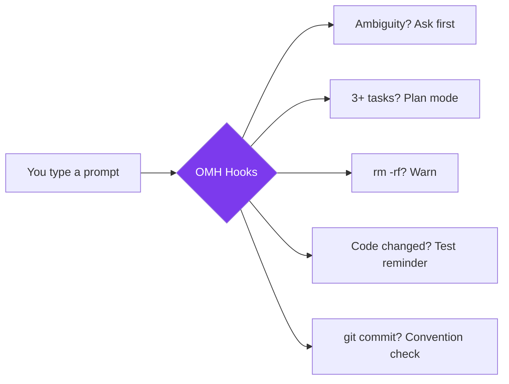
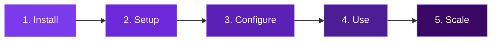
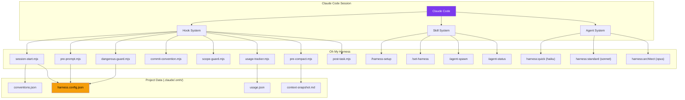
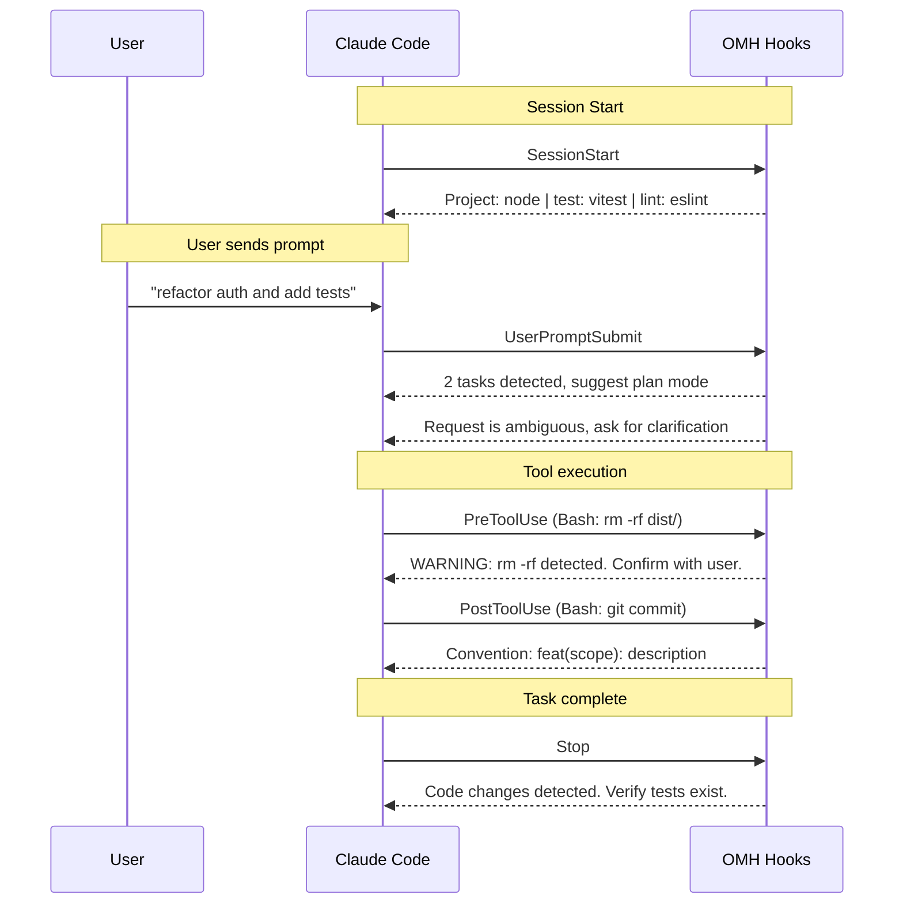
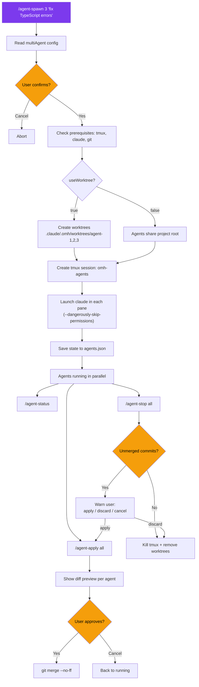
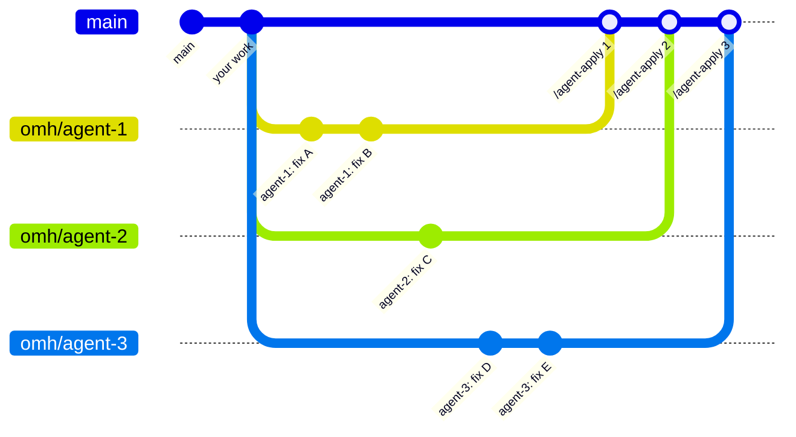

<p align="center">
  
  
  = 18" />
  
  
</p>

<h1 align="center">Oh My Harness</h1>

<p align="center">
  <strong>Lightweight Claude Code harness. Zero config, instant boost.</strong><br/>
  Smart defaults, test enforcement, model routing, and multi-agent orchestration — all through native hooks.
</p>

<p align="center">
  <a href="README.ko.md">한국어</a> &middot;
  <a href="#quick-start">Get Started</a> &middot;
  <a href="#features-overview">Features</a> &middot;
  <a href="#multi-agent-system">Multi-Agent</a> &middot;
  <a href="#configuration">Config</a> &middot;
  <a href="#cli-commands">CLI Reference</a>
</p>

---

## Why Oh My Harness?

Claude Code is powerful out of the box — but it doesn't enforce testing, doesn't warn before `rm -rf`, and treats every request the same regardless of complexity.

**Oh My Harness (OMH)** adds a thin layer of smart defaults using Claude Code's native hook system. No heavy plugins, no runtime overhead — just hooks, skills, and CLAUDE.md instructions that make every session safer and more productive.



---

## Quick Start

### Option A: Claude Code Plugin (recommended)

```bash
# In Claude Code:
/install-plugin https://github.com/Hoya324/oh-my-harness

# Then initialize your project config:
/harness-setup
```

### Option B: npm CLI

```bash
npm install -g oh-my-harness
cd your-project
oh-my-harness init
```

Either way, start Claude Code as usual — harness features activate automatically.

---

## Onboarding Guide

A step-by-step guide for first-time users.



### Step 1 — Install

```bash
# Plugin (recommended)
/install-plugin https://github.com/Hoya324/oh-my-harness

# or npm
npm install -g oh-my-harness
```

### Step 2 — Setup

```bash
# Plugin mode
/harness-setup

# npm mode
oh-my-harness init
```

What happens automatically:
- Creates `.claude/.omh/harness.config.json` (default settings)
- Adds `.claude/.omh/` to `.gitignore`
- Detects project conventions (language, test framework, linter, formatter)

### Step 3 — Configure (optional)

Defaults work great out of the box. Adjust as needed:

```bash
# View current settings
/set-harness

# Common examples
/set-harness testEnforcement.minCases 3     # Require 3+ test cases
/set-harness features.scopeGuard true       # Enable file scope restriction
/set-harness scopeGuard.allowedPaths ["src"] # Only allow changes in src/
```

### Step 4 — Use

After setup, just use Claude Code normally. OMH works automatically:

| Situation | OMH Action |
|-----------|-----------|
| Session starts | Detects project conventions, injects context |
| Vague request ("fix it") | Asks for specific scope first |
| 3+ tasks in one message | Suggests plan mode |
| `rm -rf` attempted | Warns and asks for confirmation |
| `git commit` executed | Shows commit convention format |
| Code changes completed | Reminds to verify tests exist |
| Context compaction imminent | Saves state snapshot |

### Step 5 — Scale with Multi-Agent

When you need parallel work:

```bash
# Spawn 3 agents simultaneously
/agent-spawn 3 "fix all TypeScript errors in src/"

# Check progress
/agent-status

# Merge completed work
/agent-apply all

# Cleanup
/agent-stop all
```

> **Tip:** Start with `useWorktree: true` (default). Each agent works on an isolated git branch, so there's no risk of conflicts.

---

## Features Overview

| # | Feature | Hook | Default | What it does |
|:-:|---------|------|:-------:|-------------|
| 1 | [Convention Auto-Detect](#1-convention-auto-detect) | `SessionStart` | ON | Scans project and injects language/test/lint context |
| 2 | [Test Enforcement](#2-test-enforcement) | `Stop` | ON | Reminds to verify tests after every code change |
| 3 | [Model Routing](#3-model-routing) | CLAUDE.md + agents | ON | Routes subagents to haiku / sonnet / opus by complexity |
| 4 | [Auto-Plan Mode](#4-auto-plan-mode) | `UserPromptSubmit` | ON | Detects 3+ tasks and suggests planning first |
| 5 | [Ambiguity Guard](#5-ambiguity-guard) | `UserPromptSubmit` | ON | Forces clarification for vague requests |
| 6 | [Dangerous Guard](#6-dangerous-guard) | `PreToolUse` | ON | Warns before `rm -rf`, `git push --force`, `.env` writes |
| 7 | [Context Snapshot](#7-context-snapshot) | `PreCompact` | ON | Saves task state before context compaction |
| 8 | [Commit Convention](#8-commit-convention) | `PostToolUse` | ON | Reminds commit format (Conventional / Gitmoji) |
| 9 | [Scope Guard](#9-scope-guard) | `PostToolUse` | OFF | Warns when modifying files outside allowed paths |
| 10 | [Usage Tracking](#10-usage-tracking) | `PostToolUse` | ON | Records tool usage per session |
| 11 | Auto .gitignore | CLI init | ON | Adds `.claude/.omh/` to `.gitignore` |
| 12 | [Multi-Agent](#multi-agent-system) | `/agent-spawn` | — | Parallel Claude agents in tmux with git worktrees |

---

## How It Works

OMH works in two modes — as a **Claude Code plugin** or via **npm CLI**. Both produce the same result: native hooks, skills, and CLAUDE.md instructions.

### Architecture



### Hook Pipeline



### Plugin Mode (recommended)

The plugin system handles hook registration and skill loading automatically:

```
oh-my-harness/                    <- plugin root ($CLAUDE_PLUGIN_ROOT)
├── .claude-plugin/
│   ├── plugin.json               <- plugin manifest
│   └── marketplace.json          <- marketplace listing
├── CLAUDE.md                     <- system prompt (auto-injected)
├── hooks/
│   ├── hooks.json                <- hook registration (uses $CLAUDE_PLUGIN_ROOT)
│   ├── lib/output.mjs            <- shared output helpers
│   ├── session-start.mjs         <- convention detection
│   ├── pre-prompt.mjs            <- ambiguity + auto-plan
│   ├── dangerous-guard.mjs       <- destructive command warning
│   ├── commit-convention.mjs     <- commit format reminder
│   ├── scope-guard.mjs           <- path restriction warning
│   ├── usage-tracker.mjs         <- tool usage recording
│   ├── pre-compact.mjs           <- context snapshot
│   └── post-task.mjs             <- test enforcement
├── skills/                       <- slash commands (auto-registered)
│   ├── harness-setup/SKILL.md    <- /harness-setup
│   ├── set-harness/SKILL.md      <- /set-harness
│   ├── init-project/SKILL.md     <- /init-project
│   ├── agent-spawn/SKILL.md      <- /agent-spawn
│   ├── agent-status/SKILL.md     <- /agent-status
│   ├── agent-apply/SKILL.md      <- /agent-apply
│   └── agent-stop/SKILL.md       <- /agent-stop
└── agents/                       <- model-routed agents
    ├── quick.md                   <- haiku
    ├── standard.md                <- sonnet
    └── architect.md               <- opus
```

### npm CLI Mode

The CLI copies hooks and commands into your project's `.claude/` directory:

```
your-project/
└── .claude/
    ├── settings.local.json       <- hooks registered here
    ├── CLAUDE.md                 <- behavioral rules appended
    ├── commands/                 <- slash commands
    │   ├── set-harness.md
    │   ├── init-project.md
    │   ├── agent-spawn.md
    │   ├── agent-status.md
    │   ├── agent-apply.md
    │   └── agent-stop.md
    └── .omh/                     <- project data (gitignored)
        ├── harness.config.json
        ├── conventions.json
        ├── usage.json
        └── context-snapshot.md
```

---

## Feature Details

### 1. Convention Auto-Detect

Scans project root on session start and injects detected conventions as context. Results are cached for 1 hour.

| Project File | Language | Detected Tools |
|-------------|----------|---------------|
| `package.json` | Node.js | jest / vitest / mocha, eslint / biome, prettier, typescript / vite / webpack |
| `pyproject.toml` | Python | pytest, ruff / flake8, black, mypy |
| `go.mod` | Go | go test, golangci-lint |
| `Cargo.toml` | Rust | cargo test, clippy, rustfmt |
| `build.gradle` | Java | junit, gradle |
| `pom.xml` | Java | junit, maven |

> Session start message example: `[oh-my-harness] Project: node | test: vitest | lint: eslint | fmt: prettier`

### 2. Test Enforcement

After code changes (Edit / Write / NotebookEdit), injects a reminder at session stop:

- Verify test files exist for changed code
- Each test file has at least **N** cases (configurable, default: 2)
- Suggest adding tests if missing

> Tests must cover **happy path**, **edge case**, and **error case** at minimum.

### 3. Model Routing

Three agent tiers for cost-efficient subagent delegation:

| Agent | Model | Use For |
|-------|-------|---------|
| `harness:quick` | haiku | File lookups, simple questions, exploration |
| `harness:standard` | sonnet | Implementation, bug fixes, debugging |
| `harness:architect` | opus | Architecture, complex analysis, security review |

CLAUDE.md instructs Claude to delegate to the appropriate tier automatically based on task complexity.

### 4. Auto-Plan Mode

Detects 3+ independent tasks in a single message:

- Numbered items (`1. 2. 3.`)
- Bullet points (`-`, `*`)
- Korean conjunctions (`그리고`, `또한`, `추가로`, `아울러`, `더불어`)

Suggests plan mode — does not force it.

### 5. Ambiguity Guard

Detects vague requests using a scoring system (threshold: 2):

| Signal | Score | Example |
|--------|:-----:|---------|
| Vague references | +1 | "fix this", "change that" |
| Scope-less verbs | +1 | "refactor" (no file/function target) |
| Open-ended choices | +1 | "or something", "whatever" |
| Very short message | +1 | < 15 chars without specific identifiers |
| English scope-less | +1 | "fix it", "clean up" without target |

When score >= threshold, Claude **must** ask for clarification before starting work.

### 6. Dangerous Guard

Warns before potentially destructive operations:

**Bash tool patterns:**

| Pattern | Warning |
|---------|---------|
| `rm -rf`, `rm --force` | File deletion |
| `git push --force` | Force push |
| `git reset --hard` | Hard reset |
| `git clean -f` | Git clean |
| `DROP TABLE / DATABASE` | Database destruction |
| `TRUNCATE TABLE` | Table truncation |
| `DELETE FROM` (no WHERE) | Mass deletion |
| `chmod 777` | Unsafe permissions |
| `curl \| sh` | Remote execution |
| `npm publish` | Package publish |
| `docker system prune` | Container cleanup |

**Write/Edit tool patterns:**

| Pattern | Warning |
|---------|---------|
| `.env` files | Environment secrets |
| `credentials` | Credential files |
| `secret` | Secret files |
| `id_rsa`, `.pem`, `.key` | Private keys |

> Warning only — does not block execution. Asks Claude to confirm with user.

### 7. Context Snapshot

Before context compaction (`PreCompact`), saves current state to `.claude/.omh/context-snapshot.md`:

- Session summary
- Active tasks
- Reminder to review snapshot after compaction

### 8. Commit Convention

When `git commit` is detected, reminds the commit format.

**Auto-detection priority:**
1. commitlint config files -> Conventional Commits
2. gitmoji dependency in `package.json` -> Gitmoji
3. commitizen in `package.json` -> Conventional Commits
4. Default -> Conventional Commits

```
# Conventional Commits
<type>(<scope>): <description>
# Types: feat, fix, docs, style, refactor, perf, test, build, ci, chore

# Gitmoji
<emoji> <description>
```

### 9. Scope Guard

When enabled with `allowedPaths`, warns if Edit/Write targets files outside the allowed directories.

```json
{
  "features": { "scopeGuard": true },
  "scopeGuard": { "allowedPaths": ["src/auth", "src/utils"] }
}
```

> OFF by default. Enable when you want to restrict Claude's write scope.

### 10. Usage Tracking

Silently records every tool invocation to `.claude/.omh/usage.json`:

```json
{
  "sessions": {
    "session-id": {
      "tool_counts": { "Edit": 5, "Bash": 3, "Read": 12 },
      "total_calls": 20,
      "started_at": "2026-03-23T10:00:00Z",
      "last_tool": "Edit"
    }
  }
}
```

---

## Multi-Agent System

Spawn parallel Claude Code instances in tmux panes, each with an isolated git worktree.

### Commands

| Command | Description |
|---------|-------------|
| `/agent-spawn [N] [task]` | Spawn N agents (default: 2) with worktrees in tmux panes |
| `/agent-status` | Check status of all agents (commits, changed files) |
| `/agent-apply [id\|all]` | Preview and merge agent changes to main (worktree mode only) |
| `/agent-stop [id\|all]` | Stop agents, warn about unmerged work, cleanup |

### Workflow



### Worktree Branching Model



### Worktree Mode vs Shared Mode

| | `useWorktree: true` (default) | `useWorktree: false` |
|---|---|---|
| **Isolation** | Each agent on its own branch | All agents in project root |
| **Conflicts** | Impossible during parallel work | Possible — use with care |
| **`/agent-apply`** | Required to merge changes | Not applicable |
| **`/agent-stop`** | Warns about unmerged commits | Just kills panes |
| **Best for** | Any parallel code changes | Read-only tasks, analysis |

### Prerequisites

- **tmux** — `brew install tmux` (macOS) / `apt install tmux` (Linux)
- **git** — for worktree isolation
- **claude CLI** — must be available in PATH

### Safety Policies

- **Always ask first** — never spawn without explicit user confirmation
- **Never auto-merge** — `/agent-apply` always shows a diff and waits for approval
- **Never silently discard** — `/agent-stop` with unmerged commits requires explicit choice
- **`--dangerously-skip-permissions`** — agents bypass tool prompts; user is always told this upfront
- **Max agents** — capped by `multiAgent.maxAgents` (default: 4)

---

## Configuration

All settings live in `.claude/.omh/harness.config.json`:

```json
{
  "version": 1,
  "features": {
    "conventionSetup": true,
    "testEnforcement": true,
    "contextOptimization": true,
    "autoPlanMode": true,
    "ambiguityDetection": true,
    "dangerousGuard": true,
    "contextSnapshot": true,
    "commitConvention": true,
    "scopeGuard": false,
    "usageTracking": true,
    "autoGitignore": true
  },
  "testEnforcement": { "minCases": 2, "promptOnMissing": true },
  "modelRouting": { "quick": "haiku", "standard": "sonnet", "complex": "opus" },
  "autoPlan": { "threshold": 3 },
  "ambiguityDetection": { "threshold": 2, "language": "auto" },
  "commitConvention": { "style": "auto" },
  "scopeGuard": { "allowedPaths": [] },
  "multiAgent": { "maxAgents": 4, "useWorktree": true, "tmuxSession": "omh-agents" }
}
```

### Modify Settings

```bash
/set-harness                                # Show all current settings
/set-harness features.scopeGuard true       # Enable scope guard
/set-harness testEnforcement.minCases 3     # Require 3+ test cases
/set-harness modelRouting.standard opus     # Use opus for implementation
/set-harness commitConvention.style gitmoji # Switch to gitmoji
/set-harness multiAgent.maxAgents 6         # Allow up to 6 agents
```

### Settings Reference

| Path | Type | Default | Description |
|------|------|---------|-------------|
| `features.conventionSetup` | bool | `true` | Auto-detect project conventions |
| `features.testEnforcement` | bool | `true` | Remind about tests after changes |
| `features.contextOptimization` | bool | `true` | Enable model routing |
| `features.autoPlanMode` | bool | `true` | Suggest plan mode for multi-task |
| `features.ambiguityDetection` | bool | `true` | Force clarification for vague requests |
| `features.dangerousGuard` | bool | `true` | Warn before destructive commands |
| `features.contextSnapshot` | bool | `true` | Save state before compaction |
| `features.commitConvention` | bool | `true` | Remind commit format |
| `features.scopeGuard` | bool | `false` | Restrict file modification scope |
| `features.usageTracking` | bool | `true` | Track tool usage |
| `features.autoGitignore` | bool | `true` | Auto-update .gitignore |
| `testEnforcement.minCases` | number | `2` | Minimum test cases per file |
| `testEnforcement.promptOnMissing` | bool | `true` | Alert when tests missing |
| `modelRouting.quick` | string | `haiku` | Model for exploration |
| `modelRouting.standard` | string | `sonnet` | Model for implementation |
| `modelRouting.complex` | string | `opus` | Model for architecture |
| `autoPlan.threshold` | number | `3` | Tasks to trigger auto-plan |
| `ambiguityDetection.threshold` | number | `2` | Score to trigger clarification |
| `commitConvention.style` | string | `auto` | `auto` / `conventional` / `gitmoji` |
| `scopeGuard.allowedPaths` | string[] | `[]` | Allowed directories (empty = no limit) |
| `multiAgent.maxAgents` | number | `4` | Max parallel agents |
| `multiAgent.useWorktree` | bool | `true` | Use git worktrees for isolation |
| `multiAgent.tmuxSession` | string | `omh-agents` | tmux session name |

---

## CLI Commands

```bash
oh-my-harness init      # Set up harness in current project
oh-my-harness update    # Regenerate settings from config
oh-my-harness status    # Show current configuration
oh-my-harness reset     # Remove all harness files (clean uninstall)
```

## Slash Commands (Skills)

| Command | Description |
|---------|-------------|
| `/harness-setup` | Initialize oh-my-harness (plugin mode) |
| `/set-harness [path] [value]` | View or modify harness settings |
| `/init-project` | Detect conventions and set up test infrastructure |
| `/agent-spawn [N] [task]` | Spawn N parallel Claude agents in tmux |
| `/agent-status` | Check status of running agents |
| `/agent-apply [id\|all]` | Merge agent worktree changes |
| `/agent-stop [id\|all]` | Stop agents and cleanup |

---

## OMC Compatibility

Oh My Harness coexists cleanly with [Oh My ClaudeCode](https://github.com/yeachan-heo/oh-my-claudecode):

| Concern | OMH | OMC |
|---------|-----|-----|
| CLAUDE.md markers | `<!-- HARNESS:START/END -->` | `<!-- OMC:START/END -->` |
| Hook namespace | `.omh/hooks/` | OMC plugin hooks |
| Skill prefix | (none) | `oh-my-claudecode:` |
| Agent prefix | `harness:` | `oh-my-claudecode:` |
| Kill switch | `DISABLE_HARNESS=1` | `DISABLE_OMC=1` |

Both plugins can be installed simultaneously without conflicts.

---

## Disable / Uninstall

```bash
# Temporarily disable (env var)
DISABLE_HARNESS=1 claude

# Plugin mode — uninstall
/plugin uninstall oh-my-harness

# npm mode — full removal
oh-my-harness reset
npm uninstall -g oh-my-harness
```

## Requirements

- **Node.js** >= 18
- **Claude Code** CLI
- **tmux** — for multi-agent only (`brew install tmux`)
- **git** — for worktree isolation

## License

MIT
