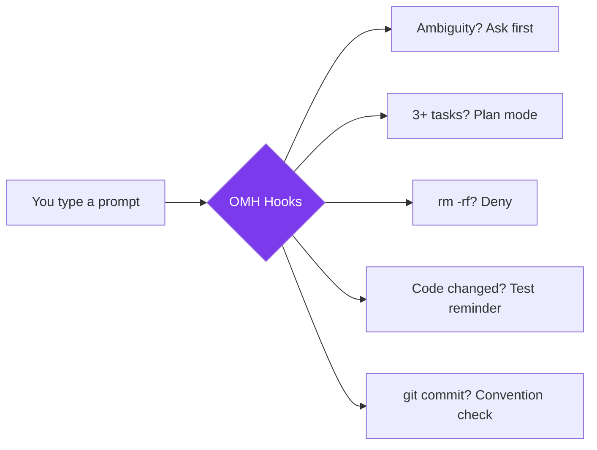
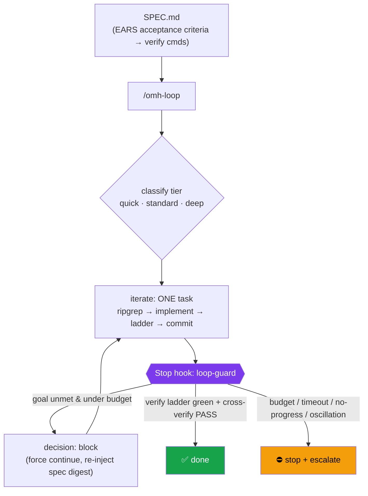
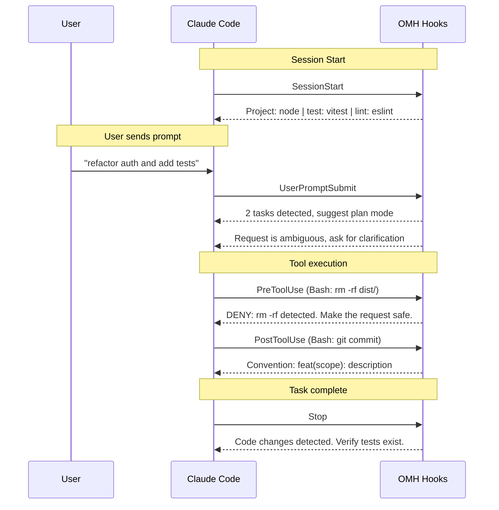
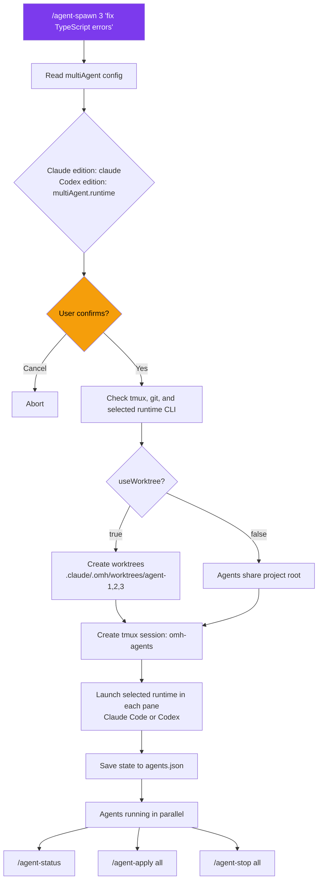
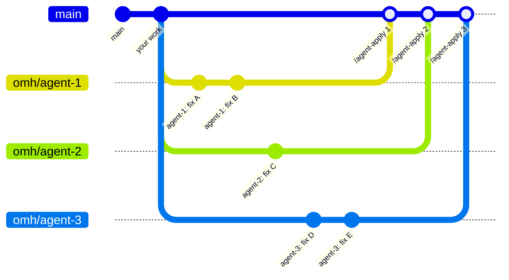
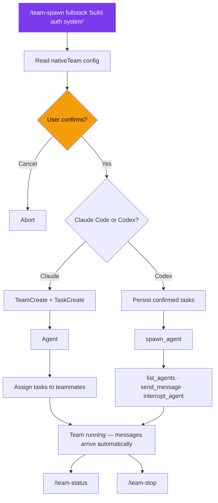

<p align="center">
  
  
  
  = 18" />
  
  
</p>

<h1 align="center">Oh My Harness</h1>

<p align="center">
  <strong>Spec-driven autonomous harness for Claude Code and Codex. Define the goal — it loops until done.</strong><br/>
  An autonomous loop that self-verifies and cross-verifies, weight-aware routing with multi-model verification, a living on-disk state anchor, plus smart defaults, test enforcement, model routing, and multi-agent orchestration — all through native hooks.
</p>

<p align="center">
  <a href="README.ko.md">한국어</a> &middot;
  <a href="#quick-start">Get Started</a> &middot;
  <a href="docs/features.md">Features</a> &middot;
  <a href="docs/multi-agent.md">Multi-Agent</a> &middot;
  <a href="docs/configuration.md">Config</a> &middot;
  <a href="docs/architecture.md">Architecture</a>
</p>

---

## Why Oh My Harness?

Claude Code is powerful out of the box — but it stops at the end of a turn even when the job isn't done, it doesn't verify its own work against the goal, and it treats every request the same regardless of complexity.

**Oh My Harness (OMH)** turns Claude Code into a **spec-driven autonomous harness**: you define the goal once in a `SPEC.md`, and OMH *loops* — implementing, self-verifying, and cross-verifying — until the spec is objectively met. The loop runs on Claude Code's native hooks, so the **harness owns when to keep going and when to stop** — never the model's self-assessment. Around the loop sit the same lightweight smart defaults (test enforcement, dangerous-op guard, model routing, multi-agent) that make every session safer.


```mermaid
graph LR
    A[You type a prompt] --> B{OMH Hooks}
    B --> C[Ambiguity? Ask first]
    B --> D[3+ tasks? Plan mode]
    B --> E[rm -rf? Deny]
    B --> F[Code changed? Test reminder]
    B --> G[git commit? Convention check]
    style B fill:#7C3AED,color:#fff
```

---

## Philosophy

**Autonomy with real walls.**

Earlier OMH was "warnings instead of walls." The autonomous loop changes that where it counts: a loop that can't be stopped is dangerous, and a loop that stops too early is useless — so the loop has **real walls**. The harness *forces continuation* while the goal is unmet and under budget, and *forces termination* on objective signals (verify ladder green + cross-verify, or a guardrail: iteration/wall-clock budget, no-progress, oscillation). The model never decides it's "done"; the harness does, against machine-checkable acceptance criteria.

Everywhere else, OMH stays the harness you barely notice — advisory defaults guide with warnings, critical pre-tool guards deny unsafe operations, and **project-specific skills** are auto-scaffolded from your detected stack (test conventions, review checklists, lint workflows) for you to own and customize.

- **Built-in skills** (agent management, setup) stay in the plugin
- **Project skills** (code-review, test-write, lint-fix) live in `.claude/skills/` for Claude Code and `.agents/skills/` for Codex; `--runtime both` scaffolds both — your project, your rules
- Run `/init-project` to scaffold, then customize freely

---

## Quick Start

Choose the installation path for Claude Code, Codex, or both:

```bash
# Claude Code
claude plugin marketplace add Hoya324/oh-my-harness
claude plugin install oh-my-harness@oh-my-harness

# Codex CLI / desktop local marketplace source
codex plugin marketplace add Hoya324/oh-my-harness
```

Or install runtime files directly into the current project:

```bash
# If the local CLI is not already on PATH
git clone https://github.com/Hoya324/oh-my-harness.git
cd oh-my-harness
npm link
cd /path/to/your-project

# Local CLI installation into a project
oh-my-harness init --runtime claude
oh-my-harness init --runtime codex
oh-my-harness init --runtime both
```

The Claude commands install the Claude Code plugin. The Codex command registers the marketplace source: in the **Codex CLI**, start Codex, enter `/plugins`, choose the configured marketplace, install `oh-my-harness`, then start a **new session**. In **Codex desktop**, open **Plugins**, select the configured marketplace under **Personal**, install `oh-my-harness`, then open a new chat. See the [official Codex plugin guide](https://developers.openai.com/codex/plugins). Marketplace installation automatically bundles the Codex hooks, skills, and MCP server only. To add quick/standard/architect role profiles and durable `AGENTS.md` guidance, invoke the bundled `/harness-setup` and approve those writes, or run `oh-my-harness init --runtime codex`; use `--runtime both` to provision both runtimes. The local CLI default remains `--runtime claude`.

## Codex Support

OMH 0.5.0 supports the Codex CLI and Codex desktop through the native [`.codex-plugin`](.codex-plugin/plugin.json) manifest. The marketplace payload exposes lifecycle hooks, Codex-native skills, and MCP memory; `/harness-setup` or direct local CLI init provisions the separate durable `AGENTS.md` guidance and quick/standard/architect roles.

| Capability | Claude Code | Codex CLI / desktop |
|---|---|---|
| Native plugin | `.claude-plugin` marketplace entry | `.codex-plugin` via the local marketplace |
| Lifecycle guards | Claude hook contract | Codex hook bridge; dangerous and explicit scope violations deny before tool use |
| Spec / loop / verify | `/omh-spec`, `/omh-loop`, `/omh-verify` | Same public skill names and shared core |
| Project skills | `.claude/skills/` | `.agents/skills/` |
| Roles / collaboration | Claude agents and team tools | Codex quick/standard/architect roles and collaboration tools |
| tmux/worktree workers | Claude process | Selectable Claude or `codex exec` process |
| Status | Claude status-line HUD | `omh-status` plus hook messages; no custom Claude HUD in Codex |
| State and memory | `.claude/.omh/` and `~/.omh/memory/graph.jsonl` | The same stores |

Codex keeps its native hook-trust boundary. After installing, open `/hooks`, review the OMH lifecycle hooks, and trust only the entries you approve; the installer never bypasses this review. The custom status-line HUD remains Claude-only because Codex has no equivalent extension surface. In Codex, invoke `omh-status` for the current tier, loop, verification, usage, and MCP memory status.

> The `.claude/.omh/` name is retained for compatibility. Claude Code and Codex intentionally read and write the same config, `STATE.md`, loop state, usage data, and learnings. Long-term memory also remains shared at `~/.omh/memory/graph.jsonl`.

Codex registers **one orchestrator** command per event. Although official Codex sibling handlers are concurrent, OMH's orchestrator runs shared handlers **sequentially** so safety order is deterministic. Critical `PreToolUse` guards fail closed when they cannot verify safety; advisory hooks warn or continue and remain fail open.

`omh-status` resolves project state first and then the **user-global fallback**. For deterministic lifecycle targeting, pass `--scope project` or `--scope user`; when omitted, the CLI uses its documented prompt, default, or detected-registration selection. Claude project and user lifecycles remain isolated. A malformed managed config, settings file, or guidance block fails preflight **before mutation**.

---

## Updating

When a new version is released, update to get the latest hooks, detection patterns, and features.

```bash
# Pull the latest plugin version
claude plugin update oh-my-harness@oh-my-harness

# Re-apply updated hooks and dictionary
/harness-setup

# Refresh only managed Codex files for the installed scope
oh-my-harness update --runtime codex
```

> **Note:** a Codex update refreshes OMH-managed hooks, built-in skills, roles, marked guidance, and the project-local memory runtime/registration. Claude plugin updates continue through their plugin setup flow and manage a different payload. User config, shared state, unrelated hooks, custom skills, and unmarked `AGENTS.md` / `CLAUDE.md` content are preserved. `reset --runtime codex` removes managed Codex registration while preserving shared project state when Claude remains installed; `reset --runtime both` removes both registrations and removes `.claude/.omh/` only when no remaining registration uses it. Neither reset deletes the separate long-term memory store at `~/.omh/memory/graph.jsonl`.

---

## Features Overview

OMH's features fall into three groups — **automatic guards** that fire on every session, **autonomous execution** you invoke explicitly, and the cross-cutting **routing, scaffolding & observability** layer.

### A. Automatic guards & routing — always on

| Feature | Hook | Default | What it does |
|---------|------|:-------:|-------------|
| Convention Auto-Detect | `SessionStart` | ON | Scans project and injects language/test/lint context |
| Weight Routing (Tier 1/2/3) | `UserPromptSubmit` | ON | Classifies prompt weight and routes guardrails proportionally; Tier 3 enforces verification before completion |
| Ambiguity Guard | `UserPromptSubmit` | ON | Forces clarification for vague requests |
| Auto-Plan Mode | `UserPromptSubmit` | ON | Detects 3+ tasks and suggests planning first |
| Dangerous Guard | `PreToolUse` | ON | Denies destructive commands and sensitive writes until the request is made safe |
| Plan Gate | `PreToolUse` (plan-gate) | ON | Tier-3 prompts must produce a plan-mode implementation plan before any edit |
| Commit Convention | `PostToolUse` | ON | Reminds commit format (Conventional / Gitmoji) |
| Scope Guard | Codex `PreToolUse` / Claude `PostToolUse` | OFF | Codex denies out-of-scope edits and recognized filesystem mutations with no auditable path; Claude reports after the tool |
| Usage Tracking | `PostToolUse` | ON | Records tool usage per session |
| Test Enforcement | `Stop` | ON | Reminds to verify tests after every code change |
| Verify Gate | `Stop` (verify-gate) | ON | Risk-judges each turn's diff and runs the verify ladder itself; blocks on red for sensitive/untested changes (never wedges) |
| Context Snapshot | `PreCompact` | ON | Saves task state before context compaction |
| Living State (`STATE.md`) | `SessionStart` / `PreCompact` | ON | Disk-anchored goal/phase/decisions re-injected across sessions to fight context rot |

For Tier-3 work, Claude gates `Edit`/`Write`-class tools and clears on `ExitPlanMode`. Codex maps `apply_patch` to an edit and clears only for a non-empty `update_plan` whose entries each have a nonblank `step` and an allowed `status`; other payloads do not clear the gate. The denial cap remains a final non-wedging escape hatch.

The scope event is intentionally runtime-specific: **Codex PreToolUse** enforcement runs inside the critical orchestrator before the tool, while **Claude PostToolUse** retains the existing observer contract. When no Codex scope config can be loaded, the project boundary is the fallback: paths inside the project remain allowed and traversal outside it is denied.

### B. Autonomous execution — you invoke it

| Feature | Trigger | Default | What it does |
|---------|---------|:-------:|-------------|
| **Autonomous Loop** | `Stop` (loop-guard) + `/omh-loop` | ON | Spec-driven loop: forces continuation until the verify ladder + cross-verify confirm done, with tiered guardrails (budget, timeout, no-progress, oscillation) |
| Spec Authoring | `/omh-spec` | ON | Writes a machine-checkable `SPEC.md` (EARS acceptance criteria → verify commands) to anchor the loop |
| N-Round Verify | `/omh-verify` | — | N independent verify+fix rounds with model rotation (Claude → GPT/codex → Gemini); external verifiers run read-only |
| **Long-Term Memory** | MCP `omh-memory` + `/omh-loop`, `/omh-verify` | ON | Cross-session, cross-runtime knowledge graph (shared with Codex): the loop reads prior learnings and persists reflexions & high-confidence findings |
| Native Team | `/team-spawn` | ON | Native Claude Code or Codex collaboration with templates |
| Multi-Agent | `/agent-spawn` | — | Runtime-selectable Claude Code or Codex workers in tmux with git worktrees |

### C. Routing, scaffolding & observability

| Feature | Trigger | Default | What it does |
|---------|---------|:-------:|-------------|
| Model Routing | CLAUDE.md + agents | ON | Routes subagents to haiku / sonnet / opus by complexity |
| Skill Scaffolding | `/init-project` | ON | Auto-generates project-specific skills based on detected stack |
| Auto .gitignore | CLI init | ON | Adds `.claude/.omh/` to `.gitignore` |
| Status HUD | status line | ON | Real-time rate-limit, context, tool-call, and model dashboard |

> See [Feature Details](docs/features.md), the [Autonomous Loop guide](docs/loop.md), and the [Verification guide](docs/verify.md) for full descriptions.

---

## Autonomous Loop

Define the goal once; OMH loops until it's objectively met.

```bash
/omh-spec add JWT auth with refresh tokens   # writes a machine-checkable SPEC.md
/omh-loop SPEC.md                             # runs it autonomously
/omh-loop stop                                # kill switch (or create .claude/.omh/STOP)
```

**How it works** — the Stop hook (`loop-guard`) is the loop engine *and* the safety enforcer:


```mermaid
graph TD
    SPEC["SPEC.md<br/>(EARS acceptance criteria → verify cmds)"] --> START["/omh-loop"]
    START --> TIER{"classify tier<br/>quick · standard · deep"}
    TIER --> ITER["iterate: ONE task<br/>ripgrep → implement → ladder → commit"]
    ITER --> STOP{{"Stop hook: loop-guard"}}
    STOP -->|"goal unmet & under budget"| CONT["decision: block<br/>(force continue, re-inject spec digest)"]
    CONT --> ITER
    STOP -->|"verify ladder green + cross-verify PASS"| DONE["✅ done"]
    STOP -->|"budget / timeout / no-progress / oscillation"| GUARD["⛔ stop + escalate"]
    style STOP fill:#7C3AED,color:#fff
    style DONE fill:#16a34a,color:#fff
    style GUARD fill:#f59e0b,color:#000
```

- **Cheap-first verify ladder** — deterministic checks (lint/typecheck → tests/build) run first and fail fast, feeding the *actual* failing output back; the expensive model judge only runs on green.
- **Cross-verification** — a *different* model (opus) scores each acceptance criterion against repo state (not the agent's self-report), runs a revert-and-rerun mutation check, and returns `PASS | FAIL | INCONCLUSIVE` (INCONCLUSIVE fails safe to stop).
- **Tiered budgets** — `quick` (≤3 iters) · `standard` (≤8) · `deep` (≤20), each with a wall-clock cap and cross-verify policy.
- **Real guardrails** — per-tier & cross-tier iteration caps, wall-clock timeout, no-progress/plateau and oscillation detection, `stop_hook_active` self-loop guard, concurrent-session/worktree isolation, atomic state, fail-open, and a `STOP` kill switch.

The design and the research behind it (Ralph Wiggum loop, Reflexion, Chain-of-Verification, FrugalGPT-style cascades, EARS) are documented in [docs/loop.md](docs/loop.md).

---

## Long-Term Memory (LTM)

OMH persists what it learns to a **knowledge-graph memory** that is **shared across Claude Code and Codex** — one store, both runtimes — so lessons from one session (and one agent) carry into the next.

```bash
# Plugin install: use the omh-memory MCP tools (for example search_nodes) in-session.
# Local Codex project scope:
oh-my-harness init --runtime codex
node .claude/.omh/runtime/lib/memory.mjs search "<project>"
# Local Codex user scope:
oh-my-harness init --runtime codex --scope user
node ~/.claude/.omh/runtime/lib/memory.mjs stats
```

- **Backend** — the pinned knowledge-graph server `@modelcontextprotocol/server-memory@2026.7.4`: local, no API key, entities + relations + observations in a JSONL file. The plugin MCP changes to the plugin root and launches `bin/omh-memory.sh`; local Codex init installs the same launcher and library under the selected scope, then manages `[mcp_servers.omh-memory]`. Both point at `~/.omh/memory/graph.jsonl`.
- **The loop reads it** — before planning, `/omh-loop` and `/omh-spec` query the graph for prior learnings, already-verified `quickCheck`/`verify` commands, and known pitfalls, and fold them into the plan (no re-detecting what's already known).
- **The loop writes it** — a failed iteration's Reflexion becomes a `Learning` entity; a green verify appends the verified commands to the `Project`; `/omh-verify` persists **high-confidence findings** (2+ models agree) so the next run doesn't rediscover them.
- **Agent + programmatic access** — plugin users use the `omh-memory` MCP tools live. Local Codex installs may use the managed scope-specific `runtime/lib/memory.mjs` helper shown above (atomic writes, format-compatible with the server).
- **Graceful degradation** — if the MCP server isn't connected (or offline), LTM steps are skipped silently; the loop never blocks on memory.
- **Launch and platforms** — the launcher uses `npx --yes --prefer-offline`; a first uncached launch still needs npm registry/network access. Release verification on macOS warms this exact package in the current machine's cache. Native Windows can run Codex hooks through `commandWindows`, but the MCP launcher itself requires Bash.

> **Concurrency note.** The knowledge-graph server keeps an in-memory copy and rewrites the whole file per mutation, so it is designed for one writer at a time. For personal single-agent use this is fine; avoid heavy simultaneous writes from Claude Code and Codex at the same instant.

**Setup** — Claude Code auto-loads the server from the plugin's `.mcp.json`. `oh-my-harness init --runtime codex` (or `both`) provisions the project-local launcher and manages this Codex registration automatically:

```toml
[mcp_servers.omh-memory]
command = "bash"
args = ["/ABSOLUTE/PROJECT/.claude/.omh/runtime/bin/omh-memory.sh"]
startup_timeout_sec = 60
```

---

## Weight-Aware Harness

Not every prompt deserves the same scrutiny. OMH classifies each request by **prompt weight** and routes guardrails proportionally — light requests stay frictionless, heavy ones get the full treatment.

```bash
/omh-verify add JWT auth with refresh tokens   # N-round independent multi-model verify + fix
```

- **Weight routing** — a `UserPromptSubmit` hook scores each prompt into **Tier 1** (trivial), **Tier 2** (standard), or **Tier 3** (heavy/risky). Higher tiers tighten guardrails automatically; **Tier 3 forces verification before completion**.
- **N-round verification** — `/omh-verify` runs N independent verify-and-fix rounds, **rotating the model lens each round** (Claude → GPT/codex → Gemini) so blind spots in one model are caught by another. External verifiers (codex, gemini) run **read-only** — they critique, they don't write.
- **Living state anchor** — a disk-anchored `STATE.md` (goal, phase, decisions, progress) is re-injected on `SessionStart` and refreshed before `PreCompact`, so the working context survives compaction and new sessions instead of rotting away.
- **Global config fallback** — settings resolve from the project's `harness.config.json` first, then fall back to a global `~/.claude/.omh`, so your defaults follow you across repos.

Full details, the verifier lenses, and the tier policy live in [docs/verify.md](docs/verify.md).

---

## Architecture

> Full details: [docs/architecture.md](docs/architecture.md)

OMH is built in **four layers**, so load-bearing decisions stay pure and unit-tested while native adapters apply the correct failure policy.

| Layer | Components | Role |
|-------|-----------|------|
| **① Hooks** | 11 shared scripts (9 lifecycle guards/observers + 2 gates) and 2 Codex bridge modules | Codex uses one orchestrator per event and executes handlers sequentially; critical guards fail closed, advisory hooks continue |
| **② Pure Core** (`lib/`) | `loop` · `tier` · `detect` · `config` · `verify` · `state` · `dictionary` | All decision logic as **pure functions** (no fs / git / time) → fully unit-tested |
| **③ Skills** | 13 Claude / 14 Codex skills | User-invoked workflows (`/omh-loop`, `/omh-verify`, `/team-spawn`, `omh-status`, …) |
| **④ Agents** | `quick` · `standard` · `architect` | Model routing — haiku / sonnet / opus by task weight |


```mermaid
graph TB
    subgraph "Claude Code Session"
        direction TB
        CC[Claude Code] --> HOOKS[Hook System]
        CC --> SKILLS[Skill System]
        CC --> AGENTS[Agent System]
    end

    subgraph "Oh My Harness"
        direction TB
        HOOKS --> H1[session-start.mjs]
        HOOKS --> H2[pre-prompt.mjs]
        HOOKS --> H3[dangerous-guard.mjs]
        HOOKS --> H4[commit-convention.mjs]
        HOOKS --> H5[scope-guard.mjs]
        HOOKS --> H6[usage-tracker.mjs]
        HOOKS --> H7[pre-compact.mjs]
        HOOKS --> H8[post-task.mjs]
        HOOKS --> H9[loop-guard.mjs]
        HOOKS --> H10[plan-gate.mjs]
        HOOKS --> H11[verify-gate.mjs]

        SKILLS --> S1["/harness-setup"]
        SKILLS --> S2["/set-harness"]
        SKILLS --> S3["/agent-spawn"]
        SKILLS --> S4["/team-spawn"]
        SKILLS --> S5["/omh-spec"]
        SKILLS --> S6["/omh-loop"]
        SKILLS --> S7["/omh-verify"]

        AGENTS --> A1["harness:quick (haiku)"]
        AGENTS --> A2["harness:standard (sonnet)"]
        AGENTS --> A3["harness:architect (opus)"]
    end

    subgraph "Project Data (.claude/.omh/)"
        CONFIG[harness.config.json]
        CONV[conventions.json]
        USAGE[usage.json]
        SNAP[context-snapshot.md]
        LOOP[loop-state.json]
        STATE[STATE.md]
    end

    H1 --> CONV
    H6 --> USAGE
    H7 --> SNAP
    H9 --> LOOP
    H1 --> STATE
    H7 --> STATE
    H1 --> CONFIG
    H2 --> CONFIG
    H3 --> CONFIG
    H10 --> CONFIG
    H11 --> CONFIG

    style CC fill:#7C3AED,color:#fff
    style CONFIG fill:#f59e0b,color:#000
```

## Hook Pipeline

Lifecycle events can trigger an ordered OMH hook chain; `PreToolUse`, `PostToolUse`, and `Stop` deliberately run more than one. The autonomous loop lives in the `Stop` chain:

| Lifecycle event | Hook | What it does |
|-----------------|------|-------------|
| `SessionStart` | `session-start.mjs` | Detect conventions · inject `STATE.md` |
| `UserPromptSubmit` | `pre-prompt.mjs` | Weight tier · ambiguity guard · auto-plan |
| `PreToolUse` | `dangerous-guard.mjs` · **`plan-gate.mjs`** · `scope-guard` (Codex) | Deny destructive operations or malformed hook input · **plan gate (Tier 3)** · enforce Codex scope |
| `PostToolUse` | `commit-convention` · `scope-guard` (Claude) · `usage-tracker` | Commit format · report Claude scope · usage stats |
| `PreCompact` | `pre-compact.mjs` | Snapshot context · refresh `STATE.md` |
| `Stop` | **`loop-guard.mjs`** · **`verify-gate.mjs`** · `post-task.mjs` | **Autonomous loop engine** · **risk-gated verify gate** · test enforcement |


```mermaid
sequenceDiagram
    participant U as User
    participant CC as Claude Code
    participant OMH as OMH Hooks

    Note over CC,OMH: Session Start
    CC->>OMH: SessionStart
    OMH-->>CC: Project: node | test: vitest | lint: eslint

    Note over U,CC: User sends prompt
    U->>CC: "refactor auth and add tests"
    CC->>OMH: UserPromptSubmit
    OMH-->>CC: 2 tasks detected, suggest plan mode
    OMH-->>CC: Request is ambiguous, ask for clarification

    Note over CC,OMH: Tool execution
    CC->>OMH: PreToolUse (Bash: rm -rf dist/)
    OMH-->>CC: DENY: rm -rf detected. Make the request safe.

    CC->>OMH: PostToolUse (Bash: git commit)
    OMH-->>CC: Convention: feat(scope): description

    Note over CC,OMH: Task complete
    CC->>OMH: Stop
    OMH-->>CC: Code changes detected. Verify tests exist.
```

## Multi-Agent

> Full details: [docs/multi-agent.md](docs/multi-agent.md)


```mermaid
graph TD
    START["/agent-spawn 3 'fix TypeScript errors'"] --> CONFIG[Read multiAgent config]
    CONFIG --> RUNTIME{"Claude edition: claude<br/>Codex edition: multiAgent.runtime"}
    RUNTIME --> CONFIRM{"User confirms?"}
    CONFIRM -->|Cancel| ABORT[Abort]
    CONFIRM -->|Yes| CHECK["Check tmux, git, and selected runtime CLI"]
    CHECK --> WT{"useWorktree?"}

    WT -->|true| CREATE_WT["Create worktrees<br/>.claude/.omh/worktrees/agent-1,2,3"]
    WT -->|false| SHARED[Agents share project root]

    CREATE_WT --> TMUX[Create tmux session: omh-agents]
    SHARED --> TMUX

    TMUX --> LAUNCH["Launch selected runtime in each pane<br/>Claude Code or Codex"]
    LAUNCH --> STATE[Save state to agents.json]
    STATE --> DONE[Agents running in parallel]

    DONE --> STATUS["/agent-status"]
    DONE --> APPLY["/agent-apply all"]
    DONE --> STOP["/agent-stop all"]

    style START fill:#7C3AED,color:#fff
    style CONFIRM fill:#f59e0b,color:#000
```

The Claude edition launches Claude. The Codex edition honors `multiAgent.runtime` (`codex` by default there, or `claude`). The fixed launch commands are:

```bash
claude --permission-mode bypassPermissions -p "Read TASK.md and complete its instructions."
codex exec --sandbox workspace-write --cd "<worktree>" "Read TASK.md and complete its instructions."
```

Claude permission bypass is disclosed at the confirmation gate. Codex uses its workspace-write sandbox. Task text stays in `TASK.md`, and neither command interpolates it into the shell.


```mermaid
gitGraph
    commit id: "main"
    commit id: "your work"
    branch omh/agent-1
    branch omh/agent-2
    branch omh/agent-3
    checkout omh/agent-1
    commit id: "agent-1: fix A"
    commit id: "agent-1: fix B"
    checkout omh/agent-2
    commit id: "agent-2: fix C"
    checkout omh/agent-3
    commit id: "agent-3: fix D"
    commit id: "agent-3: fix E"
    checkout main
    merge omh/agent-1 id: "/agent-apply 1"
    merge omh/agent-2 id: "/agent-apply 2"
    merge omh/agent-3 id: "/agent-apply 3"
```

## Native Team

> Full details: [docs/multi-agent.md](docs/multi-agent.md#native-team-system)

No tmux and no worktrees. Claude Code uses `TeamCreate`, `TaskCreate`, and `Agent`; Codex uses `spawn_agent`, `list_agents`, `send_message`, and `interrupt_agent`. Both require confirmation before creating live teammates.


```mermaid
graph TD
    START["/team-spawn fullstack 'build auth system'"] --> CONFIG[Read nativeTeam config]
    CONFIG --> CONFIRM{"User confirms?"}
    CONFIRM -->|Cancel| ABORT[Abort]
    CONFIRM -->|Yes| RUNTIME{"Claude Code or Codex?"}
    RUNTIME -->|Claude| CREATE["TeamCreate + TaskCreate"]
    CREATE --> SPAWN["Agent"]
    RUNTIME -->|Codex| CCREATE["Persist confirmed tasks"]
    CCREATE --> CSPAWN["spawn_agent"]
    CSPAWN --> CRECON["list_agents · send_message · interrupt_agent"]
    SPAWN --> ASSIGN[Assign tasks to teammates]
    ASSIGN --> RUNNING[Team running — messages arrive automatically]
    CRECON --> RUNNING

    RUNNING --> STATUS["/team-status"]
    RUNNING --> STOP["/team-stop"]

    style START fill:#7C3AED,color:#fff
    style CONFIRM fill:#f59e0b,color:#000
```

| Template | Members | Best For |
|----------|---------|----------|
| `fullstack` | frontend + backend + tester (all `standard`) | Full-stack features |
| `review` | reviewer (`architect`) + tester (`standard`) | Code review |
| `research` | researcher (`quick`) + implementer (`standard`) + architect (`architect`) | Research-driven work |

`quick` / `standard` / `architect` are shared agent types. The Claude edition maps them to haiku/sonnet/opus; the Codex edition treats them as available-profile preferences, not guarantees of a particular model.

---

## Documentation

| Document | Contents |
|----------|----------|
| **[Autonomous Loop](docs/loop.md)** | Spec-driven loop, verify ladder, cross-verification, tiers, guardrails, and the research behind the design |
| **[Verification](docs/verify.md)** | Weight routing (Tier 1/2/3), N-round multi-model verify+fix, read-only external verifiers, living `STATE.md` anchor |
| **[Features](docs/features.md)** | HUD status line, smart defaults, feature tags, detailed feature descriptions |
| **[Architecture](docs/architecture.md)** | System diagram, hook pipeline, plugin & local CLI directory structure |
| **[Multi-Agent](docs/multi-agent.md)** | Spawn commands, workflow, worktree branching model, safety policies |
| **[Configuration](docs/configuration.md)** | Settings reference, CLI commands, slash commands, OMC compatibility, uninstall |

---

## License

MIT
