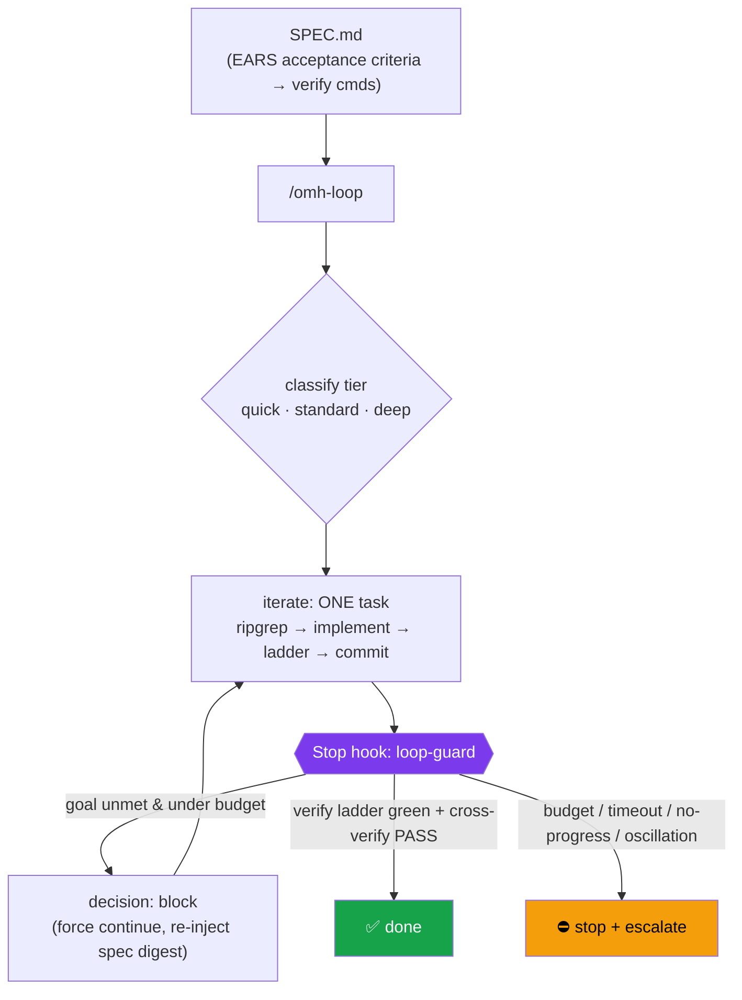
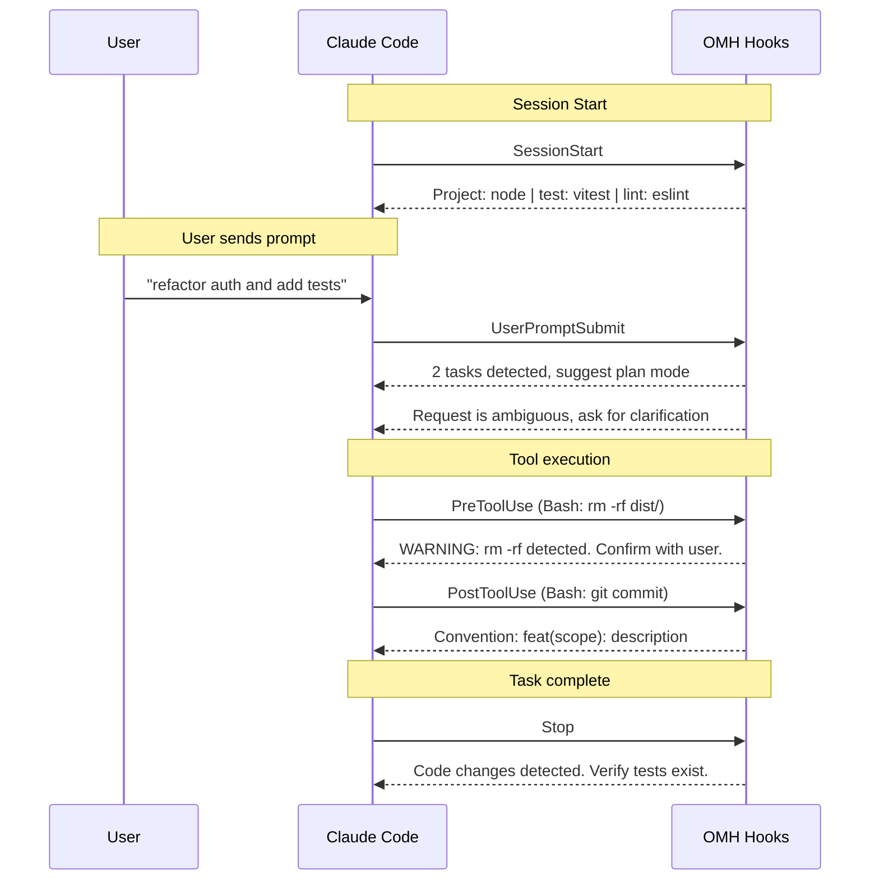
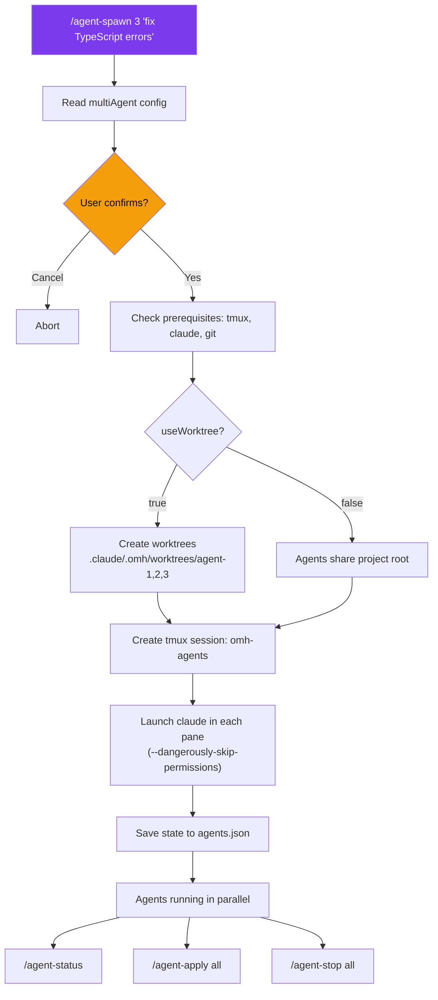
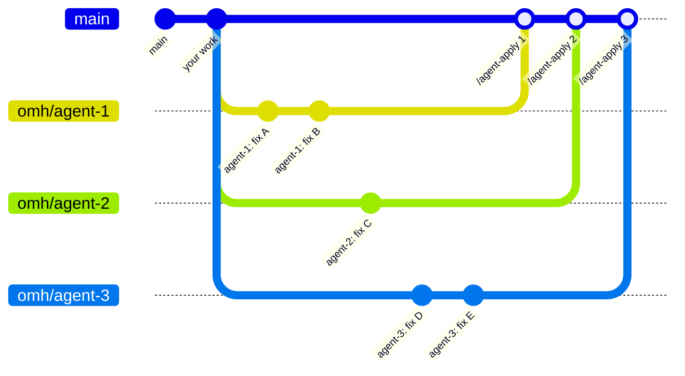
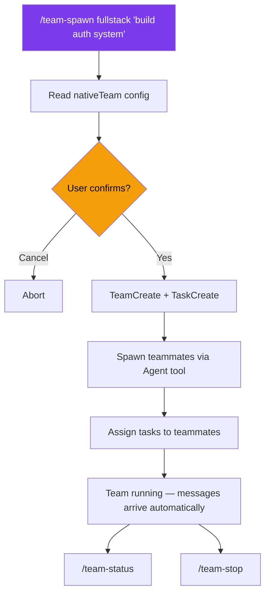

<p align="center">
  
  
  = 18" />
  
  
</p>

<h1 align="center">Oh My Harness</h1>

<p align="center">
  <strong>Spec-driven autonomous Claude Code harness. Define the goal — it loops until done.</strong><br/>
  An autonomous loop that self-verifies and cross-verifies, plus smart defaults, test enforcement, model routing, and multi-agent orchestration — all through native hooks.
</p>

<p align="center">
  <a href="README.ko.md">한국어</a> &middot;
  <a href="#quick-start">Get Started</a> &middot;
  <a href="docs/features.md">Features</a> &middot;
  <a href="docs/multi-agent.md">Multi-Agent</a> &middot;
  <a href="docs/configuration.md">Config</a> &middot;
  <a href="docs/architecture.md">Architecture</a>
</p>

---

## Why Oh My Harness?

Claude Code is powerful out of the box — but it stops at the end of a turn even when the job isn't done, it doesn't verify its own work against the goal, and it treats every request the same regardless of complexity.

**Oh My Harness (OMH)** turns Claude Code into a **spec-driven autonomous harness**: you define the goal once in a `SPEC.md`, and OMH *loops* — implementing, self-verifying, and cross-verifying — until the spec is objectively met. The loop runs on Claude Code's native hooks, so the **harness owns when to keep going and when to stop** — never the model's self-assessment. Around the loop sit the same lightweight smart defaults (test enforcement, dangerous-op guard, model routing, multi-agent) that make every session safer.


```mermaid
graph LR
    A[You type a prompt] --> B{OMH Hooks}
    B --> C[Ambiguity? Ask first]
    B --> D[3+ tasks? Plan mode]
    B --> E[rm -rf? Warn]
    B --> F[Code changed? Test reminder]
    B --> G[git commit? Convention check]
    style B fill:#7C3AED,color:#fff
```

---

## Philosophy

**Autonomy with real walls.**

Earlier OMH was "warnings instead of walls." The autonomous loop changes that where it counts: a loop that can't be stopped is dangerous, and a loop that stops too early is useless — so the loop has **real walls**. The harness *forces continuation* while the goal is unmet and under budget, and *forces termination* on objective signals (verify ladder green + cross-verify, or a guardrail: iteration/wall-clock budget, no-progress, oscillation). The model never decides it's "done"; the harness does, against machine-checkable acceptance criteria.

Everywhere else, OMH stays the harness you barely notice — smart defaults that guide with warnings, and **project-specific skills** auto-scaffolded from your detected stack (test conventions, review checklists, lint workflows) that you own and customize.

- **Built-in skills** (agent management, setup) stay in the plugin
- **Project skills** (code-review, test-write, lint-fix) live in `.claude/skills/` — your project, your rules
- Run `/init-project` to scaffold, then customize freely

---

## Quick Start

### Option A: Claude Code Plugin (recommended)

```bash
# 1. Add the marketplace, then install — one copy-paste:
claude plugin marketplace add Hoya324/oh-my-harness
claude plugin install oh-my-harness@oh-my-harness
```

That's it. **Zero setup required** — OMH works on sensible defaults the moment it's installed. `/harness-setup` is optional and only needed if you want to tune `harness.config.json`.

### Option B: npm CLI (no global install)

```bash
cd your-project
npx oh-my-harness@latest init
```

Or install globally if you prefer: `npm install -g oh-my-harness && oh-my-harness init`.

Either way, start Claude Code as usual — harness features (including the autonomous loop) activate automatically.

---

## Updating

When a new version is released, update to get the latest hooks, detection patterns, and features.

### Plugin mode

```bash
# Pull the latest plugin version
claude plugin update oh-my-harness@oh-my-harness

# Re-initialize to apply updated hooks and dictionary
/harness-setup
```

### npm CLI mode

```bash
# Update the global package
npm update -g oh-my-harness

# Re-run init to copy updated hooks into your project
oh-my-harness init
```

> **Note:** `init` preserves your existing `harness.config.json`. Only hooks, commands, and CLAUDE.md instructions are refreshed.

---

## Features Overview

| # | Feature | Hook | Default | What it does |
|:-:|---------|------|:-------:|-------------|
| 1 | Convention Auto-Detect | `SessionStart` | ON | Scans project and injects language/test/lint context |
| 2 | Test Enforcement | `Stop` | ON | Reminds to verify tests after every code change |
| 3 | Model Routing | CLAUDE.md + agents | ON | Routes subagents to haiku / sonnet / opus by complexity |
| 4 | Auto-Plan Mode | `UserPromptSubmit` | ON | Detects 3+ tasks and suggests planning first |
| 5 | Ambiguity Guard | `UserPromptSubmit` | ON | Forces clarification for vague requests |
| 6 | Dangerous Guard | `PreToolUse` | ON | Warns before `rm -rf`, `git push --force`, `.env` writes |
| 7 | Context Snapshot | `PreCompact` | ON | Saves task state before context compaction |
| 8 | Commit Convention | `PostToolUse` | ON | Reminds commit format (Conventional / Gitmoji) |
| 9 | Scope Guard | `PostToolUse` | OFF | Warns when modifying files outside allowed paths |
| 10 | Usage Tracking | `PostToolUse` | ON | Records tool usage per session |
| 11 | Auto .gitignore | CLI init | ON | Adds `.claude/.omh/` to `.gitignore` |
| 12 | Multi-Agent | `/agent-spawn` | — | Parallel Claude agents in tmux with git worktrees |
| 13 | Native Team | `/team-spawn` | ON | Native Claude Code team orchestration with templates |
| 14 | Skill Scaffolding | `/init-project` | ON | Auto-generates project-specific skills based on detected stack |
| 15 | **Autonomous Loop** | `Stop` (loop-guard) + `/omh-loop` | ON | Spec-driven loop: forces continuation until the verify ladder + cross-verify confirm done, with tiered guardrails (budget, timeout, no-progress, oscillation) |
| 16 | Spec Authoring | `/omh-spec` | ON | Writes a machine-checkable `SPEC.md` (EARS acceptance criteria → verify commands) to anchor the loop |

> See [Feature Details](docs/features.md) and the [Autonomous Loop guide](docs/loop.md) for full descriptions.

---

## Autonomous Loop

Define the goal once; OMH loops until it's objectively met.

```bash
/omh-spec add JWT auth with refresh tokens   # writes a machine-checkable SPEC.md
/omh-loop SPEC.md                             # runs it autonomously
/omh-loop stop                                # kill switch (or create .claude/.omh/STOP)
```

**How it works** — the Stop hook (`loop-guard`) is the loop engine *and* the safety enforcer:


```mermaid
graph TD
    SPEC["SPEC.md<br/>(EARS acceptance criteria → verify cmds)"] --> START["/omh-loop"]
    START --> TIER{"classify tier<br/>quick · standard · deep"}
    TIER --> ITER["iterate: ONE task<br/>ripgrep → implement → ladder → commit"]
    ITER --> STOP{{"Stop hook: loop-guard"}}
    STOP -->|"goal unmet & under budget"| CONT["decision: block<br/>(force continue, re-inject spec digest)"]
    CONT --> ITER
    STOP -->|"verify ladder green + cross-verify PASS"| DONE["✅ done"]
    STOP -->|"budget / timeout / no-progress / oscillation"| GUARD["⛔ stop + escalate"]
    style STOP fill:#7C3AED,color:#fff
    style DONE fill:#16a34a,color:#fff
    style GUARD fill:#f59e0b,color:#000
```

- **Cheap-first verify ladder** — deterministic checks (lint/typecheck → tests/build) run first and fail fast, feeding the *actual* failing output back; the expensive model judge only runs on green.
- **Cross-verification** — a *different* model (opus) scores each acceptance criterion against repo state (not the agent's self-report), runs a revert-and-rerun mutation check, and returns `PASS | FAIL | INCONCLUSIVE` (INCONCLUSIVE fails safe to stop).
- **Tiered budgets** — `quick` (≤3 iters) · `standard` (≤8) · `deep` (≤20), each with a wall-clock cap and cross-verify policy.
- **Real guardrails** — per-tier & cross-tier iteration caps, wall-clock timeout, no-progress/plateau and oscillation detection, `stop_hook_active` self-loop guard, concurrent-session/worktree isolation, atomic state, fail-open, and a `STOP` kill switch.

The design and the research behind it (Ralph Wiggum loop, Reflexion, Chain-of-Verification, FrugalGPT-style cascades, EARS) are documented in [docs/loop.md](docs/loop.md).

---

## Architecture

> Full details: [docs/architecture.md](docs/architecture.md)


```mermaid
graph TB
    subgraph "Claude Code Session"
        direction TB
        CC[Claude Code] --> HOOKS[Hook System]
        CC --> SKILLS[Skill System]
        CC --> AGENTS[Agent System]
    end

    subgraph "Oh My Harness"
        direction TB
        HOOKS --> H1[session-start.mjs]
        HOOKS --> H2[pre-prompt.mjs]
        HOOKS --> H3[dangerous-guard.mjs]
        HOOKS --> H4[commit-convention.mjs]
        HOOKS --> H5[scope-guard.mjs]
        HOOKS --> H6[usage-tracker.mjs]
        HOOKS --> H7[pre-compact.mjs]
        HOOKS --> H8[post-task.mjs]
        HOOKS --> H9[loop-guard.mjs]

        SKILLS --> S1["/harness-setup"]
        SKILLS --> S2["/set-harness"]
        SKILLS --> S3["/agent-spawn"]
        SKILLS --> S4["/team-spawn"]
        SKILLS --> S5["/omh-spec"]
        SKILLS --> S6["/omh-loop"]

        AGENTS --> A1["harness:quick (haiku)"]
        AGENTS --> A2["harness:standard (sonnet)"]
        AGENTS --> A3["harness:architect (opus)"]
    end

    subgraph "Project Data (.claude/.omh/)"
        CONFIG[harness.config.json]
        CONV[conventions.json]
        USAGE[usage.json]
        SNAP[context-snapshot.md]
        LOOP[loop-state.json]
    end

    H1 --> CONV
    H6 --> USAGE
    H7 --> SNAP
    H9 --> LOOP
    H1 --> CONFIG
    H2 --> CONFIG
    H3 --> CONFIG

    style CC fill:#7C3AED,color:#fff
    style CONFIG fill:#f59e0b,color:#000
```

## Hook Pipeline


```mermaid
sequenceDiagram
    participant U as User
    participant CC as Claude Code
    participant OMH as OMH Hooks

    Note over CC,OMH: Session Start
    CC->>OMH: SessionStart
    OMH-->>CC: Project: node | test: vitest | lint: eslint

    Note over U,CC: User sends prompt
    U->>CC: "refactor auth and add tests"
    CC->>OMH: UserPromptSubmit
    OMH-->>CC: 2 tasks detected, suggest plan mode
    OMH-->>CC: Request is ambiguous, ask for clarification

    Note over CC,OMH: Tool execution
    CC->>OMH: PreToolUse (Bash: rm -rf dist/)
    OMH-->>CC: WARNING: rm -rf detected. Confirm with user.

    CC->>OMH: PostToolUse (Bash: git commit)
    OMH-->>CC: Convention: feat(scope): description

    Note over CC,OMH: Task complete
    CC->>OMH: Stop
    OMH-->>CC: Code changes detected. Verify tests exist.
```

## Multi-Agent

> Full details: [docs/multi-agent.md](docs/multi-agent.md)


```mermaid
graph TD
    START["/agent-spawn 3 'fix TypeScript errors'"] --> CONFIG[Read multiAgent config]
    CONFIG --> CONFIRM{"User confirms?"}
    CONFIRM -->|Cancel| ABORT[Abort]
    CONFIRM -->|Yes| CHECK[Check prerequisites: tmux, claude, git]
    CHECK --> WT{"useWorktree?"}

    WT -->|true| CREATE_WT["Create worktrees<br/>.claude/.omh/worktrees/agent-1,2,3"]
    WT -->|false| SHARED[Agents share project root]

    CREATE_WT --> TMUX[Create tmux session: omh-agents]
    SHARED --> TMUX

    TMUX --> LAUNCH["Launch claude in each pane<br/>(--dangerously-skip-permissions)"]
    LAUNCH --> STATE[Save state to agents.json]
    STATE --> DONE[Agents running in parallel]

    DONE --> STATUS["/agent-status"]
    DONE --> APPLY["/agent-apply all"]
    DONE --> STOP["/agent-stop all"]

    style START fill:#7C3AED,color:#fff
    style CONFIRM fill:#f59e0b,color:#000
```


```mermaid
gitGraph
    commit id: "main"
    commit id: "your work"
    branch omh/agent-1
    branch omh/agent-2
    branch omh/agent-3
    checkout omh/agent-1
    commit id: "agent-1: fix A"
    commit id: "agent-1: fix B"
    checkout omh/agent-2
    commit id: "agent-2: fix C"
    checkout omh/agent-3
    commit id: "agent-3: fix D"
    commit id: "agent-3: fix E"
    checkout main
    merge omh/agent-1 id: "/agent-apply 1"
    merge omh/agent-2 id: "/agent-apply 2"
    merge omh/agent-3 id: "/agent-apply 3"
```

## Native Team

> Full details: [docs/multi-agent.md](docs/multi-agent.md#native-team-system)

No tmux, no worktrees — use Claude Code's built-in team orchestration.


```mermaid
graph TD
    START["/team-spawn fullstack 'build auth system'"] --> CONFIG[Read nativeTeam config]
    CONFIG --> CONFIRM{"User confirms?"}
    CONFIRM -->|Cancel| ABORT[Abort]
    CONFIRM -->|Yes| CREATE[TeamCreate + TaskCreate]
    CREATE --> SPAWN["Spawn teammates via Agent tool"]
    SPAWN --> ASSIGN[Assign tasks to teammates]
    ASSIGN --> RUNNING[Team running — messages arrive automatically]

    RUNNING --> STATUS["/team-status"]
    RUNNING --> STOP["/team-stop"]

    style START fill:#7C3AED,color:#fff
    style CONFIRM fill:#f59e0b,color:#000
```

| Template | Members | Best For |
|----------|---------|----------|
| `fullstack` | frontend + backend + tester (all sonnet) | Full-stack features |
| `review` | reviewer (opus) + tester (sonnet) | Code review |
| `research` | researcher (haiku) + implementer (sonnet) + architect (opus) | Research-driven work |

---

## Documentation

| Document | Contents |
|----------|----------|
| **[Autonomous Loop](docs/loop.md)** | Spec-driven loop, verify ladder, cross-verification, tiers, guardrails, and the research behind the design |
| **[Features](docs/features.md)** | HUD status line, smart defaults, feature tags, detailed feature descriptions |
| **[Architecture](docs/architecture.md)** | System diagram, hook pipeline, plugin mode vs npm CLI directory structure |
| **[Multi-Agent](docs/multi-agent.md)** | Spawn commands, workflow, worktree branching model, safety policies |
| **[Configuration](docs/configuration.md)** | Settings reference, CLI commands, slash commands, OMC compatibility, uninstall |

---

## License

MIT
