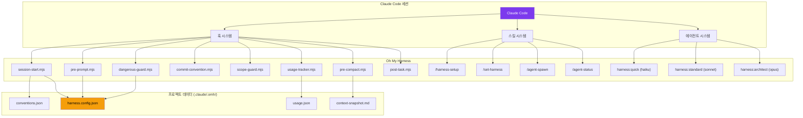
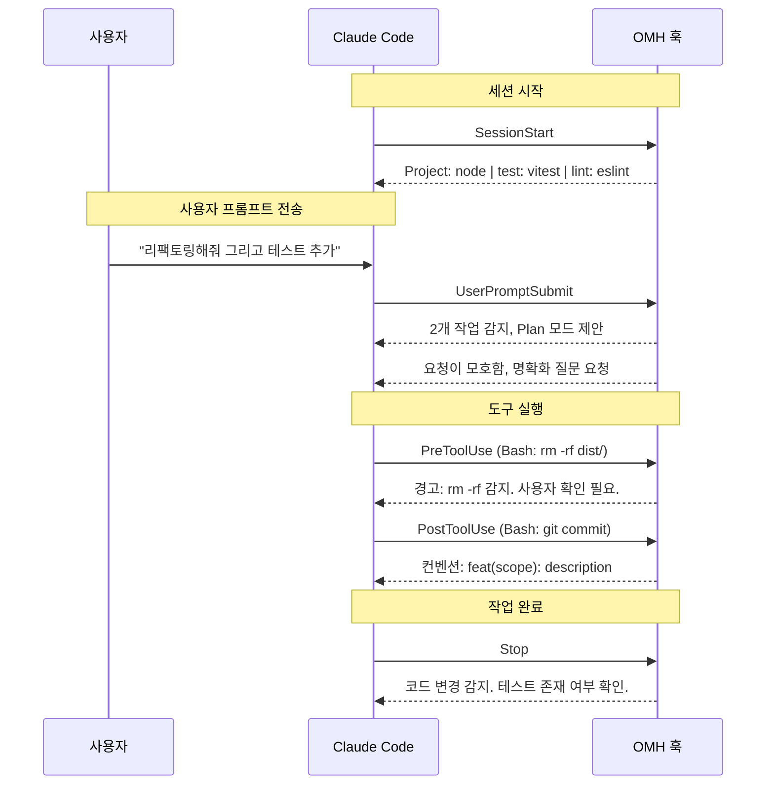

# 아키텍처

OMH는 **Claude Code 플러그인** 또는 **npm CLI** 두 가지 모드로 동작합니다. 둘 다 동일한 결과를 제공합니다: 네이티브 훅, 스킬, CLAUDE.md 지시문.

## 개요



## 훅 파이프라인



## 플러그인 모드 (권장)

플러그인 시스템이 훅 등록과 스킬 로딩을 자동으로 처리합니다:

```
oh-my-harness/                    <- 플러그인 루트 ($CLAUDE_PLUGIN_ROOT)
├── .claude-plugin/
│   ├── plugin.json               <- 플러그인 매니페스트
│   └── marketplace.json          <- 마켓플레이스 목록
├── CLAUDE.md                     <- 시스템 프롬프트 (자동 주입)
├── hooks/
│   ├── hooks.json                <- 훅 등록 ($CLAUDE_PLUGIN_ROOT 사용)
│   ├── lib/output.mjs            <- 공유 출력 헬퍼
│   ├── session-start.mjs         <- 컨벤션 감지
│   ├── pre-prompt.mjs            <- 모호성 + 자동 Plan
│   ├── dangerous-guard.mjs       <- 위험 명령 경고
│   ├── commit-convention.mjs     <- 커밋 형식 안내
│   ├── scope-guard.mjs           <- 경로 제한 경고
│   ├── usage-tracker.mjs         <- 도구 사용량 기록
│   ├── pre-compact.mjs           <- 컨텍스트 스냅샷
│   └── post-task.mjs             <- 테스트 강제
├── skills/                       <- 슬래시 명령어 (자동 등록)
│   ├── harness-setup/SKILL.md    <- /harness-setup
│   ├── set-harness/SKILL.md      <- /set-harness
│   ├── init-project/SKILL.md     <- /init-project
│   ├── agent-spawn/SKILL.md      <- /agent-spawn
│   ├── agent-status/SKILL.md     <- /agent-status
│   ├── agent-apply/SKILL.md      <- /agent-apply
│   └── agent-stop/SKILL.md       <- /agent-stop
└── agents/                       <- 모델 라우팅 에이전트
    ├── quick.md                   <- haiku
    ├── standard.md                <- sonnet
    └── architect.md               <- opus
```

## npm CLI 모드

CLI가 훅과 명령어를 프로젝트의 `.claude/` 디렉토리에 복사합니다:

```
your-project/
└── .claude/
    ├── settings.local.json       <- 훅 등록
    ├── CLAUDE.md                 <- 행동 규칙 추가
    ├── commands/                 <- 슬래시 명령어
    │   ├── set-harness.md
    │   ├── init-project.md
    │   ├── agent-spawn.md
    │   ├── agent-status.md
    │   ├── agent-apply.md
    │   └── agent-stop.md
    └── .omh/                     <- 프로젝트 데이터 (gitignored)
        ├── harness.config.json
        ├── conventions.json
        ├── usage.json
        └── context-snapshot.md
```
