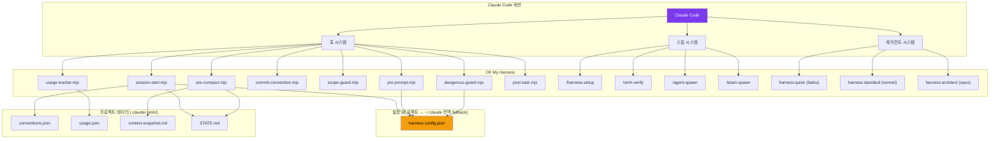
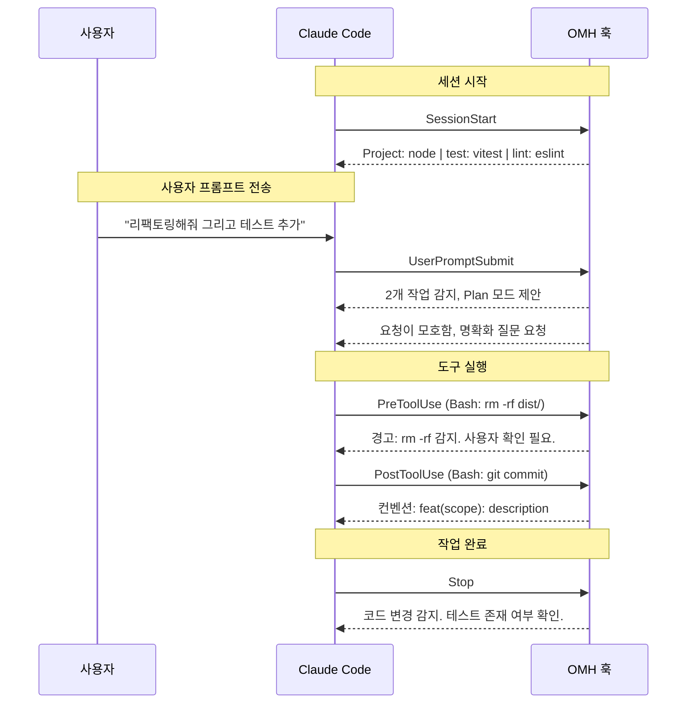

# 아키텍처

OMH는 **Claude Code 플러그인** 또는 **npm CLI** 두 가지 모드로 동작합니다. 둘 다 동일한 결과를 제공합니다: 네이티브 훅, 스킬, CLAUDE.md 지시문.

## 개요


```mermaid
graph TB
    subgraph "Claude Code 세션"
        direction TB
        CC[Claude Code] --> HOOKS[훅 시스템]
        CC --> SKILLS[스킬 시스템]
        CC --> AGENTS[에이전트 시스템]
    end

    subgraph "Oh My Harness"
        direction TB
        HOOKS --> H1[session-start.mjs]
        HOOKS --> H2[pre-prompt.mjs]
        HOOKS --> H3[dangerous-guard.mjs]
        HOOKS --> H4[commit-convention.mjs]
        HOOKS --> H5[scope-guard.mjs]
        HOOKS --> H6[usage-tracker.mjs]
        HOOKS --> H7[pre-compact.mjs]
        HOOKS --> H8[post-task.mjs]

        SKILLS --> S1["/harness-setup"]
        SKILLS --> S2["/omh-verify"]
        SKILLS --> S3["/agent-spawn"]
        SKILLS --> S4["/team-spawn"]

        AGENTS --> A1["harness:quick (haiku)"]
        AGENTS --> A2["harness:standard (sonnet)"]
        AGENTS --> A3["harness:architect (opus)"]
    end

    subgraph "설정 (프로젝트 → ~/.claude 전역 fallback)"
        CONFIG[harness.config.json]
    end

    subgraph "프로젝트 데이터 (.claude/.omh/)"
        CONV[conventions.json]
        USAGE[usage.json]
        SNAP[context-snapshot.md]
        STATE[STATE.md]
    end

    H1 --> CONV
    H6 --> USAGE
    H7 --> SNAP
    H1 --> STATE
    H7 --> STATE
    H1 --> CONFIG
    H2 --> CONFIG
    H3 --> CONFIG

    style CC fill:#7C3AED,color:#fff
    style CONFIG fill:#f59e0b,color:#000
```

## 훅 파이프라인


```mermaid
sequenceDiagram
    participant U as 사용자
    participant CC as Claude Code
    participant OMH as OMH 훅

    Note over CC,OMH: 세션 시작
    CC->>OMH: SessionStart
    OMH-->>CC: Project: node | test: vitest | lint: eslint

    Note over U,CC: 사용자 프롬프트 전송
    U->>CC: "리팩토링해줘 그리고 테스트 추가"
    CC->>OMH: UserPromptSubmit
    OMH-->>CC: 2개 작업 감지, Plan 모드 제안
    OMH-->>CC: 요청이 모호함, 명확화 질문 요청

    Note over CC,OMH: 도구 실행
    CC->>OMH: PreToolUse (Bash: rm -rf dist/)
    OMH-->>CC: 경고: rm -rf 감지. 사용자 확인 필요.

    CC->>OMH: PostToolUse (Bash: git commit)
    OMH-->>CC: 컨벤션: feat(scope): description

    Note over CC,OMH: 작업 완료
    CC->>OMH: Stop
    OMH-->>CC: 코드 변경 감지. 테스트 존재 여부 확인.
```

## 플러그인 모드 (권장)

플러그인 시스템이 훅 등록과 스킬 로딩을 자동으로 처리합니다:

```
oh-my-harness/                    <- 플러그인 루트 ($CLAUDE_PLUGIN_ROOT)
├── .claude-plugin/
│   ├── plugin.json               <- 플러그인 매니페스트
│   └── marketplace.json          <- 마켓플레이스 목록
├── CLAUDE.md                     <- 시스템 프롬프트 (자동 주입)
├── hooks/
│   ├── hooks.json                <- 훅 등록 ($CLAUDE_PLUGIN_ROOT 사용)
│   ├── lib/output.mjs            <- 공유 출력 헬퍼
│   ├── lib/dictionary.mjs        <- 한/영 패턴 + 무게 표현
│   ├── lib/tier.mjs              <- 작업 무게 분류기 (Tier 1/2/3)
│   ├── lib/hook-config.mjs       <- config 로더 (프로젝트 → ~/.claude 전역 fallback)
│   ├── session-start.mjs         <- 컨벤션 감지 + STATE.md 주입
│   ├── pre-prompt.mjs            <- 모호성 + 자동 Plan + 무게 라우팅
│   ├── dangerous-guard.mjs       <- 위험 명령 경고
│   ├── commit-convention.mjs     <- 커밋 형식 안내
│   ├── scope-guard.mjs           <- 경로 제한 경고
│   ├── usage-tracker.mjs         <- 도구 사용량 기록
│   ├── pre-compact.mjs           <- 컨텍스트 스냅샷
│   └── post-task.mjs             <- 테스트 강제
├── skills/                       <- 슬래시 명령어 (자동 등록)
│   ├── harness-setup/SKILL.md    <- /harness-setup
│   ├── set-harness/SKILL.md      <- /set-harness
│   ├── init-project/SKILL.md     <- /init-project
│   ├── agent-spawn/SKILL.md      <- /agent-spawn
│   ├── agent-status/SKILL.md     <- /agent-status
│   ├── agent-apply/SKILL.md      <- /agent-apply
│   ├── agent-stop/SKILL.md       <- /agent-stop
│   ├── omh-verify/SKILL.md       <- /omh-verify (N-라운드 독립 검증)
│   ├── team-spawn/SKILL.md       <- /team-spawn
│   ├── team-status/SKILL.md      <- /team-status
│   └── team-stop/SKILL.md        <- /team-stop
├── lib/                          <- 코어 모듈 (CLI + 검증 엔진)
│   ├── config.mjs                <- config 스키마 + deep-merge
│   ├── verify.mjs                <- /omh-verify 헬퍼 (diff, 렌즈 로테이션)
│   ├── state.mjs                 <- STATE.md 읽기/쓰기/렌더
│   └── adapters/
│       ├── codex.mjs             <- GPT 검증자 (codex exec -s read-only)
│       └── gemini.mjs            <- Gemini 검증자 (gemini -p --approval-mode plan)
└── agents/                       <- 모델 라우팅 에이전트
    ├── quick.md                   <- haiku
    ├── standard.md                <- sonnet
    └── architect.md               <- opus
```

## npm CLI 모드

CLI가 훅과 명령어를 프로젝트의 `.claude/` 디렉토리에 복사합니다:

```
your-project/
└── .claude/
    ├── settings.local.json       <- 훅 등록
    ├── CLAUDE.md                 <- 행동 규칙 추가
    ├── commands/                 <- 슬래시 명령어
    │   ├── set-harness.md
    │   ├── init-project.md
    │   ├── agent-spawn.md
    │   ├── agent-status.md
    │   ├── agent-apply.md
    │   └── agent-stop.md
    └── .omh/                     <- 프로젝트 데이터 (gitignored)
        ├── harness.config.json
        ├── conventions.json
        ├── usage.json
        ├── context-snapshot.md
        └── STATE.md
```
