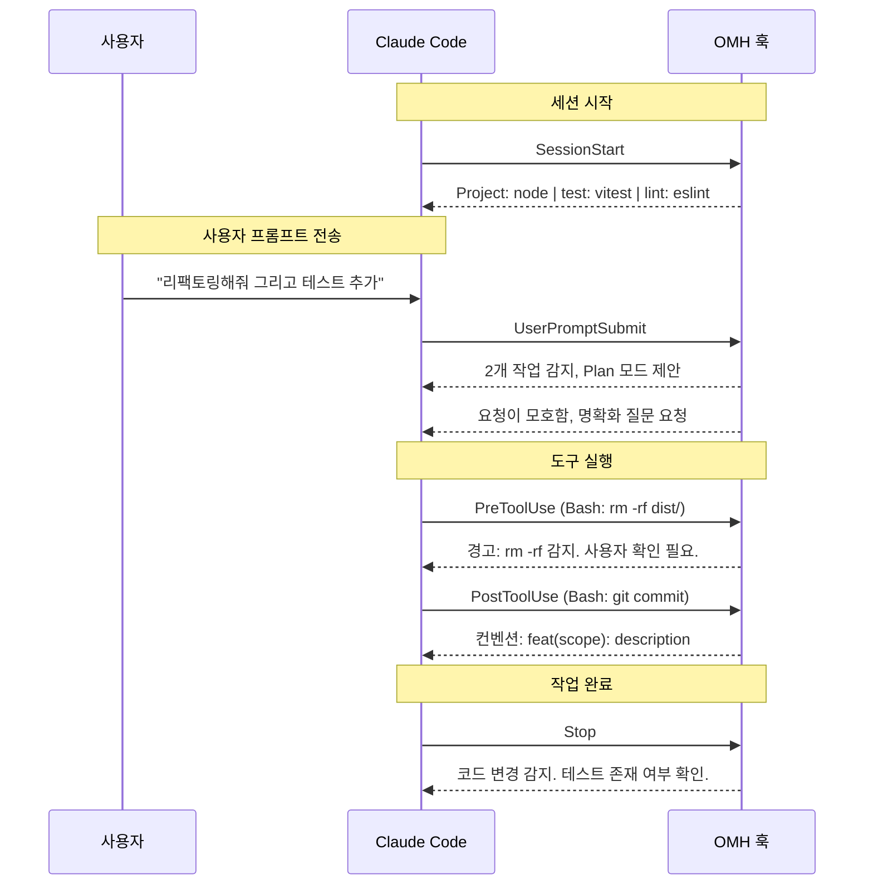
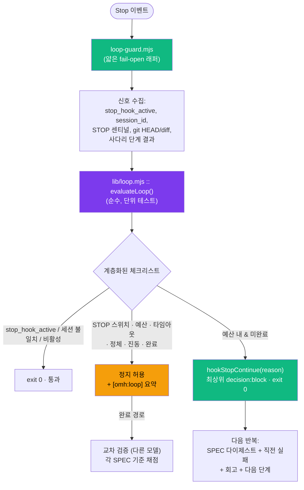

# 아키텍처

OMH는 **Claude Code 플러그인**(권장) 또는 클론한 저장소에서 실행하는 **로컬 CLI** 두 가지 모드로 동작합니다. 둘 다 동일한 결과를 제공합니다: 네이티브 훅, 스킬, CLAUDE.md 지시문.

## 개요


```mermaid
graph TB
    subgraph "Claude Code 세션"
        direction TB
        CC[Claude Code] --> HOOKS[훅 시스템]
        CC --> SKILLS[스킬 시스템]
        CC --> AGENTS[에이전트 시스템]
    end

    subgraph "Oh My Harness"
        direction TB
        HOOKS --> H1[session-start.mjs]
        HOOKS --> H2[pre-prompt.mjs]
        HOOKS --> H3[dangerous-guard.mjs]
        HOOKS --> H4[commit-convention.mjs]
        HOOKS --> H5[scope-guard.mjs]
        HOOKS --> H6[usage-tracker.mjs]
        HOOKS --> H7[pre-compact.mjs]
        HOOKS --> H9["loop-guard.mjs (Stop · 루프 엔진)"]
        HOOKS --> H8[post-task.mjs]

        SKILLS --> S1["/harness-setup"]
        SKILLS --> S2["/omh-verify"]
        SKILLS --> S3["/agent-spawn"]
        SKILLS --> S4["/agent-status"]
        SKILLS --> S5["/omh-spec"]
        SKILLS --> S6["/omh-loop"]
        SKILLS --> S7["/team-spawn"]

        AGENTS --> A1["harness:quick (haiku)"]
        AGENTS --> A2["harness:standard (sonnet)"]
        AGENTS --> A3["harness:architect (opus)"]

        H9 --> LOOPLIB["lib/loop.mjs (순수 결정 로직)"]
    end

    subgraph "설정 (프로젝트 → ~/.claude 전역 fallback)"
        CONFIG[harness.config.json]
    end

    subgraph "프로젝트 데이터 (.claude/.omh/)"
        CONV[conventions.json]
        USAGE[usage.json]
        SNAP[context-snapshot.md]
        STATE[STATE.md]
        LSTATE[loop-state.json]
        LEARN[loop-learnings.md]
    end

    PROGRESS["PROGRESS.md (프로젝트 루트 · 사람용 로그)"]

    H1 --> CONV
    H6 --> USAGE
    H7 --> SNAP
    H1 --> STATE
    H7 --> STATE
    H1 --> CONFIG
    H2 --> CONFIG
    H3 --> CONFIG
    H9 --> CONFIG
    H9 --> LSTATE
    H9 --> LEARN
    S6 --> PROGRESS

    style CC fill:#7C3AED,color:#fff
    style CONFIG fill:#f59e0b,color:#000
    style H9 fill:#10b981,color:#fff
    style LSTATE fill:#f59e0b,color:#000
```

## 훅 파이프라인


```mermaid
sequenceDiagram
    participant U as 사용자
    participant CC as Claude Code
    participant OMH as OMH 훅

    Note over CC,OMH: 세션 시작
    CC->>OMH: SessionStart
    OMH-->>CC: Project: node | test: vitest | lint: eslint

    Note over U,CC: 사용자 프롬프트 전송
    U->>CC: "리팩토링해줘 그리고 테스트 추가"
    CC->>OMH: UserPromptSubmit
    OMH-->>CC: 2개 작업 감지, Plan 모드 제안
    OMH-->>CC: 요청이 모호함, 명확화 질문 요청

    Note over CC,OMH: 도구 실행
    CC->>OMH: PreToolUse (Bash: rm -rf dist/)
    OMH-->>CC: 경고: rm -rf 감지. 사용자 확인 필요.

    CC->>OMH: PostToolUse (Bash: git commit)
    OMH-->>CC: 컨벤션: feat(scope): description

    Note over CC,OMH: 작업 완료
    CC->>OMH: Stop
    OMH-->>CC: 코드 변경 감지. 테스트 존재 여부 확인.
```

## 자율 루프 (Stop 훅)

`/omh-loop`은 **Stop** 이벤트를 스펙 기반 자율 루프로 바꿉니다. Stop 훅 `loop-guard.mjs`가 **루프 엔진 그 자체**입니다 — 매 Stop마다 계속 진행을 강제할지, 세션을 멈추게 둘지 결정합니다. 계속 진행은 stdout에 **최상위(top-level)** `{"decision":"block","reason":...}`를 출력하고 `0`으로 종료해서 강제합니다(exit 2 사용 금지, `hookSpecificOutput` 아래 중첩 금지). 루프가 완료됐거나 가드레일이 발동하면 조용히 통과(passthrough)시켜 정지를 허용합니다.

결정 로직은 순수하고 단위 테스트된 `lib/loop.mjs`에 있습니다(`evaluateLoop`, `classifyTier`, `buildLadder`, `detectPlateau`, `detectOscillation`). 훅은 **얇은 fail-open 래퍼**입니다: 신호(git HEAD/diff, 사다리 단계 결과, `stop_hook_active`, `session_id`, STOP 센티널)를 모아 `evaluateLoop`를 호출하고 결과를 내보냅니다. 오류나 상태 손상 시 상태를 삭제하고 `0`으로 종료하여 사용자를 절대 가두지 않습니다. 언제 계속하고 언제 멈출지는 모델의 자기 평가가 아니라 **하니스가** 소유합니다.


```mermaid
flowchart TD
    STOP([Stop 이벤트]) --> GUARD["loop-guard.mjs<br/>(얇은 fail-open 래퍼)"]
    GUARD --> SIG["신호 수집:<br/>stop_hook_active, session_id,<br/>STOP 센티널, git HEAD/diff,<br/>사다리 단계 결과"]
    SIG --> EVAL["lib/loop.mjs :: evaluateLoop()<br/>(순수, 단위 테스트)"]
    EVAL --> CHK{계층화된 체크리스트}

    CHK -->|stop_hook_active / 세션 불일치 / 비활성| IGN[exit 0 · 통과]
    CHK -->|STOP 스위치 · 예산 · 타임아웃<br/>· 정체 · 진동 · 완료| STOPLOOP["정지 허용<br/>+ [omh:loop] 요약"]
    CHK -->|예산 내 & 미완료| CONT["hookStopContinue(reason)<br/>최상위 decision:block · exit 0"]

    CONT --> LADDER["다음 반복:<br/>SPEC 다이제스트 + 직전 실패<br/>+ 회고 + 다음 단계"]
    STOPLOOP -->|완료 경로| XV["교차 검증 (다른 모델)<br/>각 SPEC 기준 채점"]

    style GUARD fill:#10b981,color:#fff
    style EVAL fill:#7C3AED,color:#fff
    style CONT fill:#10b981,color:#fff
    style STOPLOOP fill:#f59e0b,color:#000
```

루프는 **계층(tier)** 구조이며(`quick` / `standard` / `deep`가 반복 횟수·벽시계 시간 예산과 검증 깊이를 정하고, 계층을 가로지르는 `maxTotalIterations` 상한이 있음), **저비용 우선 검증 사다리**(quickCheck → verify → self-review → cross-verify)를 실행합니다. 이 사다리는 빠르게 실패하고 *실제* 실패 출력을 다음 반복의 지시문으로 되먹입니다. 상태는 `.claude/.omh/loop-state.json`에 저장되며(원자적 쓰기, fail-open), 프로젝트 루트의 `PROGRESS.md`가 사람이 읽는 계획 + 로그이고, `.claude/.omh/loop-learnings.md`는 빌드/테스트 호출을 캐시합니다. 전체 `loop` 설정 블록은 [docs/loop](./loop.ko.md)과 [docs/configuration](./configuration.ko.md)을 참고하세요.

## 플러그인 모드 (권장)

플러그인 시스템이 훅 등록과 스킬 로딩을 자동으로 처리합니다:

```
oh-my-harness/                    <- 플러그인 루트 ($CLAUDE_PLUGIN_ROOT)
├── .claude-plugin/
│   ├── plugin.json               <- 플러그인 매니페스트
│   └── marketplace.json          <- 마켓플레이스 목록
├── CLAUDE.md                     <- 시스템 프롬프트 (자동 주입)
├── lib/                          <- 순수 코어 라이브러리
│   └── loop.mjs                  <- 루프 결정 로직 (단위 테스트)
├── hooks/
│   ├── hooks.json                <- 훅 등록 ($CLAUDE_PLUGIN_ROOT 사용)
│   ├── lib/output.mjs            <- 공유 출력 헬퍼 (hookStopContinue 포함)
│   ├── lib/dictionary.mjs        <- 한/영 패턴 + 무게 표현
│   ├── lib/tier.mjs              <- 작업 무게 분류기 (Tier 1/2/3)
│   ├── lib/hook-config.mjs       <- config 로더 (프로젝트 → ~/.claude 전역 fallback)
│   ├── session-start.mjs         <- 컨벤션 감지 + STATE.md 주입
│   ├── pre-prompt.mjs            <- 모호성 + 자동 Plan + 무게 라우팅
│   ├── dangerous-guard.mjs       <- 위험 명령 경고
│   ├── commit-convention.mjs     <- 커밋 형식 안내
│   ├── scope-guard.mjs           <- 경로 제한 경고
│   ├── usage-tracker.mjs         <- 도구 사용량 기록
│   ├── pre-compact.mjs           <- 컨텍스트 스냅샷
│   ├── loop-guard.mjs            <- Stop 훅: 루프 엔진 + 안전장치 (lib/loop.mjs의 얇은 래퍼)
│   └── post-task.mjs             <- 테스트 강제
├── skills/                       <- 슬래시 명령어 (자동 등록)
│   ├── harness-setup/SKILL.md    <- /harness-setup
│   ├── set-harness/SKILL.md      <- /set-harness
│   ├── init-project/SKILL.md     <- /init-project
│   ├── omh-spec/SKILL.md         <- /omh-spec (SPEC.md 작성)
│   ├── omh-loop/SKILL.md         <- /omh-loop (루프 실행/중단)
│   ├── agent-spawn/SKILL.md      <- /agent-spawn
│   ├── agent-status/SKILL.md     <- /agent-status
│   ├── agent-apply/SKILL.md      <- /agent-apply
│   ├── agent-stop/SKILL.md       <- /agent-stop
│   ├── omh-verify/SKILL.md       <- /omh-verify (N-라운드 독립 검증)
│   ├── team-spawn/SKILL.md       <- /team-spawn
│   ├── team-status/SKILL.md      <- /team-status
│   └── team-stop/SKILL.md        <- /team-stop
├── lib/                          <- 코어 모듈 (CLI + 검증 엔진)
│   ├── config.mjs                <- config 스키마 + deep-merge
│   ├── verify.mjs                <- /omh-verify 헬퍼 (diff, 렌즈 로테이션)
│   ├── state.mjs                 <- STATE.md 읽기/쓰기/렌더
│   └── adapters/
│       ├── codex.mjs             <- GPT 검증자 (codex exec -s read-only)
│       └── gemini.mjs            <- Gemini 검증자 (gemini -p --approval-mode plan)
└── agents/                       <- 모델 라우팅 에이전트
    ├── quick.md                   <- haiku
    ├── standard.md                <- sonnet
    └── architect.md               <- opus
```

## 로컬 CLI 모드

클론한 저장소에서 실행합니다(`node bin/cli.mjs init`, 또는 `npm link`로 `oh-my-harness` 단축 명령 등록). CLI가 훅과 명령어를 프로젝트의 `.claude/` 디렉토리에 복사합니다:

```
your-project/
└── .claude/
    ├── settings.local.json       <- 훅 등록
    ├── CLAUDE.md                 <- 행동 규칙 추가
    ├── commands/                 <- 슬래시 명령어
    │   ├── set-harness.md
    │   ├── init-project.md
    │   ├── omh-spec.md
    │   ├── omh-loop.md
    │   ├── agent-spawn.md
    │   ├── agent-status.md
    │   ├── agent-apply.md
    │   └── agent-stop.md
    ├── PROGRESS.md               <- 루프 계획 + 사람용 로그 (프로젝트 루트)
    └── .omh/                     <- 프로젝트 데이터 (gitignored)
        ├── harness.config.json
        ├── conventions.json
        ├── usage.json
        ├── context-snapshot.md
        ├── STATE.md              <- 살아있는 앵커 (SessionStart 재주입, PreCompact)
        ├── loop-state.json       <- 루프 엔진 상태 (원자적 쓰기, fail-open)
        ├── loop-learnings.md     <- 캐시된 빌드/테스트 호출
        └── STOP                  <- 킬 스위치 (존재할 때)
```

> 참고: `PROGRESS.md`는 `.claude/` 아래가 아니라 **프로젝트 루트**에 위치합니다. 여기서는 루프 데이터와의 근접성을 위해 CLI 레이아웃 옆에 표시했습니다.
