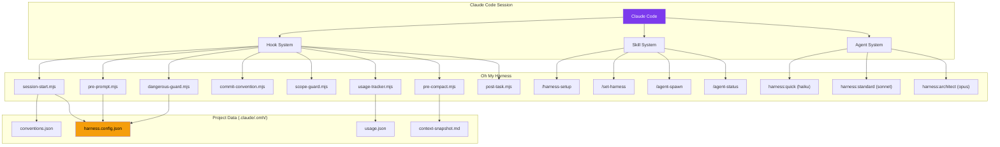
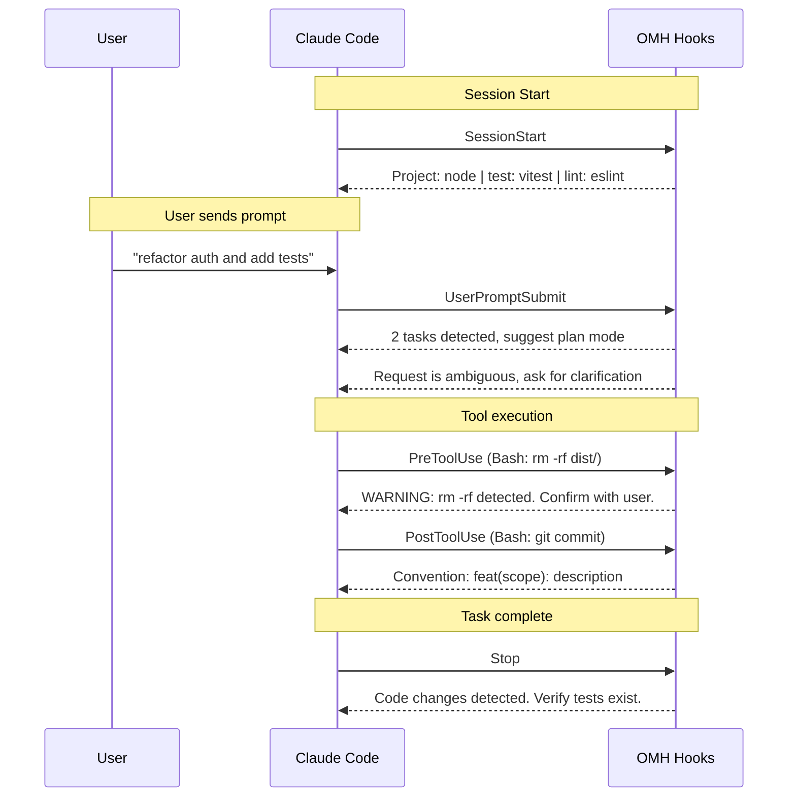

# Architecture

OMH works in two modes — as a **Claude Code plugin** or via **npm CLI**. Both produce the same result: native hooks, skills, and CLAUDE.md instructions.

## Overview



## Hook Pipeline



## Plugin Mode (recommended)

The plugin system handles hook registration and skill loading automatically:

```
oh-my-harness/                    <- plugin root ($CLAUDE_PLUGIN_ROOT)
├── .claude-plugin/
│   ├── plugin.json               <- plugin manifest
│   └── marketplace.json          <- marketplace listing
├── CLAUDE.md                     <- system prompt (auto-injected)
├── hooks/
│   ├── hooks.json                <- hook registration (uses $CLAUDE_PLUGIN_ROOT)
│   ├── lib/output.mjs            <- shared output helpers
│   ├── session-start.mjs         <- convention detection
│   ├── pre-prompt.mjs            <- ambiguity + auto-plan
│   ├── dangerous-guard.mjs       <- destructive command warning
│   ├── commit-convention.mjs     <- commit format reminder
│   ├── scope-guard.mjs           <- path restriction warning
│   ├── usage-tracker.mjs         <- tool usage recording
│   ├── pre-compact.mjs           <- context snapshot
│   └── post-task.mjs             <- test enforcement
├── skills/                       <- slash commands (auto-registered)
│   ├── harness-setup/SKILL.md    <- /harness-setup
│   ├── set-harness/SKILL.md      <- /set-harness
│   ├── init-project/SKILL.md     <- /init-project
│   ├── agent-spawn/SKILL.md      <- /agent-spawn
│   ├── agent-status/SKILL.md     <- /agent-status
│   ├── agent-apply/SKILL.md      <- /agent-apply
│   └── agent-stop/SKILL.md       <- /agent-stop
└── agents/                       <- model-routed agents
    ├── quick.md                   <- haiku
    ├── standard.md                <- sonnet
    └── architect.md               <- opus
```

## npm CLI Mode

The CLI copies hooks and commands into your project's `.claude/` directory:

```
your-project/
└── .claude/
    ├── settings.local.json       <- hooks registered here
    ├── CLAUDE.md                 <- behavioral rules appended
    ├── commands/                 <- slash commands
    │   ├── set-harness.md
    │   ├── init-project.md
    │   ├── agent-spawn.md
    │   ├── agent-status.md
    │   ├── agent-apply.md
    │   └── agent-stop.md
    └── .omh/                     <- project data (gitignored)
        ├── harness.config.json
        ├── conventions.json
        ├── usage.json
        └── context-snapshot.md
```
