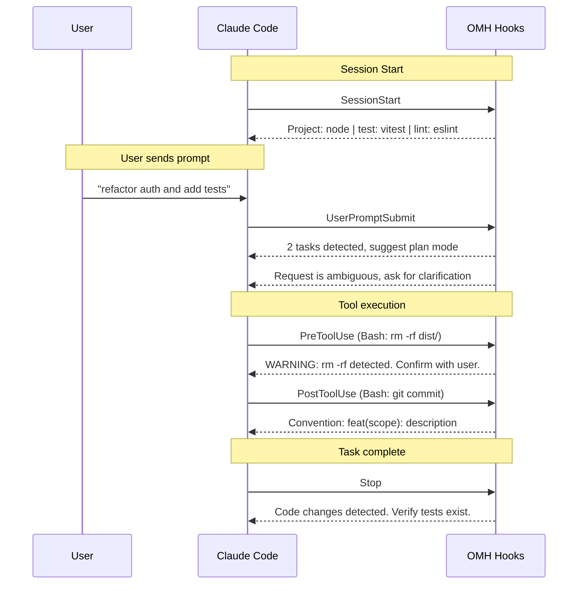

# Architecture

OMH works in two modes — as a **Claude Code plugin** or via **npm CLI**. Both produce the same result: native hooks, skills, and CLAUDE.md instructions.

## Overview


```mermaid
graph TB
    subgraph "Claude Code Session"
        direction TB
        CC[Claude Code] --> HOOKS[Hook System]
        CC --> SKILLS[Skill System]
        CC --> AGENTS[Agent System]
    end

    subgraph "Oh My Harness"
        direction TB
        HOOKS --> H1[session-start.mjs]
        HOOKS --> H2[pre-prompt.mjs]
        HOOKS --> H3[dangerous-guard.mjs]
        HOOKS --> H4[commit-convention.mjs]
        HOOKS --> H5[scope-guard.mjs]
        HOOKS --> H6[usage-tracker.mjs]
        HOOKS --> H7[pre-compact.mjs]
        HOOKS --> H9["loop-guard.mjs (Stop · loop engine)"]
        HOOKS --> H8[post-task.mjs]

        SKILLS --> S1["/harness-setup"]
        SKILLS --> S2["/set-harness"]
        SKILLS --> S3["/agent-spawn"]
        SKILLS --> S4["/agent-status"]
        SKILLS --> S5["/omh-spec"]
        SKILLS --> S6["/omh-loop"]

        AGENTS --> A1["harness:quick (haiku)"]
        AGENTS --> A2["harness:standard (sonnet)"]
        AGENTS --> A3["harness:architect (opus)"]

        H9 --> LOOPLIB["lib/loop.mjs (pure decision logic)"]
    end

    subgraph "Project Data (.claude/.omh/)"
        CONFIG[harness.config.json]
        CONV[conventions.json]
        USAGE[usage.json]
        SNAP[context-snapshot.md]
        LSTATE[loop-state.json]
        LEARN[loop-learnings.md]
    end

    PROGRESS["PROGRESS.md (project root · human log)"]

    H1 --> CONV
    H6 --> USAGE
    H7 --> SNAP
    H1 --> CONFIG
    H2 --> CONFIG
    H3 --> CONFIG
    H9 --> CONFIG
    H9 --> LSTATE
    H9 --> LEARN
    S6 --> PROGRESS

    style CC fill:#7C3AED,color:#fff
    style CONFIG fill:#f59e0b,color:#000
    style H9 fill:#10b981,color:#fff
    style LSTATE fill:#f59e0b,color:#000
```

## Hook Pipeline


```mermaid
sequenceDiagram
    participant U as User
    participant CC as Claude Code
    participant OMH as OMH Hooks

    Note over CC,OMH: Session Start
    CC->>OMH: SessionStart
    OMH-->>CC: Project: node | test: vitest | lint: eslint

    Note over U,CC: User sends prompt
    U->>CC: "refactor auth and add tests"
    CC->>OMH: UserPromptSubmit
    OMH-->>CC: 2 tasks detected, suggest plan mode
    OMH-->>CC: Request is ambiguous, ask for clarification

    Note over CC,OMH: Tool execution
    CC->>OMH: PreToolUse (Bash: rm -rf dist/)
    OMH-->>CC: WARNING: rm -rf detected. Confirm with user.

    CC->>OMH: PostToolUse (Bash: git commit)
    OMH-->>CC: Convention: feat(scope): description

    Note over CC,OMH: Task complete
    CC->>OMH: Stop
    OMH-->>CC: Code changes detected. Verify tests exist.
```

## Autonomous Loop (Stop hook)

`/omh-loop` turns the **Stop** event into a spec-driven autonomous loop. The Stop hook `loop-guard.mjs` **is the loop engine** — on every Stop it decides whether to force continuation or let the session stop. It forces continuation by printing a **top-level** `{"decision":"block","reason":...}` on stdout and exiting `0` (never exit 2, never nested under `hookSpecificOutput`); it stays silent (passthrough) to allow the stop when the loop is done or a guardrail fires.

The decision logic lives in the pure, unit-tested `lib/loop.mjs` (`evaluateLoop`, `classifyTier`, `buildLadder`, `detectPlateau`, `detectOscillation`). The hook is a **thin fail-open wrapper**: it gathers signals (git HEAD/diff, ladder rung results, `stop_hook_active`, `session_id`, STOP sentinel), calls `evaluateLoop`, and emits the result. On any error or corrupt state it deletes state and exits `0` so the user is never trapped. The harness — not the model's self-assessment — owns when to continue and when to stop.


```mermaid
flowchart TD
    STOP([Stop event]) --> GUARD["loop-guard.mjs<br/>(thin fail-open wrapper)"]
    GUARD --> SIG["gather signals:<br/>stop_hook_active, session_id,<br/>STOP sentinel, git HEAD/diff,<br/>ladder rung results"]
    SIG --> EVAL["lib/loop.mjs :: evaluateLoop()<br/>(pure, unit-tested)"]
    EVAL --> CHK{layered checklist}

    CHK -->|stop_hook_active / session mismatch / inactive| IGN[exit 0 · passthrough]
    CHK -->|STOP switch · budget · timeout<br/>· plateau · oscillation · done| STOPLOOP["allow stop<br/>+ [omh:loop] summary"]
    CHK -->|under budget & not done| CONT["hookStopContinue(reason)<br/>top-level decision:block · exit 0"]

    CONT --> LADDER["next iteration:<br/>SPEC digest + last failure<br/>+ reflections + next step"]
    STOPLOOP -->|done path| XV["cross-verify (different model)<br/>scores each SPEC criterion"]

    style GUARD fill:#10b981,color:#fff
    style EVAL fill:#7C3AED,color:#fff
    style CONT fill:#10b981,color:#fff
    style STOPLOOP fill:#f59e0b,color:#000
```

The loop is **tiered** (`quick` / `standard` / `deep` set iteration & wall-clock budgets and verification depth, with a cross-tier `maxTotalIterations` cap) and runs a **cheap-first verify ladder** (quickCheck → verify → self-review → cross-verify) that fails fast and feeds the *actual* failing output back as the next iteration's instruction. State lives in `.claude/.omh/loop-state.json` (atomic writes, fail-open); `PROGRESS.md` at the project root is the human-readable plan + log; `.claude/.omh/loop-learnings.md` caches build/test invocations. See [docs/loop](./loop.md) and [docs/configuration](./configuration.md) for the full `loop` config block.

## Plugin Mode (recommended)

The plugin system handles hook registration and skill loading automatically:

```
oh-my-harness/                    <- plugin root ($CLAUDE_PLUGIN_ROOT)
├── .claude-plugin/
│   ├── plugin.json               <- plugin manifest
│   └── marketplace.json          <- marketplace listing
├── CLAUDE.md                     <- system prompt (auto-injected)
├── lib/                          <- pure core libraries
│   └── loop.mjs                  <- loop decision logic (unit-tested)
├── hooks/
│   ├── hooks.json                <- hook registration (uses $CLAUDE_PLUGIN_ROOT)
│   ├── lib/output.mjs            <- shared output helpers (incl. hookStopContinue)
│   ├── session-start.mjs         <- convention detection
│   ├── pre-prompt.mjs            <- ambiguity + auto-plan
│   ├── dangerous-guard.mjs       <- destructive command warning
│   ├── commit-convention.mjs     <- commit format reminder
│   ├── scope-guard.mjs           <- path restriction warning
│   ├── usage-tracker.mjs         <- tool usage recording
│   ├── pre-compact.mjs           <- context snapshot
│   ├── loop-guard.mjs            <- Stop hook: loop engine + safety (thin wrapper over lib/loop.mjs)
│   └── post-task.mjs             <- test enforcement
├── skills/                       <- slash commands (auto-registered)
│   ├── harness-setup/SKILL.md    <- /harness-setup
│   ├── set-harness/SKILL.md      <- /set-harness
│   ├── init-project/SKILL.md     <- /init-project
│   ├── omh-spec/SKILL.md         <- /omh-spec (author SPEC.md)
│   ├── omh-loop/SKILL.md         <- /omh-loop (run/stop the loop)
│   ├── agent-spawn/SKILL.md      <- /agent-spawn
│   ├── agent-status/SKILL.md     <- /agent-status
│   ├── agent-apply/SKILL.md      <- /agent-apply
│   └── agent-stop/SKILL.md       <- /agent-stop
└── agents/                       <- model-routed agents
    ├── quick.md                   <- haiku
    ├── standard.md                <- sonnet
    └── architect.md               <- opus
```

## npm CLI Mode

The CLI copies hooks and commands into your project's `.claude/` directory:

```
your-project/
└── .claude/
    ├── settings.local.json       <- hooks registered here
    ├── CLAUDE.md                 <- behavioral rules appended
    ├── commands/                 <- slash commands
    │   ├── set-harness.md
    │   ├── init-project.md
    │   ├── omh-spec.md
    │   ├── omh-loop.md
    │   ├── agent-spawn.md
    │   ├── agent-status.md
    │   ├── agent-apply.md
    │   └── agent-stop.md
    ├── PROGRESS.md               <- loop plan + human-readable log (project root)
    └── .omh/                     <- project data (gitignored)
        ├── harness.config.json
        ├── conventions.json
        ├── usage.json
        ├── context-snapshot.md
        ├── loop-state.json       <- loop engine state (atomic writes, fail-open)
        ├── loop-learnings.md     <- cached build/test invocations
        └── STOP                  <- kill switch (when present)
```

> Note: `PROGRESS.md` lives at the **project root** (not under `.claude/`); it is shown here next to the CLI layout for proximity to the loop data.
