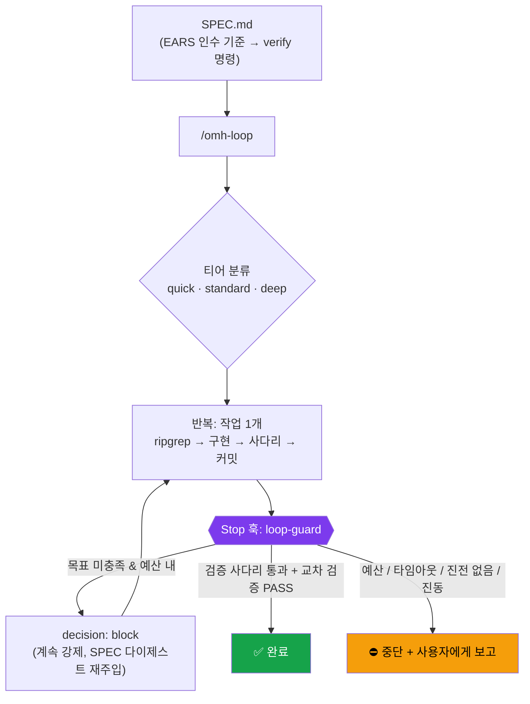
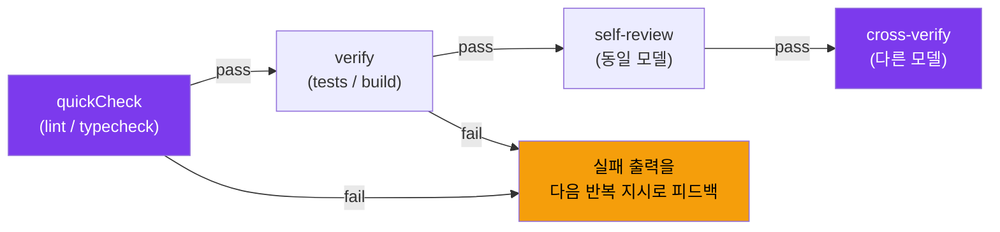

# 자율 루프 (Autonomous Loop)

> oh-my-harness **0.3.0**의 핵심 기능. 목표를 한 번 정의하면, SPEC이 객관적으로 충족될 때까지 OMH가 직접 루프를 돌립니다.

목표를 `SPEC.md`에 한 번 적어두면, OMH가 **구현 → 자가 검증(self-verify) → 교차 검증(cross-verify)** 을 반복하며 SPEC이 충족될 때까지 작업을 이어갑니다. 루프는 Claude Code의 네이티브 훅 위에서 동작하므로, **언제 계속하고 언제 멈출지는 하네스가 소유**합니다 — 모델의 자기 판단이 아닙니다.

```bash
/omh-spec add JWT auth with refresh tokens   # 기계 검증 가능한 SPEC.md 작성
/omh-loop SPEC.md                             # 자율적으로 루프 실행
/omh-loop stop                                # 킬 스위치 (또는 .claude/.omh/STOP 생성)
```

---

## 철학: "진짜 벽이 있는 자율성"

이전의 OMH는 "벽이 아니라 경고(warnings instead of walls)"였습니다. 자율 루프는 정작 중요한 곳에서 이 원칙을 바꿉니다 — **멈출 수 없는 루프는 위험하고, 너무 일찍 멈추는 루프는 쓸모가 없습니다.** 그래서 루프에는 **진짜 벽**이 있습니다.

- 하네스는 목표가 충족되지 않았고 예산 안에 있는 동안 **계속을 강제**합니다.
- 하네스는 객관적 신호가 잡히면 **종료를 강제**합니다 (검증 사다리 통과 + 교차 검증, 또는 가드레일: 반복/벽시계 예산, 진전 없음, 진동).
- 모델은 스스로 "완료"를 결정하지 않습니다. 기계 검증 가능한 인수 기준(acceptance criteria)에 대해 **하네스가** 결정합니다.

루프 바깥에서는 OMH가 여전히 가볍게 동작합니다 — 경고로 안내하는 스마트 기본값은 그대로입니다.

---

## 동작 방식

Stop 훅(`loop-guard`)이 루프 엔진이자 안전 집행자입니다.



### Stop 훅 연속 계약 (정확성의 핵심)

`hooks/loop-guard.mjs`는 계속이 필요할 때 stdout에 **최상위(top-level)** `{"decision":"block","reason":<다음 단계>}` 를 출력하고 **exit 0** 으로 종료합니다.

- 절대 **exit 2** 를 쓰지 않습니다 (플러그인으로 배포된 훅에서는 동작하지 않음).
- 절대 `hookSpecificOutput` 아래에 **중첩하지 않습니다** — 그 형태는 조용히 계속에 실패합니다.
- 완료되었거나 가드레일이 발동하면, 세션이 정상적으로 멈추도록 그냥 통과시킵니다.

---

## 종료는 하네스가 소유하는 계층화된 체크리스트

`evaluateLoop`(순수 함수, 단위 테스트됨)는 **모든** Stop 이벤트에서 다음 순서로 평가합니다:

1. **`stop_hook_active === true`** → 즉시 exit 0 (훅이 스스로를 무한히 트리거하는 것을 방지 — 가장 먼저 확인).
2. **STOP 센티넬 파일** 존재 → 중단 (킬 스위치).
3. **session_id 불일치** → 상태를 건드리지 않고 통과 (동시 세션 / worktree 격리).
4. **루프 비활성** → 조용히 통과 (일반 post-task가 동작하도록).
5. **iteration ≥ tier.maxIterations 또는 total ≥ maxTotalIterations** → 중단 (예산).
6. **elapsed > tier.maxWallClockMinutes** → 중단 (타임아웃).
7. **완료 쿼럼 충족** → 중단 (완료).
8. **플래토(plateau)** — 개선 없음 + 빈/표면적 diff가 `plateauWindow` 회 지속 → 중단.
9. **진동(oscillation)** — 동일 실패 시그니처 반복 / A-B-A-B → 중단 + 사용자에게 에스컬레이션.
10. 그 외 → 계속 (block 방출).

> 모델은 종료를 절대 결정하지 않습니다. "모델이 언제 멈출지 알아서 정하게 두는 것"은 전략이 아닙니다.

---

## 저렴한 것 먼저: 검증 사다리 (Verify Ladder)

결정론적 검사를 먼저 돌리고, 초록일 때만 비싼 단계로 올라갑니다. **가장 저렴한 단계부터, 빠르게 실패(fail-fast)** 합니다.



- **첫 번째** 0이 아닌 종료 코드에서 멈추고, **실제 실패 출력**을 `reason`에 담아 다음 반복의 지시로 흘려보냅니다. 구조적으로 깨진 코드에 모델 심판을 낭비하지 않습니다.
- 각 단계는 자체 서브프로세스 타임아웃을 가집니다 (`rungTimeoutSec` — quickCheck 30s, verify 180s).
- 결과는 `{rung, status: pass|fail|error|skipped, retryable, signature}` 로 기록됩니다. `error`/인프라 상태는 `retryable:false` → 중단 후 사용자에게 질문 (예: "테스트 러너를 못 찾음"과 진짜 실패를 구분).

---

## 교차 검증 (Cross-Verification)

생성자(generator)와 **다른 모델**이 SPEC 각 인수 기준을 채점합니다.

- **(a) 다른 모델** — 생성자가 sonnet이면 심판은 opus (모델 라우팅 경유). 자기 강화 편향(self-enhancement bias)을 제거합니다.
- **(b) 기준 분리 루브릭** — 각 SPEC 인수 기준을 **증거와 함께** PASS/FAIL로 채점합니다. 분위기 점수가 아닙니다.
- **(c) 저장소 상태에 대해 독립적으로 검증** — 에이전트의 "내가 X 했다"는 자기 보고를 다시 읽는 게 아니라, **직접 테스트를 돌리고 diff를 grep** 합니다 (factored Chain-of-Verification).
- **되돌리고-다시-돌리기(revert-and-rerun) 변이 검사** — 해당 변경을 반복별 커밋 기준으로 되돌렸을 때 새 테스트가 **FAIL** 해야 합니다. 에이전트가 공허한 테스트로 자기 게이트를 통과하는 것을 막습니다.

판정은 타입 지정 `PASS | FAIL | INCONCLUSIVE` 입니다. **INCONCLUSIVE는 안전하게 "중단 후 보고"로 폴백** 합니다. 결과는 루브릭 표와 함께 `[omh:cross-verify]` 로 방출됩니다.

> **비용 절감 — 저렴한 신호 합의로 비싼 심판 게이팅(Agreement-Based Cascading):** 결정론적 단계 결과와 표준 자가 판정을 두 투표자로 보고, 둘 다 "좋다"고 합의하면 opus 교차 검증을 **건너뜁니다**. 불일치할 때만 에스컬레이션합니다. 작업당 deep-verify 횟수는 `maxDeepVerifiesPerTask`로 제한됩니다.

---

## 티어 (Tiers)

기본은 가장 저렴한 `quick`. `standard`/`deep`은 관찰된 신호(검증 실패, 큰 diff, 재계획, 반복되는 실패 시그니처)로 도달하는 **에스컬레이션 상태**입니다.

| 티어 | 최대 반복 | 벽시계 | 교차 검증 | 비고 |
|------|:--------:|:------:|----------|------|
| `quick` | 3 | 5분 | 없음 | 가장 저렴, 기본값 |
| `standard` | 8 | 15분 | 완료 시점에 | 표준 작업 |
| `deep` | 20 | 45분 | 5회마다 + 완료 시점 | 복잡한 작업 |

- **티어 횡단 상한:** `maxTotalIterations = 30` (모든 티어를 합산한 절대 한도).
- 모든 티어 전환은 감사 가능하도록 `PROGRESS.md`에 기록됩니다.

---

## 진짜 가드레일

| 가드레일 | 동작 |
|---------|------|
| `stop_hook_active` 우선 확인 | 훅이 스스로를 트리거하는 무한 루프 방지 |
| 동시 세션 / worktree 격리 | `sessionId`로 다른 세션의 상태를 건드리지 않음 |
| STOP 킬 스위치 | `.claude/.omh/STOP` 파일 또는 `/omh-loop stop` |
| 원자적 상태 쓰기 | 임시 파일 + rename (부분 쓰기 없음) |
| 손상 시 fail-open | 상태 파일이 깨지면 삭제 후 통과 — 사용자를 가두지 않음 |
| 반복 예산 | 티어별 + 티어 횡단 (`maxTotalIterations`) 한도 |
| 벽시계 타임아웃 | 반복/비용 상한 아래에서 멈춘 테스트를 잡는 독립 축 |
| 진전 없음 / 플래토 감지 | 빈 커밋 diff = 새 산출물 없음 |
| 진동 감지 | 반복되는 실패 시그니처 / A-B-A-B 패턴 |

어떤 하드 한도에 닿아도 조용히 끊거나 에러를 내지 않습니다 — "최종 반복" 지시를 주입하고, `PROGRESS.md`에 종료 항목("stopped: budget/timeout at iteration N")을 남기고, 마지막 커밋 후 깔끔하게 멈춥니다.

---

## SPEC.md — EARS 인수 기준

루프 시작은 기계 검증 가능한 인수 기준을 담은 내구적 `SPEC.md`에 게이팅됩니다. 인수 기준은 **EARS 표기법**을 사용합니다:

```
WHEN <트리거> THE SYSTEM SHALL <응답>
```

- 각 인수 기준은 하나의 **verify 명령**에 매핑됩니다. 루프는 모든 기준의 명령이 exit 0일 때만 멈출 수 있습니다.
- `/omh-spec`은 SPEC에 `[NEEDS CLARIFICATION]` 마커가 남아 있는 한 루프 시작을 **거부**하고, OMH의 기존 모호성 가드(AskUserQuestion)로 폴백합니다.
- SPEC의 **압축된 고정 다이제스트**(전체 파일이 아니라)가 매 반복마다 훅의 `reason`으로 재주입됩니다 — 의도 표류(intent drift)를 막는 신선한 컨텍스트 규율.

---

## 상태와 로그

- **상태 파일:** `.claude/.omh/loop-state.json` — `active, sessionId, tier, goal, specPath, iteration, totalIterations, startedAt, history[]`(반복별: 검증 단계 상태, diff 통계, 실패 시그니처, 반성).
- **사람이 읽는 로그:** 프로젝트 루트의 `PROGRESS.md` — 계획 + 로그. 완료 항목은 표시 후 정리(mark+prune)하고, 임계 크기를 넘으면 압축합니다.
- **학습 캐시:** `.claude/.omh/loop-learnings.md` — 빌드/테스트 호출을 캐싱해 새 반복이 매번 재학습하지 않게 합니다.

실패 시에는 맹목적 재시도 대신 구조적 **Reflexion** 블록을 `PROGRESS.md`에 씁니다("시도 N은 X 때문에 실패; 근본 원인 Y; 다음엔 Z"). 훅은 마지막 `reflectionWindow`개의 반성을 재주입합니다. 동일 실패 시그니처가 N회 재발하거나 검증 점수 증가폭이 티어 엡실론 아래로 떨어지면, "반복이 아니라 아키텍처 문제"라는 명시적 메시지와 함께 중단 + 에스컬레이션합니다.

---

## 설정

`features.autonomousLoop`(기본 `true`)와 `loop` 블록으로 제어합니다.

```jsonc
"features": { "autonomousLoop": true },
"loop": {
  "classify": "auto",               // auto | quick | standard | deep
  "defaultTier": "quick",           // 저렴하게 시작, 신호로 에스컬레이션
  "requireSpec": true,
  "specPath": "SPEC.md",
  "logFile": "PROGRESS.md",
  "learningsFile": ".claude/.omh/loop-learnings.md",
  "requireCommit": true,
  "oneTaskPerIteration": true,
  "maxDiffFilesPerIteration": 20,
  "maxTotalIterations": 30,
  "stopOnNoProgress": true,
  "quickCheckCommand": "",          // 빠른 단계 (lint/typecheck), 컨벤션에서 자동 감지
  "verifyCommand": "",              // 전체 단계 (tests/build), 자동 감지
  "verifyInHook": true,
  "rungTimeoutSec": { "quickCheck": 30, "verify": 180 },
  "crossVerify": true,
  "crossVerifyModel": "architect",  // 생성자와 다른 모델
  "maxDeepVerifiesPerTask": 3,
  "reflectionWindow": 3,
  "tiers": {
    "quick":    { "model": "standard",  "maxIterations": 3,  "maxWallClockMinutes": 5,  "plateauWindow": 2, "crossVerify": false, "marginalGainEpsilon": 0.05 },
    "standard": { "model": "standard",  "maxIterations": 8,  "maxWallClockMinutes": 15, "plateauWindow": 2, "crossVerify": true,  "crossVerifyEvery": 0, "marginalGainEpsilon": 0.03 },
    "deep":     { "model": "architect", "maxIterations": 20, "maxWallClockMinutes": 45, "plateauWindow": 3, "crossVerify": true,  "crossVerifyEvery": 5, "marginalGainEpsilon": 0.02 }
  }
}
```

> `loop` 블록은 기본값에 deep-merge됩니다. 일부만 지정해도 나머지는 기본값을 유지합니다. 반복 예산(quick 3 / standard 8 / deep 20)은 기본값이며, 비용을 더 줄이려면 보수적으로 낮춰 튜닝할 수 있습니다.

설정이 ON이어도 `/omh-loop`가 활성 상태를 쓰기 전까지는 **무동작(inert)** 입니다 — 루프를 쓰지 않는 세션에는 오버헤드가 없습니다(활성 상태가 없으면 훅이 즉시 조용히 반환).

---

## 명령어

| 명령어 | 설명 |
|--------|------|
| `/omh-spec [목표]` | EARS 인수 기준 → verify 명령으로 기계 검증 가능한 `SPEC.md` 작성. 모호하면 작성을 거부 |
| `/omh-loop [SPEC.md\|목표]` | 티어 분류 → 확인 → 자율 루프 실행 (작업 1개 → 사다리 → PROGRESS.md → 커밋) |
| `/omh-loop stop` | 킬 스위치 — 루프 중단 (`.claude/.omh/STOP` 생성과 동일) |

---

## 기능 태그

루프는 어떤 결정이 내려졌는지 항상 보이도록 태그를 방출합니다:

```
[omh:loop]          → 자율 루프 계속 강제 / 중단 결정
[omh:cross-verify]  → 다른 모델이 SPEC 기준을 루브릭으로 채점
```

---

## 설계의 배경 (참고한 기법)

이 설계는 팬아웃 웹 리서치 패스로 검증되었으며, 다음 기법들을 OMH 네이티브로 흡수했습니다:

- **Ralph Wiggum 루프** — Stop 훅 기반 인세션 자율 루프, 반복별 커밋, 신선한 컨텍스트 규율
- **Reflexion** — 실패에 대한 구조적 반성, 맹목적 재시도 금지
- **Self-Refine** — 자가 검토 단계 (자기 편향 주의)
- **Chain-of-Verification (factored CoVe)** — 저장소 상태에 대한 독립 검증
- **LLM-as-judge** — 다른 모델 / 참조 가이드 / 기준 분리 루브릭 심판
- **FrugalGPT cascade · Agreement-Based Cascading** — 저렴한 신호 합의로 비싼 심판 게이팅
- **EARS 표기법 · Spec-Driven Development** — 기계 검증 가능한 인수 기준을 앵커로

---

## 관련 문서

| 문서 | 내용 |
|------|------|
| [기능](features.ko.md) | HUD 상태 표시줄, 스마트 기본값, 기능 태그, 기능 상세 |
| [아키텍처](architecture.ko.md) | 시스템 다이어그램, 훅 파이프라인, 디렉토리 구조 |
| [설정](configuration.ko.md) | 설정 레퍼런스, CLI / 슬래시 명령어, OMC 호환성, 삭제 |
| [멀티 에이전트](multi-agent.ko.md) | 병렬 에이전트 / 네이티브 팀, worktree 브랜칭, 안전 정책 |
