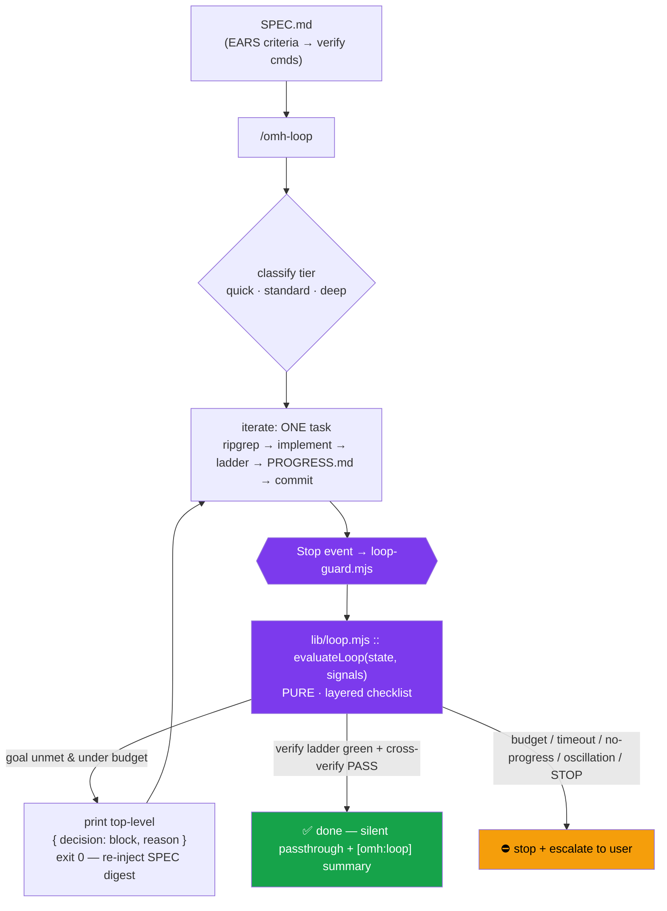
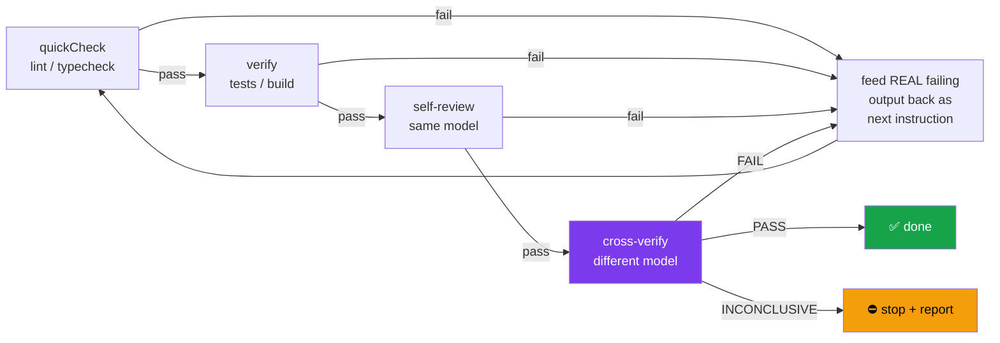

# Autonomous Loop

> **New in 0.2.0** — the headline feature. Define the goal once in a `SPEC.md`, and OMH loops — implementing, self-verifying, and cross-verifying — until the spec is objectively met, with enforceable guardrails so autonomy never becomes runaway.

The Autonomous Loop is a **spec-driven, tiered, self- and cross-verifying** loop that runs entirely on Claude Code's native hooks. Two skills drive it (`/omh-spec`, `/omh-loop`); the Stop hook `hooks/loop-guard.mjs` is the loop engine *and* the safety enforcer.

---

## What it is — and the philosophy shift

Claude Code stops at the end of a turn even when the job isn't finished, and it judges its own work against its own summary. The Autonomous Loop replaces that with an objective contract: the loop **forces continuation** while the goal is unmet and under budget, and **forces termination** the moment the verify ladder is green and cross-verification confirms it — or a guardrail fires.

This is a deliberate identity shift for OMH:

| Before (0.1.x) | Now (0.2.0) |
|----------------|-------------|
| "Minimal guards — warnings instead of walls." | **"Autonomy with real walls."** |
| The model decides when it's done. | **The harness decides** — against machine-checkable acceptance criteria. |
| Hooks *suggest* (test reminders, ambiguity guard). | The loop hook *enforces* continuation and termination. |

> The principle in one line: **the harness owns when to continue and when to stop — never the model's self-assessment.** Everywhere outside the loop, OMH stays lightweight: the same smart defaults that guide with warnings, plus project skills you own and customize.

---

## Quick start

```bash
/omh-spec add JWT auth with refresh tokens   # writes a machine-checkable SPEC.md
/omh-loop SPEC.md                             # runs it autonomously
/omh-loop stop                                # kill switch (or create .claude/.omh/STOP)
```

### Step 1 — author a SPEC with `/omh-spec`

`/omh-spec` writes a `SPEC.md` whose acceptance criteria are written in **EARS notation** (Easy Approach to Requirements Syntax) — each criterion is a `WHEN <trigger> THE SYSTEM SHALL <response>` statement mapped to a concrete **verify command**. The loop may stop only when every criterion's command exits 0.

`/omh-spec` will **refuse to start a loop while any `[NEEDS CLARIFICATION]` markers remain** — unresolved ambiguity falls back to OMH's existing Ambiguity Guard (AskUserQuestion) rather than guessing.

A minimal `SPEC.md`:

```markdown
# SPEC: JWT auth with refresh tokens

## Goal
Add stateless JWT authentication with refresh-token rotation to the API.

## Acceptance Criteria (EARS)

- **AC1** — WHEN a valid credential is POSTed to `/login`
  THE SYSTEM SHALL return a 200 with an access token (15m) and a refresh token (7d).
  - verify: `npm test -- auth/login`

- **AC2** — WHEN an expired access token is presented to a protected route
  THE SYSTEM SHALL respond 401 without leaking the reason.
  - verify: `npm test -- auth/expiry`

- **AC3** — WHEN a refresh token is used
  THE SYSTEM SHALL issue a new pair and invalidate the old refresh token.
  - verify: `npm test -- auth/refresh`

## Non-goals
- Social/OAuth providers (separate spec).

## Constraints
- No new runtime dependencies beyond `jsonwebtoken`.
```

### Step 2 — run it with `/omh-loop`

```bash
/omh-loop SPEC.md
```

`/omh-loop` classifies the task into a tier (or honors an explicit tier), confirms with you, writes an active `loop-state.json`, and starts iterating: **one task per iteration** — ripgrep before implementing, full implementations only (no placeholders), run the verify ladder, append to `PROGRESS.md`, commit. When you stop being involved, the **Stop hook** takes over and decides whether to keep going.

### Step 3 — stop it any time

```bash
/omh-loop stop                  # or:
touch .claude/.omh/STOP         # the STOP kill switch
```

---

## How the Stop-hook loop engine works

The loop has two parts, separated for testability:

- **`lib/loop.mjs`** — a **pure, unit-tested** core. It owns the decision logic: `evaluateLoop` (the layered termination checklist), `classifyTier`, `buildLadder`, `detectPlateau`, `detectOscillation`. No I/O, fully deterministic, fully tested.
- **`hooks/loop-guard.mjs`** — a thin wrapper that runs on every **Stop** event. It gathers cheap signals (`stop_hook_active`, `session_id`, the STOP sentinel, git HEAD/diff, ladder rung results), reads/writes state atomically, calls `evaluateLoop`, and emits the result.

The load-bearing detail: to force the session to continue, the hook prints a **top-level** `{"decision":"block","reason":<next-step>}` on stdout and **exits 0**. It never exits 2 (broken for plugin-distributed hooks) and never nests the decision under `hookSpecificOutput` (that shape silently fails to continue). When the loop should end, the hook stays silent and lets the session stop normally.



### The termination checklist (evaluated every Stop, in order)

`evaluateLoop` runs a layered checklist so the cheapest, safest checks come first:

1. `stop_hook_active === true` → **stop immediately.** Prevents the hook's own respond→block→respond infinite loop. This is checked first, always.
2. STOP sentinel present → **stop** (kill switch).
3. `session_id` mismatch → **ignore** without touching state (concurrent-session / worktree isolation).
4. Loop not active → **silent passthrough** (let normal post-task hooks run).
5. iteration ≥ `tier.maxIterations` OR total ≥ `maxTotalIterations` → **stop** (budget).
6. elapsed > `tier.maxWallClockMinutes` → **stop** (timeout).
7. Done-quorum met (ladder green + cross-verify) → **stop** (done).
8. Plateau (no improvement + empty/cosmetic diff for `plateauWindow` iters) → **stop**.
9. Oscillation (repeated failure signature / A-B-A-B) → **stop + escalate**.
10. Otherwise → **continue** (emit the block).

Each iteration re-injects a **compact, fixed digest of the SPEC** (not the whole file, not a growing transcript) plus the last failing output and recent reflections — the fresh-context discipline that prevents intent drift across long runs.

> Every corruption or edge path is **fail-open**: on bad state the hook deletes the state, exits 0, and never traps you in a loop. `PROGRESS.md` at the project root is the human-readable plan + log.

---

## The cheap-first verify ladder

Before any expensive model judge runs, the loop climbs a strictly ordered ladder of checks — **cheapest first, fail fast.** On the first non-zero exit it stops climbing and feeds the **actual failing output** back as the next iteration's instruction. There is no point spending an opus judge on structurally broken code.

| Rung | What runs | Cost | On failure |
|------|-----------|------|-----------|
| 1. `quickCheck` | lint / typecheck | seconds | Block with the real lint/type error; skip higher rungs |
| 2. `verify` | unit tests / build | tens of seconds | Block with the real test/build output; skip higher rungs |
| 3. self-review | same model reviews its own diff | one model turn | Block with the review findings |
| 4. cross-verify | a **different** model judges against the spec | most expensive | See below |

Each rung runs in its own subprocess with a **per-rung timeout** (`rungTimeoutSec`, default `quickCheck: 30`, `verify: 180`). Rung results are logged as `{rung, status: pass|fail|error|skipped}`. An `error`/infra state (e.g. "no test runner found") is **not retryable** → the loop stops and asks, distinguishing a real failure from a broken environment.



> **Cost gating** — the expensive rung is gated on cheap-signal agreement. Treat the deterministic rung result and the self-review verdict as two voters: if both agree the work is good, the loop can **skip** the opus cross-verify; it escalates only on disagreement. Deep-verifies are capped per task by `maxDeepVerifiesPerTask` (default 3).

---

## Cross-verification

When a verdict actually matters, the loop hands the work to an independent judge. Cross-verification is deliberately designed to kill self-enhancement bias:

- **A different model than the generator.** Via OMH model routing, the generator (`standard` / sonnet) is judged by `architect` (opus). A model grading its own output is a vibe check; a different model is a review. Configured by `crossVerifyModel` (default `architect`).
- **A criterion-separated rubric.** The judge scores **each SPEC acceptance criterion** `PASS`/`FAIL` **with evidence** — not a single "looks good" score. It emits an `[omh:cross-verify]` rubric table mapping every EARS criterion to its verdict.
- **Independent verification against repo state.** The judge does *not* re-read the agent's "I did X" summary. It **runs the tests, greps the diff** against the real repository — factored Chain-of-Verification.
- **A revert-and-rerun mutation check.** The judge reverts the change against the per-iteration commit; the new tests **must FAIL on the reverted code.** This stops the agent satisfying its own gate with vacuous tests that pass no matter what.
- **A typed verdict.** The result is exactly one of `PASS | FAIL | INCONCLUSIVE`. **`INCONCLUSIVE` fails safe to stop-and-report** — the loop never treats uncertainty as success.

---

## Tiers

Effort is tiered. Each tier sets iteration and wall-clock budgets and a cross-verification policy. The loop **defaults to the cheapest tier** for every task and treats `standard` / `deep` as **escalation states** reached only on observed signals (verify failure, large diff, replan, a repeated failure signature).

| Tier | Iterations | Wall-clock | Generator model | Cross-verify | Plateau window |
|------|:----------:|:----------:|-----------------|--------------|:--------------:|
| `quick` | ≤ 3 | 5 min | standard (sonnet) | off | 2 |
| `standard` | ≤ 8 | 15 min | standard (sonnet) | at "done" | 2 |
| `deep` | ≤ 20 | 45 min | architect (opus) | every 5 iters **+** at "done" | 3 |

> **Cross-tier cap:** regardless of tier, total iterations never exceed `maxTotalIterations` (default **30**). Wall-clock is an independent axis — it catches a hung test even when iteration counts look fine.

When a hard limit is hit, the loop doesn't silently cut off or error: it injects a "final iteration" directive, writes a terminal `PROGRESS.md` entry (`stopped: budget/timeout at iteration N`), makes a final commit, and stops cleanly.

---

## Guardrails & safety

The loop has **real walls**. The full set:

- **`stop_hook_active` self-loop guard** — checked first on every Stop event; prevents the hook from triggering its own infinite respond→block→respond cycle.
- **STOP kill switch** — `/omh-loop stop` or `.claude/.omh/STOP` halts the loop immediately (see below).
- **Concurrent-session / worktree isolation** — state carries a `sessionId`; a Stop event from a different session is ignored without touching state, so parallel loops and worktrees don't corrupt each other.
- **Atomic state writes** — `loop-state.json` is written via temp file + rename, so a crash mid-write can't produce a half-written state.
- **Fail-open on corruption** — any unreadable/corrupt state causes the hook to delete state and exit 0. A broken harness never traps the user in a loop.
- **Per-tier iteration budget** — `tier.maxIterations` (quick 3 / standard 8 / deep 20).
- **Cross-tier iteration cap** — `maxTotalIterations` (default 30) bounds total work regardless of tier escalation.
- **Wall-clock timeout** — `tier.maxWallClockMinutes` (5 / 15 / 45) bounds time independently of iteration count.
- **No-progress / plateau detection** — the per-iteration commit is a free progress signal: an empty/cosmetic commit diff with no verify improvement for `plateauWindow` consecutive iterations stops the loop.
- **Oscillation detection** — a hash of `(failureSignature + fixDiff)`; an identical-repeat or A-B-A-B pattern over the last few iterations stops **and escalates** with an explicit "architectural, not iterative" message.
- **Per-rung subprocess timeouts** — each ladder rung is bounded by `rungTimeoutSec`, so a hung test can't block the loop forever.
- **Risk-tiered human gates** — the loop self-verifies and auto-commits, but **halts for human confirmation before irreversible/out-of-scope actions**: anything outside `scopeGuard.allowedPaths`, deletions, force-push, or merging a cross-verify branch. This formalizes OMH's existing Dangerous-Op Guard and "NEVER auto-merge" rules as hard loop gates; an approval-window timeout fails safe to DENIED.

### Kill switch

Two equivalent ways to stop a running loop at any time:

```bash
/omh-loop stop                  # writes the stop signal through the skill
touch .claude/.omh/STOP         # the STOP sentinel file — checked early in the checklist
```

The STOP sentinel is checked near the top of the termination checklist (right after the self-loop guard), so it takes effect on the very next Stop event.

---

## Configuration

The loop is controlled by `features.autonomousLoop` (default `true`) plus a `loop` block in `.claude/.omh/harness.config.json`. The block is deep-merged into defaults, so you only specify what you want to change. Defaults shown:

```jsonc
"features": { "autonomousLoop": true },
"loop": {
  "classify": "auto",               // auto | quick | standard | deep
  "defaultTier": "quick",           // start cheap, escalate on signals
  "requireSpec": true,
  "specPath": "SPEC.md",
  "logFile": "PROGRESS.md",
  "learningsFile": ".claude/.omh/loop-learnings.md",
  "requireCommit": true,
  "oneTaskPerIteration": true,
  "maxDiffFilesPerIteration": 20,   // a larger diff is a smell — split the task
  "maxTotalIterations": 30,         // cross-tier cap
  "stopOnNoProgress": true,
  "quickCheckCommand": "",          // fast rung (lint/typecheck); auto-detected from conventions
  "verifyCommand": "",              // full rung (tests/build); auto-detected
  "verifyInHook": true,
  "rungTimeoutSec": { "quickCheck": 30, "verify": 180 },
  "crossVerify": true,
  "crossVerifyModel": "architect",  // different model than the generator
  "maxDeepVerifiesPerTask": 3,
  "reflectionWindow": 3,            // how many recent reflections to re-inject
  "tiers": {
    "quick":    { "model": "standard",  "maxIterations": 3,  "maxWallClockMinutes": 5,  "plateauWindow": 2, "crossVerify": false, "marginalGainEpsilon": 0.05 },
    "standard": { "model": "standard",  "maxIterations": 8,  "maxWallClockMinutes": 15, "plateauWindow": 2, "crossVerify": true,  "crossVerifyEvery": 0, "marginalGainEpsilon": 0.03 },
    "deep":     { "model": "architect", "maxIterations": 20, "maxWallClockMinutes": 45, "plateauWindow": 3, "crossVerify": true,  "crossVerifyEvery": 5, "marginalGainEpsilon": 0.02 }
  }
}
```

| Key | Meaning |
|-----|---------|
| `classify` | `auto` lets `classifyTier` pick; or pin a tier |
| `defaultTier` | Tier to start from before escalation (cheapest by default) |
| `requireSpec` / `specPath` | Gate the loop on a durable spec; default file `SPEC.md` |
| `logFile` | Human-readable plan + log (`PROGRESS.md`) |
| `learningsFile` | Cached build/test invocations so fresh iterations don't relearn them |
| `requireCommit` | Each iteration commits — the per-iteration commit drives progress detection |
| `oneTaskPerIteration` / `maxDiffFilesPerIteration` | One unit of work per iteration; an oversized diff is a smell |
| `maxTotalIterations` | Cross-tier hard cap (default 30) |
| `quickCheckCommand` / `verifyCommand` | The two deterministic rungs; auto-detected from project conventions when blank |
| `rungTimeoutSec` | Per-rung subprocess timeouts |
| `crossVerify` / `crossVerifyModel` | Enable cross-verification and which (different) model judges |
| `maxDeepVerifiesPerTask` | Cap on expensive judge runs per task |
| `reflectionWindow` | How many recent Reflexion notes the hook re-injects |
| `tiers.*` | Per-tier budgets, model, plateau window, cross-verify cadence, diminishing-returns epsilon |

### State & logs

| Path | Purpose |
|------|---------|
| `.claude/.omh/loop-state.json` | Machine state: active, sessionId, tier, goal, specPath, iteration, totalIterations, history |
| `PROGRESS.md` | Human-readable plan + per-iteration log (findings, reflections, tier transitions, stop cause) |
| `.claude/.omh/loop-learnings.md` | Cached build/test invocations across iterations |

---

## The research behind it

The Autonomous Loop is an OMH-native synthesis of well-studied agentic-loop and verification techniques. The design references them where they apply:

- **Ralph Wiggum loop** — the core "loop until the spec is met, re-injecting a fixed digest each pass" pattern, ported here to an in-session Stop-hook engine with atomic state and session isolation.
- **Reflexion** — on a verify failure the agent writes a structured reflection ("attempt N failed because X; root cause Y; next I will Z") that is re-injected, so the loop reflects rather than blindly retrying.
- **Self-Refine** — the same-model self-review rung — used with the explicit caveat that a model reviewing its own work is biased, which is *why* cross-verification uses a different model.
- **Chain-of-Verification (CoVe)** — the cross-verifier checks claims independently against repo state (runs tests, greps the diff) instead of trusting the agent's self-report — factored verification.
- **LLM-as-judge** — the cross-verifier is a different-model, criterion-separated, evidence-bearing judge, chosen to avoid the known self-enhancement and position biases of naive LLM scoring.
- **FrugalGPT cascade / Agreement-Based Cascading** — the cheap-first ladder and "skip the expensive judge when cheap signals agree" gating that keeps cost proportional to difficulty.
- **EARS notation** — the `WHEN <trigger> THE SYSTEM SHALL <response>` form for machine-checkable, testable acceptance criteria.
- **Spec-Driven Development** — `SPEC.md` as the durable anchor: the loop starts from an executable spec and may only declare done when every acceptance criterion's verify command passes.

> The full design spec — every decision with its research citation — lives in [`docs/superpowers/specs/2026-06-13-autonomous-loop-design.md`](superpowers/specs/2026-06-13-autonomous-loop-design.md).

---

## See also

| Document | Contents |
|----------|----------|
| [Features](features.md) | HUD status line, smart defaults, feature tags |
| [Architecture](architecture.md) | System diagram, hook pipeline, directory structure |
| [Configuration](configuration.md) | Full settings reference, CLI and slash commands |
| [Multi-Agent](multi-agent.md) | Parallel agents (tmux + worktree) and the native team system |
