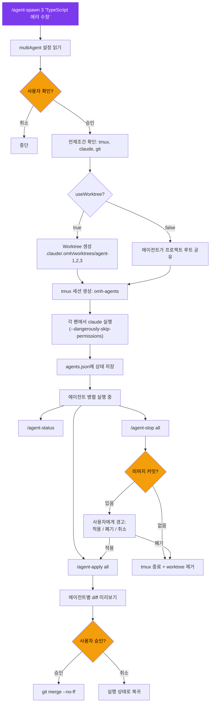
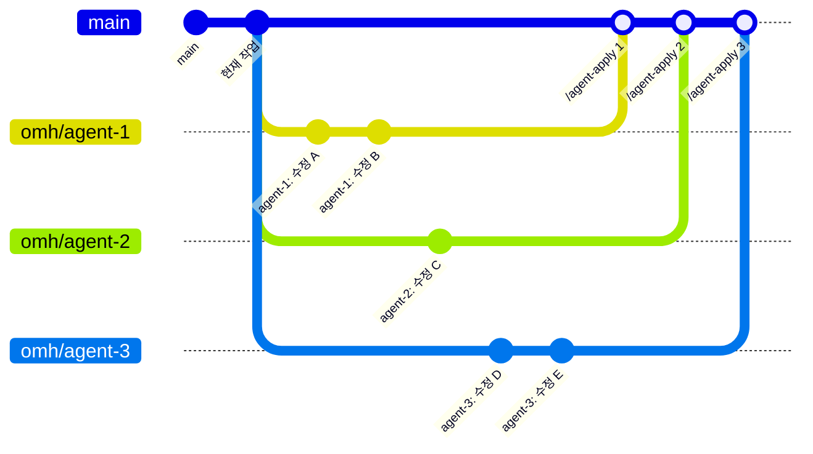

# 멀티 에이전트 시스템

tmux 팬에서 병렬 Claude Code 인스턴스를 실행하며, 각각 독립된 git worktree를 갖습니다.

## 명령어

| 명령어 | 설명 |
|--------|------|
| `/agent-spawn [N] [task]` | N개의 에이전트를 worktree와 함께 tmux 팬에서 실행 (기본: 2) |
| `/agent-status` | 모든 에이전트 상태 확인 (커밋, 변경 파일) |
| `/agent-apply [id\|all]` | 에이전트 변경사항을 main에 미리보기 및 머지 (worktree 모드 전용) |
| `/agent-stop [id\|all]` | 에이전트 중지, 미머지 작업 경고, 정리 |

## 워크플로우

## Worktree 브랜칭 모델

## Worktree 모드 vs 공유 모드

| | `useWorktree: true` (기본) | `useWorktree: false` |
|---|---|---|
| **격리** | 각 에이전트가 독립 브랜치에서 작업 | 모든 에이전트가 프로젝트 루트 공유 |
| **충돌** | 병렬 작업 중 불가능 | 가능 — 주의 필요 |
| **`/agent-apply`** | 변경사항 머지에 필수 | 해당 없음 |
| **`/agent-stop`** | 미머지 커밋 경고 | 팬만 종료 |
| **적합한 용도** | 모든 병렬 코드 변경 | 읽기 전용 작업, 분석 |

## 전제조건

- **tmux** — `brew install tmux` (macOS) / `apt install tmux` (Linux)
- **git** — worktree 격리용
- **claude CLI** — PATH에서 사용 가능해야 함

## 안전 정책

- **항상 먼저 묻기** — 사용자 확인 없이 절대 실행하지 않음
- **자동 머지 금지** — `/agent-apply`는 항상 diff를 보여주고 승인을 기다림
- **조용한 폐기 금지** — 미머지 커밋이 있는 `/agent-stop`은 명시적 선택 필요
- **`--dangerously-skip-permissions`** — 에이전트가 도구 확인을 건너뜀; 사용자에게 항상 사전 고지
- **최대 에이전트 수** — `multiAgent.maxAgents`로 제한 (기본값: 4)
