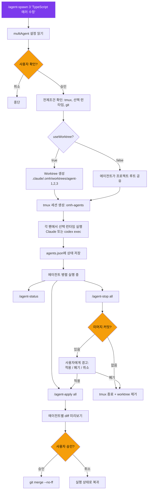
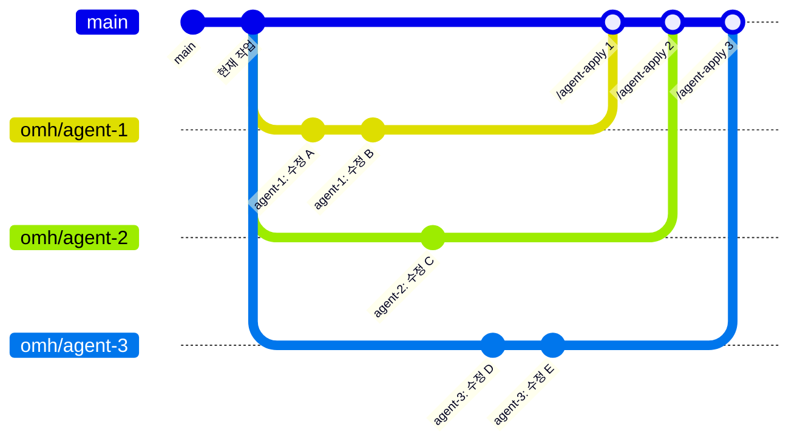
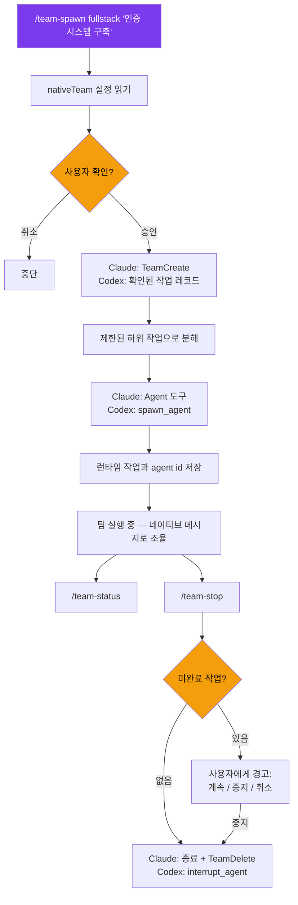

# 멀티 에이전트 시스템

tmux 팬에서 병렬 Claude Code 또는 Codex 워커를 실행하며 기본적으로 독립된 git worktree를 사용합니다. 읽기 전용 작업에는 공유 모드를 선택할 수 있습니다.

## Codex 지원

Codex는 OMH의 두 오케스트레이션 모드를 모두 지원합니다:

- **네이티브 협업** — `/team-spawn`은 확인된 제한적 할당을 `spawn_agent`에 매핑하고, `/team-status`는 `list_agents`와 `.claude/.omh/teams.json`을 대조하며, 조율은 `send_message`, 확인된 종료는 `interrupt_agent`를 사용합니다. 반환된 agent id와 canonical task name은 불투명 값으로 취급해 저장합니다. 설치와 탐색 중에는 에이전트를 생성하지 않습니다.
- **tmux/worktree 워커** — `/agent-spawn`은 `TASK.md` 작업 지시, worktree 격리, 확인, 상태, 미리보기, 자동 merge 금지 규칙을 유지합니다. `multiAgent.runtime`은 `claude` 또는 `codex`로 설정합니다. Codex 워커 실행 명령은 다음과 같습니다:

```bash
codex exec --sandbox workspace-write --cd "<worktree>" "Read TASK.md and complete its instructions."
```

네이티브 협업은 협업 작업이 별도 격리를 제공하지 않는 한 현재 워크스페이스를 공유합니다. tmux/worktree 모드는 워커별 브랜치를 만듭니다. 두 모드 모두 생성, merge, interrupt, 파괴적 정리, 권한 우회에 확인이 필요합니다.

## 명령어

| 명령어 | 설명 |
|--------|------|
| `/agent-spawn [N] [task]` | N개의 에이전트를 worktree와 함께 tmux 팬에서 실행 (기본: 2) |
| `/agent-status` | 모든 에이전트 상태 확인 (커밋, 변경 파일) |
| `/agent-apply [id\|all]` | 에이전트 변경사항을 main에 미리보기 및 머지 (worktree 모드 전용) |
| `/agent-stop [id\|all]` | 에이전트 중지, 미머지 작업 경고, 정리 |

## 워크플로우


```mermaid
graph TD
    START["/agent-spawn 3 'TypeScript 에러 수정'"] --> CONFIG[multiAgent 설정 읽기]
    CONFIG --> CONFIRM{"사용자 확인?"}
    CONFIRM -->|취소| ABORT[중단]
    CONFIRM -->|승인| CHECK["전제조건 확인: tmux, 선택 런타임, git"]
    CHECK --> WT{"useWorktree?"}

    WT -->|true| CREATE_WT["Worktree 생성<br/>.claude/.omh/worktrees/agent-1,2,3"]
    WT -->|false| SHARED[에이전트가 프로젝트 루트 공유]

    CREATE_WT --> TMUX["tmux 세션 생성: omh-agents"]
    SHARED --> TMUX

    TMUX --> LAUNCH["각 팬에서 선택 런타임 실행<br/>Claude 또는 codex exec"]
    LAUNCH --> STATE[agents.json에 상태 저장]
    STATE --> DONE[에이전트 병렬 실행 중]

    DONE --> STATUS["/agent-status"]
    DONE --> APPLY["/agent-apply all"]
    DONE --> STOP["/agent-stop all"]

    APPLY --> DIFF[에이전트별 diff 미리보기]
    DIFF --> MERGE{"사용자 승인?"}
    MERGE -->|승인| GIT_MERGE["git merge --no-ff"]
    MERGE -->|취소| BACK[실행 상태로 복귀]

    STOP --> UNMERGED{"미머지 커밋?"}
    UNMERGED -->|있음| WARN["사용자에게 경고:<br/>적용 / 폐기 / 취소"]
    UNMERGED -->|없음| CLEANUP["tmux 종료 + worktree 제거"]
    WARN -->|폐기| CLEANUP
    WARN -->|적용| APPLY

    style START fill:#7C3AED,color:#fff
    style CONFIRM fill:#f59e0b,color:#000
    style MERGE fill:#f59e0b,color:#000
    style UNMERGED fill:#f59e0b,color:#000
```

## Worktree 브랜칭 모델


```mermaid
gitGraph
    commit id: "main"
    commit id: "현재 작업"
    branch omh/agent-1
    branch omh/agent-2
    branch omh/agent-3
    checkout omh/agent-1
    commit id: "agent-1: 수정 A"
    commit id: "agent-1: 수정 B"
    checkout omh/agent-2
    commit id: "agent-2: 수정 C"
    checkout omh/agent-3
    commit id: "agent-3: 수정 D"
    commit id: "agent-3: 수정 E"
    checkout main
    merge omh/agent-1 id: "/agent-apply 1"
    merge omh/agent-2 id: "/agent-apply 2"
    merge omh/agent-3 id: "/agent-apply 3"
```

## Worktree 모드 vs 공유 모드

| | `useWorktree: true` (기본) | `useWorktree: false` |
|---|---|---|
| **격리** | 각 에이전트가 독립 브랜치에서 작업 | 모든 에이전트가 프로젝트 루트 공유 |
| **충돌** | 병렬 작업 중 불가능 | 가능 — 주의 필요 |
| **`/agent-apply`** | 변경사항 머지에 필수 | 해당 없음 |
| **`/agent-stop`** | 미머지 커밋 경고 | 팬만 종료 |
| **적합한 용도** | 모든 병렬 코드 변경 | 읽기 전용 작업, 분석 |

## 전제조건

- **tmux** — `brew install tmux` (macOS) / `apt install tmux` (Linux)
- **git** — worktree 격리용
- **선택 런타임 CLI** — `claude` 또는 `codex`가 PATH에서 사용 가능해야 함

## 안전 정책

- **항상 먼저 묻기** — 사용자 확인 없이 절대 실행하지 않음
- **자동 머지 금지** — `/agent-apply`는 항상 diff를 보여주고 승인을 기다림
- **조용한 폐기 금지** — 미머지 커밋이 있는 `/agent-stop`은 명시적 선택 필요
- **런타임 권한** — Claude 선택 시 `--permission-mode bypassPermissions`를 고지하고, Codex 워커는 `--sandbox workspace-write` 사용
- **최대 에이전트 수** — `multiAgent.maxAgents`로 제한 (기본값: 4)

---

# 네이티브 팀 시스템

Claude Code 내장 팀 도구 또는 Codex 네이티브 협업 작업을 사용합니다 — tmux나 worktree 의존성이 필요 없습니다.

## 명령어

| 명령어 | 설명 |
|--------|------|
| `/team-spawn [template\|N] [task]` | 템플릿 또는 커스텀 인원으로 팀 생성 |
| `/team-status` | 팀원 상태 및 작업 진행률 확인 |
| `/team-stop` | 팀원 종료, 미완료 작업 경고, 정리 |

## 템플릿

| 템플릿 | 구성원 | 용도 |
|--------|--------|------|
| `fullstack` | frontend (sonnet) + backend (sonnet) + tester (sonnet) | 풀스택 기능 개발 |
| `review` | reviewer (opus) + tester (sonnet) | 코드 리뷰 및 테스트 |
| `research` | researcher (haiku) + implementer (sonnet) + architect (opus) | 연구 기반 개발 |

Claude는 표의 모델 이름을 사용합니다. Codex는 설정된 역할 모델로 동일한 quick/standard/architect 의미를 유지합니다.

## 워크플로우


```mermaid
graph TD
    START["/team-spawn fullstack '인증 시스템 구축'"] --> CONFIG[nativeTeam 설정 읽기]
    CONFIG --> CONFIRM{"사용자 확인?"}
    CONFIRM -->|취소| ABORT[중단]
    CONFIRM -->|승인| CREATE["Claude: TeamCreate<br/>Codex: 확인된 작업 레코드"]
    CREATE --> TASKS["제한된 하위 작업으로 분해"]
    TASKS --> SPAWN["Claude: Agent 도구<br/>Codex: spawn_agent"]
    SPAWN --> ASSIGN["런타임 작업과 agent id 저장"]
    ASSIGN --> RUNNING["팀 실행 중 — 네이티브 메시지로 조율"]

    RUNNING --> STATUS["/team-status"]
    RUNNING --> STOP["/team-stop"]

    STOP --> CHECK{"미완료 작업?"}
    CHECK -->|있음| WARN["사용자에게 경고:<br/>계속 / 중지 / 취소"]
    CHECK -->|없음| SHUTDOWN["Claude: 종료 + TeamDelete<br/>Codex: interrupt_agent"]
    WARN -->|중지| SHUTDOWN

    style START fill:#7C3AED,color:#fff
    style CONFIRM fill:#f59e0b,color:#000
    style CHECK fill:#f59e0b,color:#000
```

## 멀티 에이전트 vs 네이티브 팀

| | 멀티 에이전트 (`/agent-spawn`) | 네이티브 팀 (`/team-spawn`) |
|---|---|---|
| **인프라** | tmux + git worktree | Claude 팀 도구 또는 Codex 협업 작업 |
| **전제조건** | tmux, git, 선택 런타임 CLI | 활성 런타임 외에는 없음 |
| **격리** | 에이전트별 Git 브랜치 | 공유 저장소 (또는 Agent 도구 격리) |
| **통신** | tmux 팬 관찰 | Claude `SendMessage` 또는 Codex `send_message` |
| **작업 관리** | `TASK.md` 파일 | Claude 작업 도구 또는 Codex `list_agents` + `teams.json` |
| **머지 전략** | `/agent-apply` (수동 머지) | 불필요 — 브랜치 없음 |
| **적합한 용도** | 격리가 필요한 병렬 코드 변경 | 조율된 팀 워크플로우 |

## 안전 정책

- **항상 먼저 묻기** — 사용자 확인 없이 절대 팀을 생성하지 않음
- **조용한 폐기 금지** — 미완료 작업이 있는 `/team-stop`은 명시적 선택 필요
- **최대 팀원 수** — `nativeTeam.maxTeammates`로 제한 (기본값: 4)
- **한 번에 하나의 팀** — 새 팀 생성 전 기존 팀을 먼저 중지해야 함
