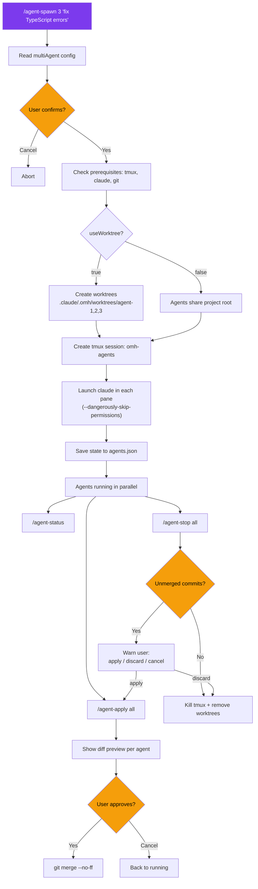
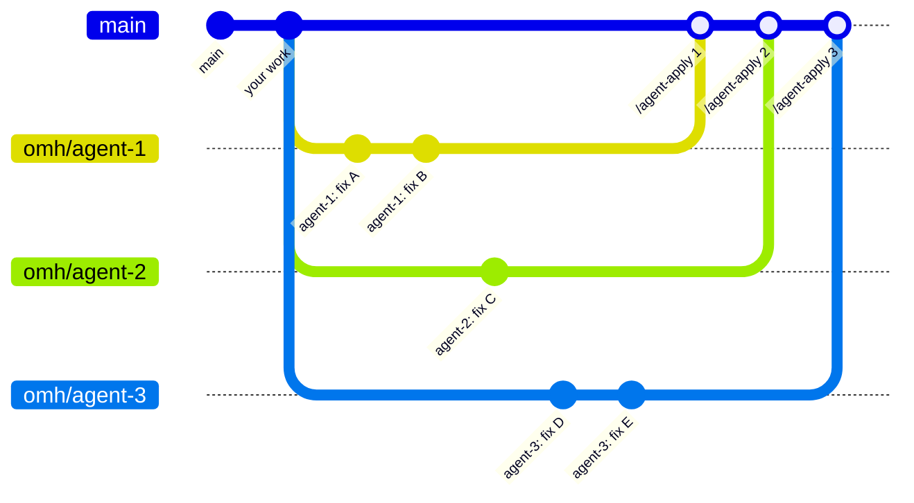

# Multi-Agent System

Spawn parallel Claude Code instances in tmux panes, each with an isolated git worktree.

## Commands

| Command | Description |
|---------|-------------|
| `/agent-spawn [N] [task]` | Spawn N agents (default: 2) with worktrees in tmux panes |
| `/agent-status` | Check status of all agents (commits, changed files) |
| `/agent-apply [id\|all]` | Preview and merge agent changes to main (worktree mode only) |
| `/agent-stop [id\|all]` | Stop agents, warn about unmerged work, cleanup |

## Workflow

## Worktree Branching Model

## Worktree Mode vs Shared Mode

| | `useWorktree: true` (default) | `useWorktree: false` |
|---|---|---|
| **Isolation** | Each agent on its own branch | All agents in project root |
| **Conflicts** | Impossible during parallel work | Possible — use with care |
| **`/agent-apply`** | Required to merge changes | Not applicable |
| **`/agent-stop`** | Warns about unmerged commits | Just kills panes |
| **Best for** | Any parallel code changes | Read-only tasks, analysis |

## Prerequisites

- **tmux** — `brew install tmux` (macOS) / `apt install tmux` (Linux)
- **git** — for worktree isolation
- **claude CLI** — must be available in PATH

## Safety Policies

- **Always ask first** — never spawn without explicit user confirmation
- **Never auto-merge** — `/agent-apply` always shows a diff and waits for approval
- **Never silently discard** — `/agent-stop` with unmerged commits requires explicit choice
- **`--dangerously-skip-permissions`** — agents bypass tool prompts; user is always told this upfront
- **Max agents** — capped by `multiAgent.maxAgents` (default: 4)
