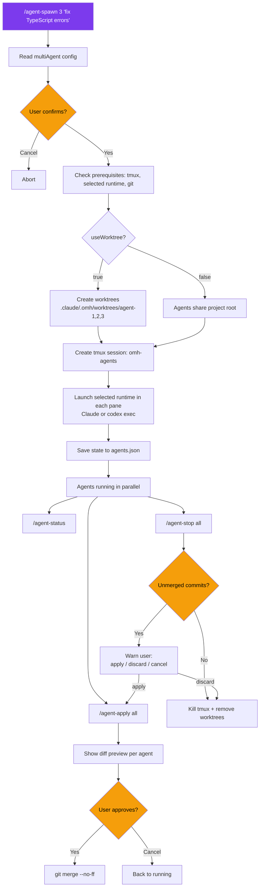
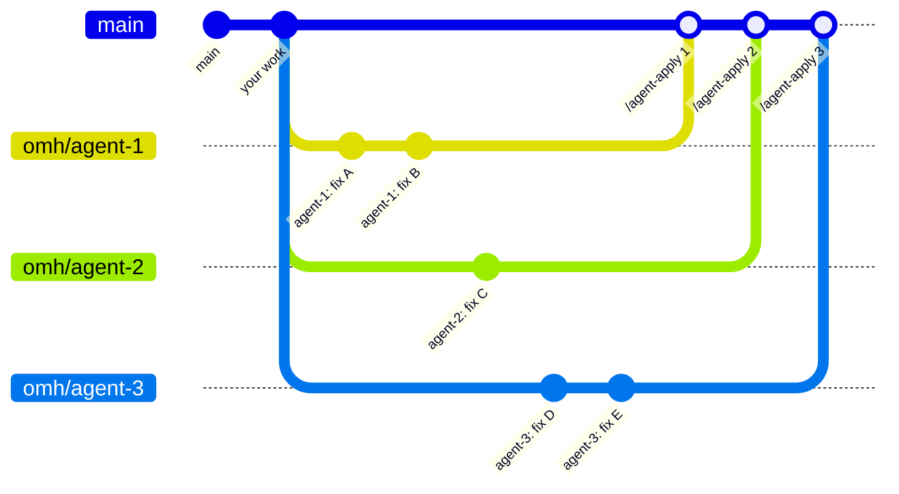
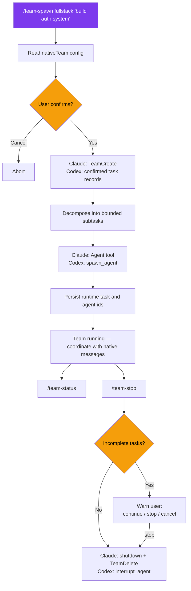

# Multi-Agent System

Spawn parallel Claude Code or Codex workers in tmux panes, using isolated git worktrees by default. Shared mode is available for read-only work.

## Codex Support

Codex supports both OMH orchestration modes:

- **Native collaboration** — `/team-spawn` maps confirmed bounded assignments to `spawn_agent`; `/team-status` reconciles `list_agents` with `.claude/.omh/teams.json`; coordination uses `send_message`; confirmed shutdown uses `interrupt_agent`. Returned agent ids and canonical task names are opaque and persisted. Installation and discovery never spawn agents.
- **tmux/worktree workers** — `/agent-spawn` keeps task text in `TASK.md`, worktree isolation, confirmation, status, preview, and no-auto-merge rules. Set `multiAgent.runtime` to `claude` or `codex`. A Codex worker launches with:

```bash
codex exec --sandbox workspace-write --cd "<worktree>" "Read TASK.md and complete its instructions."
```

Native collaboration shares the current workspace unless the collaboration operation provides isolation. tmux/worktree mode creates a branch per worker. In both modes, spawning, merging, interrupting, destructive cleanup, and permission bypass require confirmation.

## Commands

| Command | Description |
|---------|-------------|
| `/agent-spawn [N] [task]` | Spawn N agents (default: 2) with worktrees in tmux panes |
| `/agent-status` | Check status of all agents (commits, changed files) |
| `/agent-apply [id\|all]` | Preview and merge agent changes to main (worktree mode only) |
| `/agent-stop [id\|all]` | Stop agents, warn about unmerged work, cleanup |

## Workflow


```mermaid
graph TD
    START["/agent-spawn 3 'fix TypeScript errors'"] --> CONFIG[Read multiAgent config]
    CONFIG --> CONFIRM{"User confirms?"}
    CONFIRM -->|Cancel| ABORT[Abort]
    CONFIRM -->|Yes| CHECK[Check prerequisites: tmux, selected runtime, git]
    CHECK --> WT{"useWorktree?"}

    WT -->|true| CREATE_WT["Create worktrees<br/>.claude/.omh/worktrees/agent-1,2,3"]
    WT -->|false| SHARED[Agents share project root]

    CREATE_WT --> TMUX[Create tmux session: omh-agents]
    SHARED --> TMUX

    TMUX --> LAUNCH["Launch selected runtime in each pane<br/>Claude or codex exec"]
    LAUNCH --> STATE[Save state to agents.json]
    STATE --> DONE[Agents running in parallel]

    DONE --> STATUS["/agent-status"]
    DONE --> APPLY["/agent-apply all"]
    DONE --> STOP["/agent-stop all"]

    APPLY --> DIFF[Show diff preview per agent]
    DIFF --> MERGE{"User approves?"}
    MERGE -->|Yes| GIT_MERGE["git merge --no-ff"]
    MERGE -->|Cancel| BACK[Back to running]

    STOP --> UNMERGED{"Unmerged commits?"}
    UNMERGED -->|Yes| WARN["Warn user:<br/>apply / discard / cancel"]
    UNMERGED -->|No| CLEANUP["Kill tmux + remove worktrees"]
    WARN -->|discard| CLEANUP
    WARN -->|apply| APPLY

    style START fill:#7C3AED,color:#fff
    style CONFIRM fill:#f59e0b,color:#000
    style MERGE fill:#f59e0b,color:#000
    style UNMERGED fill:#f59e0b,color:#000
```

## Worktree Branching Model


```mermaid
gitGraph
    commit id: "main"
    commit id: "your work"
    branch omh/agent-1
    branch omh/agent-2
    branch omh/agent-3
    checkout omh/agent-1
    commit id: "agent-1: fix A"
    commit id: "agent-1: fix B"
    checkout omh/agent-2
    commit id: "agent-2: fix C"
    checkout omh/agent-3
    commit id: "agent-3: fix D"
    commit id: "agent-3: fix E"
    checkout main
    merge omh/agent-1 id: "/agent-apply 1"
    merge omh/agent-2 id: "/agent-apply 2"
    merge omh/agent-3 id: "/agent-apply 3"
```

## Worktree Mode vs Shared Mode

| | `useWorktree: true` (default) | `useWorktree: false` |
|---|---|---|
| **Isolation** | Each agent on its own branch | All agents in project root |
| **Conflicts** | Impossible during parallel work | Possible — use with care |
| **`/agent-apply`** | Required to merge changes | Not applicable |
| **`/agent-stop`** | Warns about unmerged commits | Just kills panes |
| **Best for** | Any parallel code changes | Read-only tasks, analysis |

## Prerequisites

- **tmux** — `brew install tmux` (macOS) / `apt install tmux` (Linux)
- **git** — for worktree isolation
- **Selected runtime CLI** — `claude` or `codex` must be available in PATH

## Safety Policies

- **Always ask first** — never spawn without explicit user confirmation
- **Never auto-merge** — `/agent-apply` always shows a diff and waits for approval
- **Never silently discard** — `/agent-stop` with unmerged commits requires explicit choice
- **Runtime permissions** — disclose Claude `--permission-mode bypassPermissions` when selected; Codex workers use `--sandbox workspace-write`
- **Max agents** — capped by `multiAgent.maxAgents` (default: 4)

---

# Native Team System

Use Claude Code's built-in team tools or Codex native collaboration operations — no tmux or worktree dependency is required.

## Commands

| Command | Description |
|---------|-------------|
| `/team-spawn [template\|N] [task]` | Create a team with teammates from a template or custom count |
| `/team-status` | Check teammate status and task progress |
| `/team-stop` | Shutdown teammates, warn about incomplete tasks, cleanup |

## Templates

| Template | Members | Use For |
|----------|---------|---------|
| `fullstack` | frontend (sonnet) + backend (sonnet) + tester (sonnet) | Full-stack feature development |
| `review` | reviewer (opus) + tester (sonnet) | Code review and testing |
| `research` | researcher (haiku) + implementer (sonnet) + architect (opus) | Research-driven development |

Claude uses the model names shown. Codex preserves the same quick/standard/architect semantics with its configured role models.

## Workflow


```mermaid
graph TD
    START["/team-spawn fullstack 'build auth system'"] --> CONFIG[Read nativeTeam config]
    CONFIG --> CONFIRM{"User confirms?"}
    CONFIRM -->|Cancel| ABORT[Abort]
    CONFIRM -->|Yes| CREATE["Claude: TeamCreate<br/>Codex: confirmed task records"]
    CREATE --> TASKS[Decompose into bounded subtasks]
    TASKS --> SPAWN["Claude: Agent tool<br/>Codex: spawn_agent"]
    SPAWN --> ASSIGN["Persist runtime task and agent ids"]
    ASSIGN --> RUNNING["Team running — coordinate with native messages"]

    RUNNING --> STATUS["/team-status"]
    RUNNING --> STOP["/team-stop"]

    STOP --> CHECK{"Incomplete tasks?"}
    CHECK -->|Yes| WARN["Warn user:<br/>continue / stop / cancel"]
    CHECK -->|No| SHUTDOWN["Claude: shutdown + TeamDelete<br/>Codex: interrupt_agent"]
    WARN -->|stop| SHUTDOWN

    style START fill:#7C3AED,color:#fff
    style CONFIRM fill:#f59e0b,color:#000
    style CHECK fill:#f59e0b,color:#000
```

## Multi-Agent vs Native Team

| | Multi-Agent (`/agent-spawn`) | Native Team (`/team-spawn`) |
|---|---|---|
| **Infrastructure** | tmux + git worktrees | Claude team tools or Codex collaboration operations |
| **Prerequisites** | tmux, git, selected runtime CLI | None beyond the active runtime |
| **Isolation** | Git branches per agent | Shared repo (or Agent tool isolation) |
| **Communication** | Observe tmux panes | Claude `SendMessage` or Codex `send_message` |
| **Task Management** | `TASK.md` files | Claude task tools or Codex `list_agents` + `teams.json` |
| **Merge Strategy** | `/agent-apply` (manual merge) | Not needed — no branches |
| **Best for** | Parallel code changes needing isolation | Coordinated team workflows |

## Safety Policies

- **Always ask first** — never create a team without explicit user confirmation
- **Never silently discard** — `/team-stop` with incomplete tasks requires explicit choice
- **Max teammates** — capped by `nativeTeam.maxTeammates` (default: 4)
- **One team at a time** — must stop existing team before creating a new one
